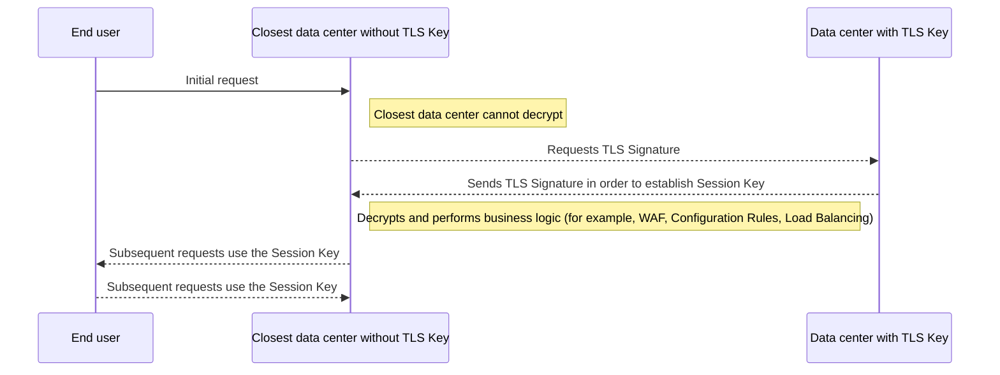

Your **key region** restricts where your private SSL/TLS keys are stored. These are the cryptographic keys Cloudflare uses to decrypt your HTTPS traffic.

In your contract, the dashboard, and the API, this setting is called Geo Key Manager.

## Customize key storage

By default, your private keys are encrypted and distributed to every Cloudflare data center, where they are used for local TLS termination. Setting a key region restricts that distribution to the locations you choose.

You can define key regions as allowlists and blocklists of countries. For example, you can store your private keys only in Australia, or limit storage to the EU and the UK. Older configurations were restricted to the US, the EU, and high-security data centers; the [eleven available key regions](/data-localization/regions-by-setting/#key-region) replace those fixed options.

A key region uses its own country-based list, which is not the same as the [processing region](/data-localization/regions-by-setting/#processing-region) list. For the regions available to each setting, refer to [Regions by setting](/data-localization/regions-by-setting/).

## Cloudflare data center flow example

The following diagram shows what happens when an end user connects to a Cloudflare data center that does not hold your private key. TLS termination requires the private key, so the local data center requests a temporary session key (a short-lived symmetric encryption key) from a data center in an authorized region.

 

 

## Latency on the first connection

With a key region set, or with [Keyless SSL](/ssl/keyless-ssl/) where your private key stays on your own infrastructure, latency is added only when establishing a new connection.

If the data center handling the connection does not hold your private key, it must contact a key server in an authorized region. This adds latency corresponding to the round-trip time between the two locations, which can be as much as a second if the key server is on the other side of the world. Once the handshake is complete, the key server is not involved. If the visitor reconnects within the TLS Session Resumption window, which reuses previous connection parameters, the private key is not required.

Learn more about how it works in the [Geo Key Manager blog post](https://blog.cloudflare.com/geo-key-manager-how-it-works/).

## Additional information

For detailed information on setup and supported options, refer to [Geo Key Manager documentation](/ssl/edge-certificates/geokey-manager/).

For product exceptions, refer to [What stays in your region](/data-localization/what-stays-in-your-region/).
