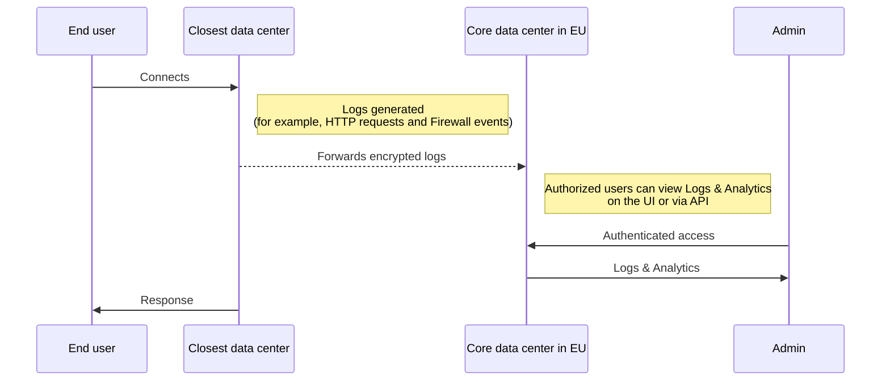

import { Render } from "~/components";

Your **log region** restricts where your logs and analytics are stored.

It covers traffic metadata: the records generated when visitors reach your site, such as request URLs, timestamps, and firewall events. It does **not** cover content you store. To confine files and objects to a region, set a [storage region](/data-localization/storage-region/).

In your contract, the dashboard, and the API, this setting is called the Customer Metadata Boundary (CMB).

This metadata could identify your end users. Logs are tagged with your [Account ID](/fundamentals/account/find-account-and-zone-ids/).

A log region can be the European Union (`eu`) or the United States (`us`). There are no other options. By default no log region is applied, and logs may be stored in Cloudflare's core data centers globally.

If you set the `eu` log region, logs are sent only to Cloudflare's core data center in the European Union. A core data center is a centralized processing facility, as distinct from the globally distributed edge data centers.

A few Logpush datasets do not respect your log region and may be stored elsewhere. Check [Logpush datasets](/data-localization/log-region/logpush-datasets/) before you rely on a dataset.

A log region uses its own region list, which is much shorter than the [processing region](/data-localization/regions-by-setting/#processing-region) list.

Enabling **Allow out-of-region access** changes who can read your logs, not where they are stored. With it enabled, authorized users on your account can read logs regardless of their physical location. Refer to [Out of region access](/data-localization/log-region/out-of-region-access/).

## Traffic metadata flow

The following diagram shows how metadata about your traffic is generated at a Cloudflare edge data center and forwarded exclusively to the core data center in the configured region (EU in this example). Authorized users access logs and analytics from that core data center.

 

 

## Dashboard analytics visibility

When a log region is configured, dashboard analytics and Logs views are only accessible to users whose sessions are routed to the configured region's core data center. This is determined by geo-steering, not by your physical location. If your session is routed to a data center outside the configured region, you may see "no data" for analytics and logs.

To allow authorized users to view logs and analytics regardless of where their session is routed, enable [Allow out-of-region access](/data-localization/log-region/out-of-region-access/).

## Log management

Additionally, you can configure [Logpush](/logs/logpush/) (Cloudflare's log export service) to push your logs to your own storage services, SIEMs (Security Information and Event Management systems), and log management providers.

## Prerequisites for an EU log region

Before you can set your log region to `eu`, you must disable Log Retention for all zones within your account. Log Retention is a legacy feature of [Logpull](/logs/logpull/), an older API for downloading logs that is superseded by [Logpush](/logs/logpush/).

When the log region is set to `eu`, most analytics and logging sections in the Cloudflare dashboard will show no data. Your logs are still stored in the EU as configured. To read them, use [Security Analytics](/waf/analytics/security-analytics/), which respects the log region, or set up [Logpush](/logs/logpush/) to export [HTTP request](/logs/logpush/logpush-job/datasets/zone/http_requests/) logs to a storage destination you control.

### Data unavailability

<Render file="customer_metadata_boundary_error" product="analytics" />

## Product-specific behavior

For product exceptions, refer to [What stays in your region](/data-localization/what-stays-in-your-region/).

For defects currently under investigation, refer to [Known issues](/data-localization/known-issues/).
