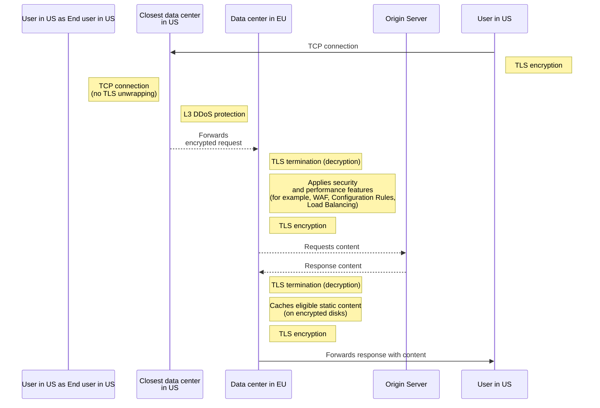

import { GlossaryTooltip, Steps } from "~/components";

Your **processing region** restricts which Cloudflare data centers can decrypt and service HTTPS traffic for your hostnames.

This is the only setting that controls traffic processing. It does not affect where your logs, stored content, or TLS keys reside. For those, set a [log region](/data-localization/log-region/), a [storage region](/data-localization/storage-region/), or a [key region](/data-localization/key-region/).

In your contract, the dashboard, and the API, this setting is called Regional Services.

A processing region receives and processes traffic within designated geographic boundaries, for customers who need to meet regional compliance requirements or who prefer to maintain regional control over their data. Examples of use cases include accommodating regional restrictions like [GDPR](https://www.cloudflare.com/trust-hub/gdpr/) (General Data Protection Regulation), or fulfilling contractual agreements with customers that include geographic restrictions on data flows or data processing.

When you set a processing region, TLS termination only occurs inside that region. TLS termination is the point at which encrypted HTTPS traffic is decrypted so that Cloudflare can inspect it and apply your security rules. For example, if a hostname is configured to regionalize to the European Union (EU), any HTTPS request from the United States (US) will be forwarded in encrypted form to an EU data center before being decrypted.

## Global traffic management

Cloudflare accepts traffic at any data center worldwide and applies [L3/L4 DDoS mitigations](/ddos-protection/about/attack-coverage/), which are network-layer and transport-layer protections that block volumetric attacks without needing to decrypt traffic content. Security, performance, and reliability functions that require access to decrypted traffic are applied only at Cloudflare locations inside your processing region.

Your processing region ensures that all of the following application-layer services (among others) operate within the selected region:

- Storing and retrieving content from Cache.
- Blocking malicious HTTP payloads with the Web Application Firewall (WAF).
- Detecting and blocking suspicious activity with Bot Management.
- Running Cloudflare Workers scripts.
- Load Balancing traffic to the best origin servers (or other <GlossaryTooltip term="endpoint">endpoints</GlossaryTooltip>).

A processing region is a compliance control, not a performance optimization. Within the configured region, Cloudflare routes requests to the most performant in-region data center, which is not necessarily the closest one. Routing uses a scoring system that considers available connections, latency, and load. Refer to [Geographic traffic routing](/support/troubleshooting/general-troubleshooting/geographic-traffic-routing/) for more details. For geographically large regions, requests may be processed at a data center farther than the closest in-region option.

## Request flow example

The following diagram is a high-level example of the flow of a request coming from an end user located within the US, connecting to a website whose processing region is set to the EU.

 

 

## Egress behavior and ingress IPs

Your processing region controls where traffic is ingested and processed (decrypted), not where it exits to your origin. Egress IPs to your origin are site-local IPs from the in-region data center where the request was processed. If you need guaranteed egress IP geolocation or origin allowlisting, use [Dedicated CDN Egress IPs](/smart-shield/configuration/dedicated-egress-ips/) in addition to a processing region.

For Regional Hostnames using Cloudflare shared ingress IPs, third-party IP geolocation providers may return a location that does not match your configured region (often the United States). This is a limitation of shared IP addressing and does not affect where your traffic is actually decrypted and processed.

## Ways to set a processing region

Regional Services is a single product with three ways to apply a processing region. They are features, not versions: none supersedes another, and all three are generally available. The right one depends on how your traffic reaches Cloudflare. Most customers use only one.

- **Regional Hostnames** assign a region to a proxied hostname, and Cloudflare steers that hostname's traffic to in-region data centers. This is the most common choice.
- **Regionalized Spectrum Applications** regionalize [Spectrum](/spectrum/) HTTP/S applications, and work with both [Spectrum Static IPs](/spectrum/about/static-ip/) and [Bring Your Own IP (BYOIP)](/byoip/).
- **Regionalized IP Bindings** bind a [BYOIP](/byoip/) prefix to a region, so traffic destined for those addresses is processed in-region. This suits broad configurations such as whole prefixes or accounts.

| Option                                                                                            | How traffic is addressed      | Granularity                         | Static IP / BYOIP    | API                         | Also called                                            | Best for                                                   |
| ------------------------------------------------------------------------------------------------- | ----------------------------- | ----------------------------------- | -------------------- | --------------------------- | ------------------------------------------------------ | ---------------------------------------------------------- |
| [Regional Hostnames](/data-localization/processing-region/regional-hostnames/)                    | Cloudflare shared IPs         | Per hostname                        | Not supported        | Regional Hostnames API      | Regional Services v2, RSv2                             | Most deployments; regionalizing specific proxied hostnames |
| [Regionalized Spectrum Applications](/data-localization/processing-region/spectrum-applications/) | Dedicated IP via Spectrum app | Per zone (all Spectrum HTTP/S apps) | Static IPs and BYOIP | Spectrum API                | Regional Services v1, RSv1                             | Traffic addressed by IP that needs Static IPs or BYOIP     |
| [Regionalized IP Bindings](/data-localization/processing-region/ip-bindings/)                     | BYOIP prefix at the IP layer  | Per CIDR or IP prefix               | BYOIP only           | Data Localization Suite API | Regional Services for BYOIP, regionalized address maps | Broad, self-serve regionalization of whole prefixes        |

The **Also called** column lists names you may still see in older material and contracts. Cloudflare no longer uses the version numbers, because they implied each option replaced the last.

All three options support [managed regions](/data-localization/regions-by-setting/#region-types). [Custom regions](/data-localization/regions-by-setting/#region-types) are available for Regionalized Spectrum Applications and Regionalized IP Bindings, but not for Regional Hostnames.

## Get started

Setting a processing region follows the same path regardless of which option you choose:

<Steps>

1. **Confirm your entitlements.** A processing region is an Enterprise add-on. Contact your account team to confirm your account has the required entitlements. Some options have additional requirements: Regionalized Spectrum Applications also need [Spectrum](/spectrum/), and Regionalized IP Bindings also need the Regional Services for BYOIP entitlement.

2. **Choose the option that matches how your traffic reaches Cloudflare.** Use the [comparison table](#ways-to-set-a-processing-region) to decide between the three options.

3. **Follow the setup guide for your option.**

   - [Regional Hostnames](/data-localization/processing-region/regional-hostnames/)
   - [Regionalized Spectrum Applications](/data-localization/processing-region/spectrum-applications/)
   - [Regionalized IP Bindings](/data-localization/processing-region/ip-bindings/)

4. **Verify regionalization.** Confirm that traffic is processed in your configured region. Refer to [Verify your processing region](/data-localization/how-to/#verify-your-processing-region).

</Steps>

## Availability and SLA

For availability and Service Level Agreements (SLAs), refer to your Cloudflare Enterprise contract. For a processing region restricted to a single country (except the US), Cloudflare's SLA includes specific exclusions: because traffic cannot fail over to data centers outside that country, there is no automatic failover if in-country capacity is unavailable. Multi-country regions (for example, the European Union) generally maintain the standard SLA.

## Unsupported features and protocols

The following are not supported in a processing region and will not work on regionalized hostnames:

- [ICMP](https://www.cloudflare.com/learning/ddos/glossary/internet-control-message-protocol-icmp/), used for network diagnostics like `ping`
- [Encrypted Client Hello (ECH)](/ssl/edge-certificates/ech/), which encrypts the initial part of a TLS connection
- [O2O](/cloudflare-for-platforms/cloudflare-for-saas/saas-customers/how-it-works/), a Cloudflare for SaaS origin-to-origin setup
- [Onion Routing (Tor)](/network/onion-routing/)

Because processing regions use [Spectrum](/spectrum/) in the background, [Spectrum limitations](/spectrum/reference/limitations/) also apply.

Your processing region does not apply to [subrequests](/workers/platform/limits/#subrequests), the secondary HTTP requests your Workers make to other services. A processing region acts on your hostname's IPs, so a subrequest is processed wherever its own destination resolves to. Because that destination comes from DNS, Cloudflare recommends [DNSSEC](/learning-paths/application-security/default-traffic-security/dnssec/) and [DNS over HTTPS](/1.1.1.1/encryption/dns-over-https/) so those responses cannot be tampered with.

### Regional hostnames and Spectrum applications

Regional hostnames configured through the dashboard or the Regional Hostnames API only apply to hostnames [proxied](/dns/proxy-status/) through Cloudflare. They do not regionalize [Spectrum](/spectrum/) applications.

If a hostname has both a regional hostname configuration and an active Spectrum application, these are independent systems. The Spectrum application may override the regional hostname's IP steering with its own IP assignment, so traffic may not be processed in the region configured via the Regional Hostnames API. If you need to regionalize a Spectrum application, contact your [account team](/support/contacting-cloudflare-support/) about Spectrum-specific regionalization options, which apply only to HTTP and HTTPS [application types](/spectrum/reference/configuration-options/#application-type).

## Additional information

For product exceptions, refer to [What stays in your region](/data-localization/what-stays-in-your-region/).

For every in-scope product on your Enterprise subscription, Cloudflare terminates TLS connections only in the region you configured.
