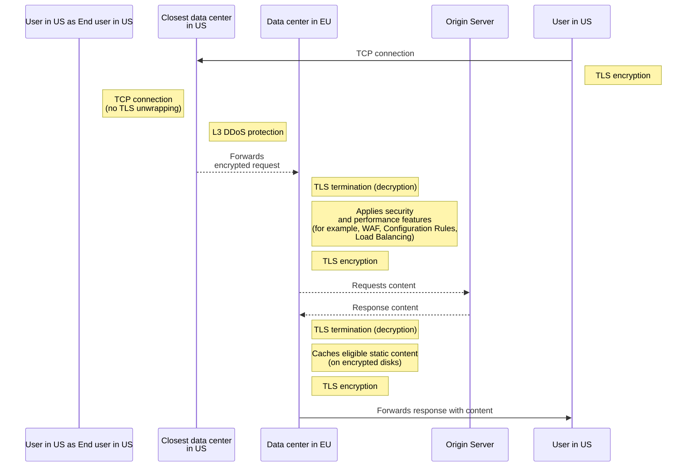

import { GlossaryTooltip } from "~/components"

Regional Services gives you the ability to accommodate regional restrictions by choosing which subset of data centers decrypt and service HTTPS traffic.

Regional Services proceeds and processes traffic within certain regions for customers who have to meet regional compliance or have preferences for maintaining regional control over their data. Examples of use cases could be a customer that needs to accommodate regional restrictions like [GDPR](https://www.cloudflare.com/trust-hub/gdpr/) (General Data Protection Regulation), or customers that are bound by agreement with their own customers that include geographic restrictions on data flows or data processing.

With Regional Services, TLS is only terminated inside the configured region. For example, if a hostname is configured to regionalize to the European Union (EU), any HTTPS request from the United States (US) will route to the EU.

## Global traffic management

Regional Services globally ingests traffic, implementing [L3/L4 DDoS mitigations](/ddos-protection/about/attack-coverage/). Meanwhile, security, performance, and reliability functions are serviced at only in-region Cloudflare locations.

Regional Services ensures that all edge application services operate within the selected region. This includes (the following list is not exhaustive):

* Storing and retrieving content from Cache.
* Blocking malicious HTTP payloads with the Web Application Firewall (WAF).
* Detecting and blocking suspicious activity with Bot Management.
* Running Cloudflare Workers scripts.
* Load Balancing traffic to the best origin servers (or other <GlossaryTooltip term="endpoint">endpoints</GlossaryTooltip>).

## Request flow example

The following diagram is a high-level example of the flow of a request coming from an end user located within the US connecting to a website using Cloudflare Regional Services set to EU.

 

 

## Additional information

For more details about the products that are compatible with Regional Services, refer to the [Cloudflare product compatibility](/data-localization/compatibility/) page. If you have purchased these products as part of your Enterprise subscription plan, Cloudflare will only terminate TLS connections for these products in the geographic region you have configured for Regional Services.
