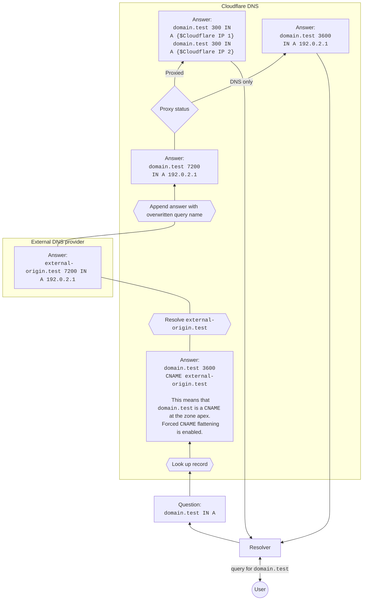

import { Example } from "~/components"

With `CNAME` flattening, Cloudflare returns an IP address instead of the target hostname that a `CNAME` record points to.
This process supports a few features and delivers better performance and flexibility, as mentioned in the [CNAME flattening concept page](/dns/cname-flattening/).

Consider the diagram below to have an overview of the steps that may be involved in `CNAME` flattening.

:::note

Note that this is a simpler scenario. Cases where `CNAME` flattening is optional and/or the target hostname is not external to Cloudflare work differently. 

:::

## Example use case

* `domain.test` is a zone on Cloudflare and has the following `CNAME` record:

<Example>

| Type       | Name          | Content                | TTL    |
| ---------- | ------------- | ---------------------- | ------ |
| `CNAME`    | `domain.test` | `external-origin.test` | `3600` |

</Example>

* `external-origin.test` is a zone on a different DNS provider and has the following A record:

<Example>

| Type       | Name                   | Content     | TTL    |
| ---------- | ---------------------- | ----------- | ------ |
| `A`        | `external-origin.test` | `192.0.2.1` | `7200` |

</Example>

In this case, the process to respond to queries for `domain.test` directly with the IP address can be represented by the following diagram:

## Aspects to consider

* If the `CNAME` record is proxied in Cloudflare, the answer is made up of multiple [Cloudflare IPs](https://www.cloudflare.com/ips/) and its Time to Live (TTL) is set to `300`.
* If the `CNAME` record in Cloudflare is not proxied, the flattened answer consists of the IP address from the external DNS provider and its TTL corresponds to the lower value between the external record and the Cloudflare `CNAME` record.
