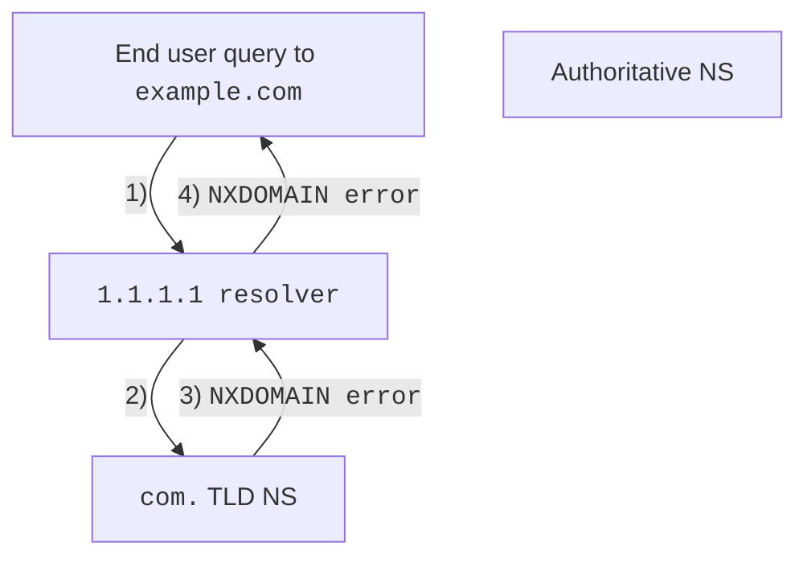
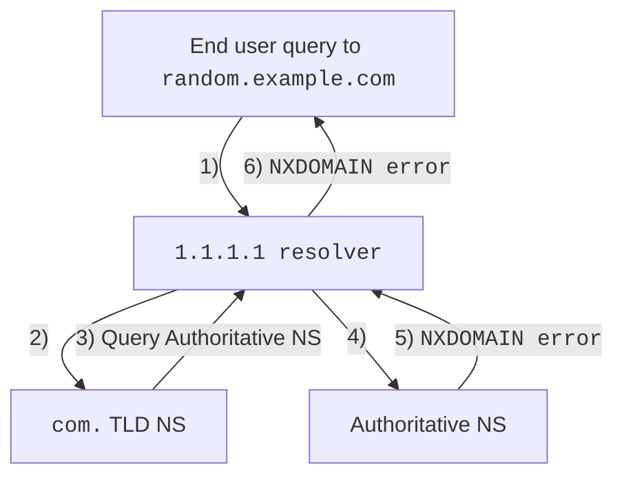

import { Render } from "~/components"

<Render file="random-prefix-attack-definition" />  

## Attack characteristics

### Queries for nonexistent domains

If the request only involved nonexistent domains, the `NXDOMAIN` errors would only be served by the top-level domain (TLD) nameservers for `com.`. This means that the queries never reach the authoritative nameservers.

 

### Queries for nonexistent subdomains

These attacks are successful because they target subdomains, which require a response from a domain's authoritative nameservers.

 

With an attack against a subdomain of an existing domain, the resolver is forced to fully resolve it against the authoritative nameservers since these random subdomains are likely not cached by the resolver or any other proxy. If an attacker sends enough of these queries, and the authoritative nameservers cannot handle the query load, it will become unresponsive or even fall over, taking all zones it is hosting down, not just the attacked zone.

This attack is difficult to mitigate for a few reasons. From the perspective of the authoritative nameservers, the attacker appears to be Cloudflare (`1.1.1.1`) since that is the source of the queries. Blocking Cloudflare is not an option since that will block legitimate traffic.

## Solution

When you [enable random prefix attack mitigations](/dns/dns-firewall/random-prefix-attacks/setup/), Cloudflare monitors incoming queries for potential random prefix attacks.

When we detect an attack, we will temporarily stop querying your upstream nameservers for subdomains, sub-subdomains, and more. Cloudflare will then respond with cached responses (if their TTL has not yet expired).
