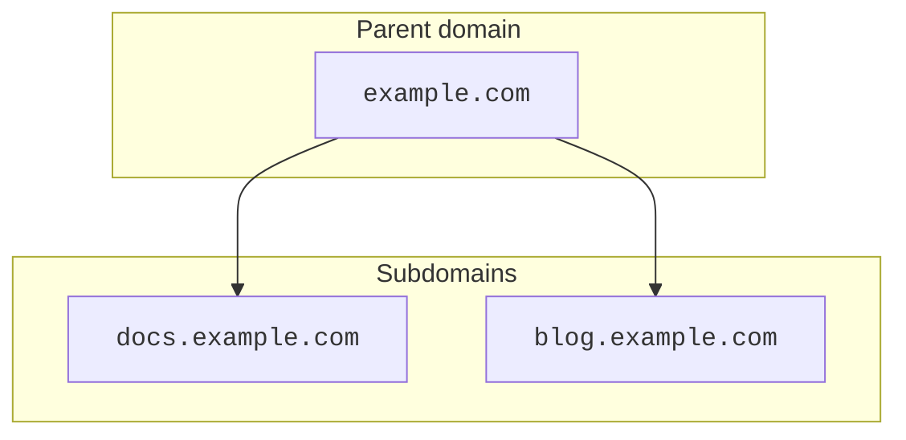

import { DirectoryListing, GlossaryTooltip, Render } from "~/components"

:::caution

Subdomain setup is only available for Enterprise accounts. If you only want to create a subdomain for your site in Cloudflare, refer to [Create a subdomain record](/dns/manage-dns-records/how-to/create-subdomain/).
:::

[Subdomain setup](/dns/zone-setups/subdomain-setup/) relies on a process known as delegation. When, in a parent domain such as `example.com`, an [`NS` record](https://www.cloudflare.com/learning/dns/dns-records/dns-ns-record/) is created for a subdomain `blog.example.com`, this means that DNS management for the subdomain can be done separately, in its own <GlossaryTooltip term="DNS zone" link="/dns/concepts/#zone">DNS zone</GlossaryTooltip>.

***

## Available setups

The availability of different setups will depend on both the parent zone setup and the setup used for the child zone. A child zone holds DNS management for a delegated subdomain.

| Parent zone                                                                                                   | Child zone                                                            | Available |
| ------------------------------------------------------------------------------------------------------------- | --------------------------------------------------------------------- | --------- |
| [Full](/dns/zone-setups/full-setup/) or [Secondary](/dns/zone-setups/zone-transfers/cloudflare-as-secondary/) | [Full](/dns/zone-setups/full-setup/)                                  | Yes       |
| [Full](/dns/zone-setups/full-setup/) or [Secondary](/dns/zone-setups/zone-transfers/cloudflare-as-secondary/) | [Secondary](/dns/zone-setups/zone-transfers/cloudflare-as-secondary/) | Yes       |
| [Full](/dns/zone-setups/full-setup/) or [Secondary](/dns/zone-setups/zone-transfers/cloudflare-as-secondary/) | [Partial](/dns/zone-setups/partial-setup/)                            | No        |
| [Partial](/dns/zone-setups/partial-setup/)                                                                    | [Full](/dns/zone-setups/full-setup/)                                  | Yes       |
| [Partial](/dns/zone-setups/partial-setup/)                                                                    | [Secondary](/dns/zone-setups/zone-transfers/cloudflare-as-secondary/) | Yes       |
| [Partial](/dns/zone-setups/partial-setup/)                                                                    | [Partial](/dns/zone-setups/partial-setup/)\*                          | Yes       |

:::caution[* Subdomain zones in partial setup are not delegated]

Subdomains using a partial setup represent an exception in the sense that [delegation](#subdomain-delegation) does not apply in this context. As explained in the dedicated [Partial (CNAME) setup section](/dns/zone-setups/partial-setup/), this setup is intended to simply proxy individual subdomains through Cloudflare. For completeness, however, this is listed as an option in this table and the [how-to guide](/dns/zone-setups/subdomain-setup/setup/parent-on-partial/) has detailed explanation on how to achieve a subdomain zone using partial setup.
:::

This table assumes zones that are in an [active status](/dns/zone-setups/reference/domain-status/). For example, if you need to add the parent zone to Cloudflare when its child zone already exists in a partial setup, you can [convert the parent zone to partial](/dns/zone-setups/partial-setup/setup/#1-convert-your-zone-and-review-dns-records) while it is still in pending status.

***

## How to

Refer to the following guides to learn how to configure a subdomain setup depending on the setup used for the parent zone:

<DirectoryListing />

Although the how-to guides in this documentation are focused on both parent domains and subdomains existing in Cloudflare, it is also possible to achieve a subdomain setup in Cloudflare while the parent domain exists in a different DNS provider.

***

## SSL/TLS certificates

If the parent domain's SSL/TLS certificate explicitly lists the delegated subdomain and is created after the subdomain's SSL/TLS own certificate, the parent domain's certificate will take precedence over the subdomain's certificate.

For instance, if `example.com` [creates an advanced certificate](/ssl/edge-certificates/advanced-certificate-manager/manage-certificates/) that directly lists `docs.example.com`, visitors to `docs.example.com` might see the SSL/TLS certificate for `example.com`.

## Access applications

<Render file="subdomain-setup-access-apps" />