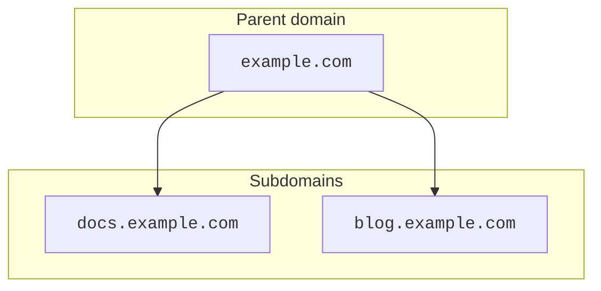

import { DirectoryListing, GlossaryTooltip, Render } from "~/components";

:::caution

Subdomain setup is only available for Enterprise accounts. If you only want to create a subdomain for your site in Cloudflare, refer to [Create a subdomain record](/dns/manage-dns-records/how-to/create-subdomain/).
:::

[Subdomain setup](/dns/zone-setups/subdomain-setup/) relies on a process known as delegation. When, in a parent domain such as `example.com`, an [NS record](https://www.cloudflare.com/learning/dns/dns-records/dns-ns-record/) is created for a subdomain `blog.example.com`, this means that DNS management for the subdomain can be done separately, in its own <GlossaryTooltip term="DNS zone" link="/dns/concepts/#zone">DNS zone</GlossaryTooltip>.

```mermaid
    flowchart TD
      accTitle: Example of parent zone and subdomains
      A[<code>example.com</code>] --> B[<code>docs.example.com</code>]
      A[<code>example.com</code>] --> C[<code>blog.example.com</code>]
      subgraph Parent domain
        A
      end
      subgraph Subdomains
        B
        C
      end

```

---

## Available setups

The availability of different setups will depend on both the parent zone setup and the setup used for the child zone. A child zone holds DNS management for a delegated subdomain.

| Parent zone                                                                                                   | Child zone                                                            | Available |
| ------------------------------------------------------------------------------------------------------------- | --------------------------------------------------------------------- | --------- |
| [Full](/dns/zone-setups/full-setup/) or [Secondary](/dns/zone-setups/zone-transfers/cloudflare-as-secondary/) | [Full](/dns/zone-setups/full-setup/)                                  | Yes       |
| [Full](/dns/zone-setups/full-setup/) or [Secondary](/dns/zone-setups/zone-transfers/cloudflare-as-secondary/) | [Secondary](/dns/zone-setups/zone-transfers/cloudflare-as-secondary/) | Yes       |
| [Full](/dns/zone-setups/full-setup/) or [Secondary](/dns/zone-setups/zone-transfers/cloudflare-as-secondary/) | [Partial](/dns/zone-setups/partial-setup/)                            | No        |
| [Partial](/dns/zone-setups/partial-setup/)                                                                    | [Full](/dns/zone-setups/full-setup/)                                  | Yes       |
| [Partial](/dns/zone-setups/partial-setup/)                                                                    | [Secondary](/dns/zone-setups/zone-transfers/cloudflare-as-secondary/) | Yes       |
| [Partial](/dns/zone-setups/partial-setup/)                                                                    | [Partial](/dns/zone-setups/partial-setup/)\*                          | Yes       |

:::caution[* Subdomain zones in partial setup are not delegated]

Subdomains using a partial setup represent an exception in the sense that delegation does not apply in this context. As explained in the dedicated [Partial (CNAME) setup section](/dns/zone-setups/partial-setup/), this setup is intended to simply proxy individual subdomains through Cloudflare. For completeness, however, this is listed as an option in this table and the [how-to guide](/dns/zone-setups/subdomain-setup/setup/parent-on-partial/) has detailed explanation on how to achieve a subdomain zone using partial setup.
:::

This table assumes zones that are in an [active status](/dns/zone-setups/reference/domain-status/). For example, if you need to add the parent zone to Cloudflare when its child zone already exists in a partial setup, you can [convert the parent zone to partial](/dns/zone-setups/partial-setup/setup/#1-convert-your-zone-and-review-dns-records) while it is still in pending status.

---

## How to

Refer to the following guides to learn how to configure a subdomain setup depending on the setup used for the parent zone:

<DirectoryListing />

Although the how-to guides in this documentation are focused on both parent domains and subdomains existing in Cloudflare, it is also possible to achieve a subdomain setup in Cloudflare while the parent domain exists in a different DNS provider.

---

## SSL/TLS certificates

:::note[Certificate Precedence]
If the **parent zone's** SSL/TLS certificate explicitly lists the delegated subdomain (e.g., `docs.example.com` on the `example.com` certificate) and is provisioned *after* the subdomain's own certificate, the **parent zone's certificate will take precedence**. This means visitors to the delegated subdomain might incorrectly see the parent domain's certificate.

To ensure the child zone's certificate is always used, **do not include the delegated subdomain hostname** in any certificate covering the parent zone.
:::

### Troubleshooting Certificate Validation

This section addresses common issues where Edge Certificate provisioning appears to be stuck or failing. In the context of Subdomain Setup, these failures are often **expected behaviors** due to conflicts in domain hierarchy and delegation.

* **Conflict 1: Active Child Zone Certificate Blocks Parent Zone Validation**
    If a certificate is already **active on the child zone** for a specific hostname (e.g., `subdomainA.example.com`), any certificate pack containing that exact hostname in the **parent zone** (e.g., for `example.com`) will **fail validation**.
    * **Why it happens:** This is the **expected behavior** to ensure the child zone's certificate takes precedence. The active certificate in the child zone prevents the parent zone from completing Domain Control Validation (DCV) for that specific hostname.

* **Conflict 2: Parent Zone Wildcard DNS Record Blocks Child Zone Validation**
    If a **wildcard DNS record** exists in the **parent zone** (e.g., `*.test.example.com`) that covers a hostname in the **child zone** (e.g., `subdomainA.test.example.com`), the Domain Control Validation (DCV) process for a certificate in the child zone will **fail**.
    * **Why it happens:** The wildcard record in the parent zone intercepts the DCV query, causing it to resolve against the parent zone's configuration instead of the child zone's, thus blocking validation.
    * **Resolution:** To successfully provision the certificate in the child zone, you must **pause or remove the conflicting wildcard DNS record** in the parent zone temporarily.

## Access applications

<Render file="subdomain-setup-access-apps" product="dns" />
