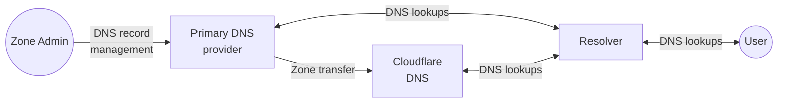

With incoming zone transfers, you can keep your primary DNS provider and use Cloudflare as a secondary DNS provider.

When you make edits in your primary DNS provider, those DNS records will be transferred from your primary DNS provider to Cloudflare via zone transfer using [AXFR](https://datatracker.ietf.org/doc/html/rfc5936) or [IXFR](https://datatracker.ietf.org/doc/html/rfc1995).

## How to

* [Set up incoming zone transfers](/dns/zone-setups/zone-transfers/cloudflare-as-secondary/setup/)
* Proxy traffic through Cloudflare with [Secondary DNS Override](/dns/zone-setups/zone-transfers/cloudflare-as-secondary/proxy-traffic/)

## Availability

Secondary DNS is only available to Enterprise customers. For more details on activation and pricing, contact your account team.

## Limitations

At this time, you cannot convert a secondary zone to a primary zone.
