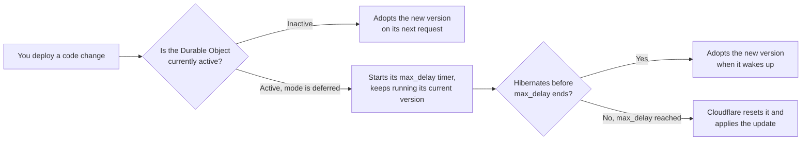

import { WranglerConfig, PackageManagers } from "~/components";

{/* TODO: Confirm the compatibility date and launch date before publication.
    TODO: Confirm the `code_update_strategy` REST API field name and shape with the EWC/API
    team. The engineering spec still calls this field `durable_objects_hibernation_timeout`
    and uses a duration string. This page follows Brendan Irvine-Broque's proposal instead
    (`code_update_strategy` with `mode` and `max_delay`). Update this page once the spec and
    schema catch up. */}

When you deploy new code, Cloudflare applies the update to every Durable Object it affects. By default, this happens immediately: Cloudflare resets each active Durable Object right away, which drops in-flight requests, closes WebSocket connections, and interrupts storage operations, because a Durable Object can only run one version of your code at a time.

Set a Durable Object's code update strategy to `deferred` to let an active object keep running its current code until it hibernates, instead of resetting it right away. Cloudflare still applies the update once the object hibernates, or once the strategy's maximum delay is reached, whichever comes first.

## Choose a code update strategy

| Mode        | Default `max_delay` | Behavior                                                                                                                                          |
| ----------- | -------------------- | ---------------------------------------------------------------------------------------------------------------------------------------------------- |
| `deferred`  | 30 seconds            | Cloudflare waits for an active Durable Object to hibernate before applying the update. If the object does not hibernate within `max_delay`, Cloudflare resets it and applies the update. |
| `immediate` | Not applicable        | Cloudflare resets an active Durable Object and applies the update right away, without waiting for it to hibernate.                                |

This is a breaking change to existing behavior, so Cloudflare rolls out `deferred` as the new default behind a compatibility date. If you don't set `code_update_strategy` yourself:

- Workers with a compatibility date **before** `COMPATIBILITY_DATE` default to `immediate`.
- Workers with a compatibility date **on or after** `COMPATIBILITY_DATE` default to `deferred` with a 30-second `max_delay`.

An explicit `code_update_strategy` — whether in your Wrangler configuration, passed as a flag, or sent through the REST API — always overrides the compatibility-date default.

## How it works

1. You deploy a code change.
2. A client makes a request to an inactive Durable Object, or creates a new Durable Object. This uses the latest version of your code.
3. Some Durable Objects are currently active — they are performing work or holding open connections. If their code update strategy is `deferred`, these objects continue running their existing version of your code. They keep handling requests, events, storage operations, and messages on WebSockets accepted with the [Hibernation API](/durable-objects/best-practices/websockets/#durable-objects-hibernation-websocket-api).
4. If an active Durable Object hibernates before `max_delay` is reached, Cloudflare applies the new version the next time that Durable Object "wakes up" in response to an incoming request or WebSocket message. Hibernated WebSocket connections stay connected throughout.
5. If a Durable Object is still active when `max_delay` is reached, Cloudflare resets it and applies the update.



Deploying again before an object hibernates does not restart or extend its `max_delay`. The object applies the latest deployed version once it hibernates or the original `max_delay` is reached, and it might skip versions you deployed in between.

## Configure a code update strategy

Add `code_update_strategy` alongside `bindings` in the `durable_objects` object of your [Wrangler configuration file](/workers/wrangler/configuration/#durable-objects):

<WranglerConfig>

```jsonc
{
	"durable_objects": {
		"bindings": [
			{
				"name": "CHAT_ROOM",
				"class_name": "ChatRoom",
			},
		],
		"code_update_strategy": {
			"mode": "deferred",
			"max_delay": 60,
		},
	},
}
```

</WranglerConfig>

`max_delay` is in seconds and only applies when `mode` is `deferred`. The maximum is `300` (five minutes). Omit `max_delay` to use the default for your compatibility date.

## What each configuration does

| `code_update_strategy`                                                    | Result                                                                                                                       |
| --------------------------------------------------------------------------- | ----------------------------------------------------------------------------------------------------------------------------- |
| *(omitted)*, compatibility date before `COMPATIBILITY_DATE`                 | Defaults to `immediate`.                                                                                                     |
| *(omitted)*, compatibility date on or after `COMPATIBILITY_DATE`            | Defaults to `deferred` with a 30-second `max_delay`.                                                                         |
| `{ "mode": "deferred" }`                                                     | Cloudflare waits up to the default `max_delay` (30 seconds) for the object to hibernate.                                     |
| `{ "mode": "deferred", "max_delay": 0 }`                                     | Valid, but Cloudflare waits zero seconds — behaves identically to `immediate`.                                               |
| `{ "mode": "deferred", "max_delay": 120 }`                                   | Cloudflare waits up to 120 seconds for the object to hibernate before applying the update.                                   |
| `{ "mode": "immediate" }`                                                    | Cloudflare applies the update immediately, without waiting for the object to hibernate.                                     |
| `{ "mode": "immediate", "max_delay": 60 }`                                   | **Invalid.** Wrangler and the REST API reject this configuration — `max_delay` has no effect when `mode` is `immediate`.     |

## Override the mode for one deployment

Use the flag when a single deployment needs different behavior than your checked-in Wrangler configuration — for example, applying an `immediate` update during an incident without editing and re-committing `code_update_strategy`. Pass `--durable-objects-code-update-mode` to `wrangler versions deploy` or `wrangler versions rollback` (or their `wrangler deploy` and `wrangler rollback` aliases) to override the configured mode for a single deployment:

<PackageManagers type="exec" pkg="wrangler" args="versions deploy <VERSION_ID>@100% --durable-objects-code-update-mode immediate" />

The flag accepts `deferred` or `immediate` and overrides only `mode`. To use a `max_delay` other than the default, set `code_update_strategy` in your Wrangler configuration or in the REST API request instead — the flag does not accept `max_delay`.

Wrangler resolves `mode` in this order:

1. The `--durable-objects-code-update-mode` flag.
2. `durable_objects.code_update_strategy.mode` in your Wrangler configuration.
3. The default for your compatibility date.

## Use the REST API

Add `code_update_strategy` to a [Create deployment](/api/resources/workers/subresources/scripts/subresources/deployments/methods/create/) request. This field belongs to the deployment, not the Worker version.

```bash
curl "https://api.cloudflare.com/client/v4/accounts/$ACCOUNT_ID/workers/scripts/$SCRIPT_NAME/deployments" \
  --request POST \
  --header "Authorization: Bearer $CLOUDFLARE_API_TOKEN" \
  --header "Content-Type: application/json" \
  --data '{
    "strategy": "percentage",
    "versions": [
      {
        "version_id": "f3b5b2d2-75d6-4c3f-ae3d-4df2f9cfeb7a",
        "percentage": 100
      }
    ],
    "code_update_strategy": {
      "mode": "deferred",
      "max_delay": 60
    }
  }'
```

Cloudflare returns the effective strategy in create, get, and list deployment responses, including the compatibility-date default when you omit the field:

```json
{
	"result": {
		"id": "184e7530-050e-4a03-8d9f-8f391fb4f204",
		"code_update_strategy": {
			"mode": "deferred",
			"max_delay": 30
		}
	},
	"success": true,
	"errors": [],
	"messages": []
}
```

To apply an update immediately through the REST API, set `"code_update_strategy": { "mode": "immediate" }`.

Use `GET /accounts/{account_id}/workers/scripts/{script_name}/deployments/{deployment_id}` to check the strategy Cloudflare applied to one deployment, or `GET /accounts/{account_id}/workers/scripts/{script_name}/deployments` to list deployment history.

:::note
The REST API field name above reflects the proposed naming and is not yet final. Check back here or in the [API reference](/api/resources/workers/subresources/scripts/subresources/deployments/methods/create/) before you build automation against it.
:::

## Apply an update immediately

Set `code_update_strategy` to `{ "mode": "immediate" }`, or pass `--durable-objects-code-update-mode immediate` for a single deployment, when waiting is worse than resetting. Common cases:

- You need to ship a correctness or security fix immediately, even if it interrupts active objects.
- Some of your objects rarely or never hibernate, and you need to force them onto new code, or reduce their duration costs, without waiting.

Cloudflare applies an `immediate` update without waiting for the Durable Object to hibernate.

## Gradual deployments

During a [gradual deployment](/workers/versions-and-deployments/gradual-deployments/with-durable-objects/), Cloudflare assigns each Durable Object to one of the versions in the deployment. Increasing a version's traffic percentage assigns more objects to that version. Only the newly assigned objects follow the mechanism described in [How it works](/durable-objects/deployments/durable-objects-code-updates/#how-it-works) above — for example, increasing a version's traffic percentage from 20% to 50% starts a `deferred` wait only for the additional 30% of objects newly assigned to it. Objects that already run that version, and objects still assigned to an earlier version, are not affected.

Different objects can be on different `max_delay` clocks at the same time. If a later progression uses a different code update strategy, that strategy applies only to the objects that progression reassigns.

Keep your Worker and Durable Object code forward and backward compatible for as long as any version might still be running, not just for the length of the deployment. Refer to [Code updates](/durable-objects/platform/known-issues/#code-updates).

## Limitations

- A `deferred` code update strategy is best-effort. Cloudflare does not guarantee that an object keeps running its current code for the entire `max_delay`.
- A `deferred` code update does not stop an object from accepting new requests, events, or storage operations while it waits to hibernate.
- An object that is still active when `max_delay` is reached resets the same way an `immediate` update does.
- A code update strategy does not delay restarts unrelated to code updates, such as process sandbox migrations, resource limits, or Workers runtime updates.
- A code update strategy does not make incompatible Worker and Durable Object versions safe to run together. Keep your interfaces forward and backward compatible across versions.

## Related resources

- [Lifecycle of a Durable Object](/durable-objects/concepts/durable-object-lifecycle/)
- [Gradual deployments with Durable Objects](/workers/versions-and-deployments/gradual-deployments/with-durable-objects/)
- [Code updates](/durable-objects/platform/known-issues/#code-updates)
- [Troubleshoot Durable Object resets](/durable-objects/observability/troubleshooting/#durable-object-reset-because-its-code-was-updated)
