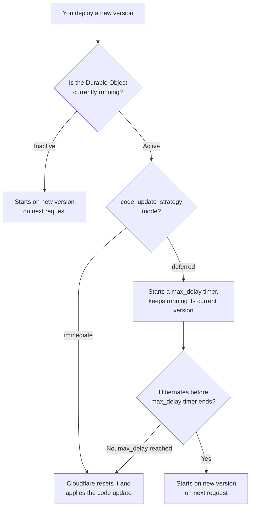

import { WranglerConfig, PackageManagers } from "~/components";

{/* TODO: Confirm the compatibility date and launch date before publication.
    TODO: Confirm the `code_update_strategy` REST API field name and shape with the EWC/API
    team. The engineering spec still calls this field `durable_objects_hibernation_timeout`
    and uses a duration string. This page follows Brendan Irvine-Broque's proposal instead
    (`code_update_strategy` with `mode` and `max_delay`). Update this page once the spec and
    schema catch up. */}

By default, Durable Objects delay applying Worker code deployments so in-flight requests can finish. Instead of resetting an active Durable Object immediately to apply a code update, Cloudflare applies the code update once the object is inactive (is hibernated).

Deploy a Worker with `durable-objects-code-update-strategy` set to `immediate` to apply a code update right away instead of waiting. Refer to [Lifecycle of a Durable Object](/durable-objects/concepts/durable-object-lifecycle/) for more on when an object hibernates.

## Code update strategy

| Mode        | Default `max_delay` | Behavior                                                                                                                                          |
| ----------- | -------------------- | ---------------------------------------------------------------------------------------------------------------------------------------------------- |
| `deferred`  | 30 seconds            | Cloudflare waits for an active Durable Object to hibernate before applying the update. If the object does not hibernate within `max_delay`, Cloudflare resets it and applies the update. |
| `immediate` | Not applicable        | Cloudflare resets an active Durable Object and applies the update right away, without waiting for it to hibernate.                                |

Durable Objects code update strategy depends on your Workers compatibility date:

- Workers with a compatibility date **before** `COMPATIBILITY_DATE` default to `immediate`.
- Workers with a compatibility date **on or after** `COMPATIBILITY_DATE` default to `deferred` with a 30-second `max_delay`.

An explicit `code_update_strategy` — whether in your Wrangler configuration, passed as a CLI flag, or sent through the REST API — always overrides the compatibility-date default.

## How it works

1. You deploy a new version to 100% of traffic.
2. A client makes a request to a Durable Object that is not running, either an inactive object or a new object. This uses the latest version of your code.
3. If a Durable Object is active with a `deferred` code update strategy, it keeps running its existing version and handling requests until it hibernates. If the object hibernates before `max_delay` is reached, Cloudflare applies the new version on next request. 
4. If the object is still active when `max_delay` is reached, Cloudflare resets it and applies the update.



Deploying again before an object hibernates does not extend its `max_delay` window — a later deploy can only shorten the remaining wait, never lengthen it. Whichever deploy's `max_delay` sets the deadline, the object always applies the *latest* deployed version when that deadline arrives, not necessarily the version that set it.

For example: you deploy version A with `max_delay: 30`. Ten seconds later, you deploy version B with `max_delay: 60` before the object hibernates. The deadline stays at 30 seconds from A's deploy — B's longer window doesn't extend it — but when that deadline arrives, Cloudflare resets the object and applies version B, the latest version, not A. The same is true if the object hibernates on its own before the deadline: it always wakes up running the latest deployed version.

This means an `immediate` deploy always forces the update right away, even while an earlier `deferred` deploy's window is still running, and it might skip versions you deployed in between.

## Configure a code update strategy

Configure `code_update_strategy` as a persistent default in your Wrangler configuration, or override it for a single deployment using the CLI flag or the REST API.

### Options

Add `code_update_strategy` alongside `bindings` in the `durable_objects` object of your [Wrangler configuration file](/workers/wrangler/configuration/#durable-objects):

<WranglerConfig>

```jsonc
{
	"durable_objects": {
		"bindings": [
			{
				"name": "CHAT_ROOM",
				"class_name": "ChatRoom",
			},
		],
		"code_update_strategy": {
			"mode": "deferred",
			"max_delay": 60,
		},
	},
}
```

</WranglerConfig>

`max_delay` is in seconds and only applies when `mode` is `deferred`. The maximum is `300` (five minutes). Omit `max_delay` to use the default for your compatibility date.

`code_update_strategy` applies to every Durable Object class this Worker exports and binds to — you can't set a different strategy for one class than another in the same deployment. If a binding uses `script_name` to reference a class defined in a different Worker, that class's code updates are controlled by that other Worker's own `code_update_strategy`, not this one.

### Set strategy for a single deployment

Use a single-deployment override when you need different behavior than your checked-in Wrangler configuration, without editing and re-committing it.

Pass `--durable-objects-code-update-mode` to `wrangler versions deploy` or `wrangler versions rollback` (or their `wrangler deploy` and `wrangler rollback` aliases):

<PackageManagers type="exec" pkg="wrangler" args="versions deploy <VERSION_ID>@100% --durable-objects-code-update-mode immediate" />

The flag overrides only `mode`. `max_delay` is set only through your Wrangler configuration or the REST API.

Wrangler resolves `mode` in this order:

1. The `--durable-objects-code-update-mode` flag.
2. `durable_objects.code_update_strategy.mode` in your Wrangler configuration.
3. The default for your compatibility date.

To set a strategy through the REST API instead, add `code_update_strategy` to a [Create deployment](/api/resources/workers/subresources/scripts/subresources/deployments/methods/create/) request. This field belongs to the deployment, not the Worker version:

```bash
curl "https://api.cloudflare.com/client/v4/accounts/$ACCOUNT_ID/workers/scripts/$SCRIPT_NAME/deployments" \
  --request POST \
  --header "Authorization: Bearer $CLOUDFLARE_API_TOKEN" \
  --header "Content-Type: application/json" \
  --data '{
    "strategy": "percentage",
    "versions": [
      {
        "version_id": "f3b5b2d2-75d6-4c3f-ae3d-4df2f9cfeb7a",
        "percentage": 100
      }
    ],
    "code_update_strategy": {
      "mode": "deferred",
      "max_delay": 60
    }
  }'
```

Cloudflare returns the effective strategy in create, get, and list deployment responses, including the compatibility-date default when you omit the field:

```json
{
	"result": {
		"id": "184e7530-050e-4a03-8d9f-8f391fb4f204",
		"code_update_strategy": {
			"mode": "deferred",
			"max_delay": 30
		}
	},
	"success": true,
	"errors": [],
	"messages": []
}
```

Use `GET /accounts/{account_id}/workers/scripts/{script_name}/deployments/{deployment_id}` to check the strategy Cloudflare applied to one deployment, or `GET /accounts/{account_id}/workers/scripts/{script_name}/deployments` to list deployment history.

:::note
The REST API field name above reflects the proposed naming and is not yet final. Check back here or in the [API reference](/api/resources/workers/subresources/scripts/subresources/deployments/methods/create/) before you build automation against it.
:::

A single-deployment override is most useful when waiting is worse than resetting. For example, set `code_update_strategy` to `{ "mode": "immediate" }` (or pass `--durable-objects-code-update-mode immediate`) when:

- You need to ship a correctness or security fix immediately, even if it interrupts active objects.
- Some of your objects rarely or never hibernate, and you need to force them onto new code, or reduce their duration costs, without waiting.

## What each configuration does

| `code_update_strategy`                                                    | Result                                                                                                                       |
| --------------------------------------------------------------------------- | ----------------------------------------------------------------------------------------------------------------------------- |
| *(omitted)*, compatibility date before `COMPATIBILITY_DATE`                 | Defaults to `immediate`.                                                                                                     |
| *(omitted)*, compatibility date on or after `COMPATIBILITY_DATE`            | Defaults to `deferred` with a 30-second `max_delay`.                                                                         |
| `{ "mode": "deferred" }`                                                     | Cloudflare waits up to the default `max_delay` (30 seconds) for the object to hibernate.                                     |
| `{ "mode": "deferred", "max_delay": 0 }`                                     | Valid, but Cloudflare waits zero seconds — behaves identically to `immediate`.                                               |
| `{ "mode": "deferred", "max_delay": 120 }`                                   | Cloudflare waits up to 120 seconds for the object to hibernate before applying the update.                                   |
| `{ "mode": "immediate" }`                                                    | Cloudflare applies the update immediately, without waiting for the object to hibernate.                                     |
| `{ "mode": "immediate", "max_delay": 60 }`                                   | **Invalid.** Wrangler and the REST API reject this configuration — `max_delay` has no effect when `mode` is `immediate`.     |

## Gradual deployments

During a [gradual deployment](/workers/versions-and-deployments/gradual-deployments/with-durable-objects/), Cloudflare assigns each Durable Object to one of the versions in the deployment. Increasing a version's traffic percentage assigns more objects to that version. Only the newly assigned objects follow the mechanism described in [How it works](/durable-objects/deployments/durable-objects-code-updates/#how-it-works) above — for example, increasing a version's traffic percentage from 20% to 50% starts a `max_delay` wait only for the additional 30% of objects newly assigned to it. Objects that already run that version are not affected.

Different objects can be on different `max_delay` clocks at the same time. If a later progression uses a different code update strategy, that strategy applies only to the objects that progression reassigns.

Keep your Worker and Durable Object code forward and backward compatible for as long as any version might still be running, not just for the length of the deployment. Refer to [Code updates](/durable-objects/platform/known-issues/#code-updates).

## Limitations

- A `deferred` code update strategy is best-effort. Cloudflare does not guarantee that an object keeps running its current code for the entire `max_delay`.
- A `deferred` code update does not stop an object from accepting new requests while it waits to hibernate.
- An object that is still active when `max_delay` is reached resets the same way an `immediate` update does.
- A code update strategy does not delay restarts unrelated to code updates, such as Workers runtime updates.
- A code update strategy does not make incompatible Worker and Durable Object versions safe to run together. Keep your interfaces forward and backward compatible across versions.

## Related resources

- [Lifecycle of a Durable Object](/durable-objects/concepts/durable-object-lifecycle/)
- [Gradual deployments with Durable Objects](/workers/versions-and-deployments/gradual-deployments/with-durable-objects/)
- [Code updates](/durable-objects/platform/known-issues/#code-updates)
- [Troubleshoot Durable Object resets](/durable-objects/observability/troubleshooting/#durable-object-reset-because-its-code-was-updated)
