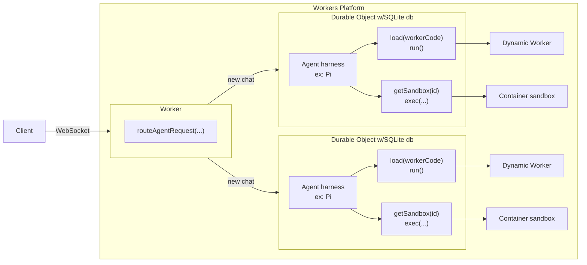

AI agents that generate and execute code need isolated sandboxes to run that code safely.

This example shows the core architecture pattern for building agents on Cloudflare, where each agent session runs in its own compute - an instance of a Durable Object - and Dynamic Workers are used as code sandboxes.



Each component in this architecture runs on the Workers platform. The following sections walk through each layer.

## Request routing

The Worker handles incoming connections and routes them to the correct Durable Object:

1. A client connects to the Worker over WebSocket.
2. The Worker calls `routeAgentRequest(request, env)` from the [Agents SDK](/agents/) to route the connection to the correct Durable Object instance.
3. Each chat session maps to a unique Durable Object instance, identified by name in the URL path (`/agents/:agent/:id`).

```ts
import { routeAgentRequest } from "agents";

export default {
  async fetch(request: Request, env: Env): Promise<Response> {
    return (
      (await routeAgentRequest(request, env)) ||
      new Response("Not found", { status: 404 })
    );
  },
};
```

## Per-chat Durable Object

Each chat gets its own Durable Object with a built-in SQLite database for persistent state. Message history, tool call results, and conversation metadata all live in this database and survive restarts.

The agent harness (for example, [Pi](https://github.com/badlogic/pi-mono/tree/main/packages/coding-agent#programmatic-usage)) runs within the Durable Object, not within the sandbox. When it needs to generate and then run code, it creates a Dynamic Worker on demand to run this untrusted code. The Agents SDK provides `AIChatAgent` as a base class that handles message persistence, streaming, and WebSocket communication automatically. For more information, refer to the [Chat agents](/agents/api-reference/chat-agents/) documentation.

The harness has access to both Dynamic Workers (`env.LOADER`) and Container sandboxes (`env.Sandbox`) through bindings, and can choose the right sandbox type for each task.

```ts
import { AIChatAgent } from "@cloudflare/ai-chat";

export class MyAgent extends AIChatAgent {
  async onChatMessage() {
    // Agent generates code and executes it in a sandbox
    const worker = this.env.LOADER.load({
      compatibilityDate: "2025-01-01",
      mainModule: "worker.js",
      modules: { "worker.js": generatedCode },
    });
    const result = await worker.getEntrypoint().fetch(
      new Request("http://sandbox/"),
    );
    // ... continue conversation with result
  }
}
```

## Dynamic Worker sandboxes

When the agent needs to execute generated code, it calls `env.LOADER.load(workerCode)` to spin up an isolated Dynamic Worker.

Each Dynamic Worker is a fresh V8 isolate with no shared memory, no access to the parent Worker's bindings, and no network access by default. The isolate is created, executes the code, and is discarded.

The `load()` method works well for one-off code execution — each call creates a new isolate. For repeated execution of the same code, `get(id, callback)` caches the isolate by ID. Refer to the [API reference](/dynamic-workers/api-reference/) for details on both methods.

```ts
const worker = env.LOADER.load({
  compatibilityDate: "2025-01-01",
  mainModule: "sandbox.js",
  modules: {
    "sandbox.js": userCode,
  },
  globalOutbound: null, // Block all network access
});

const response = await worker.getEntrypoint().fetch(
  new Request("http://sandbox/"),
);
```

### Network access

By default, Dynamic Workers have no network access. The `globalOutbound` option controls outbound connectivity:

- Set `globalOutbound` to `null` to block all `fetch()` and `connect()` calls from the sandbox.
- Provide an egress gateway Worker to intercept, audit, and filter outbound requests. The gateway can inject credentials, enforce allowlists, or log all traffic without exposing secrets to the sandbox.

```ts
const worker = env.LOADER.load({
  compatibilityDate: "2025-01-01",
  mainModule: "sandbox.js",
  modules: { "sandbox.js": userCode },
  globalOutbound: null, // No network access
});
```

For more information, refer to [Egress control](/dynamic-workers/usage/egress-control/).

### Custom bindings

The `env` field in the `WorkerCode` object passes RPC bindings into the sandbox. Each binding is a `WorkerEntrypoint` class that defines the exact API surface available to the sandbox. The sandbox never sees the parent Worker's bindings directly — it only gets the capabilities you explicitly grant.

For example, you can give a sandbox a `CHAT_ROOM` binding that allows posting messages to a specific room, without exposing the underlying API key or giving access to other rooms.

For more information, refer to [Bindings](/dynamic-workers/usage/bindings/).

## Container sandboxes

For workloads that require a full operating system, file system access, or long-running processes, [Container sandboxes](/sandbox/) provide an alternative execution environment. Container sandboxes run full Linux environments with pre-installed runtimes like Python and Node.js.

The agent harness can use both sandbox types within the same Durable Object — Dynamic Workers for lightweight, millisecond-startup code execution and Container sandboxes for heavier workloads. For more information, refer to the [Sandbox SDK documentation](/sandbox/).

## Related resources

- [Dynamic Workers: Getting started](/dynamic-workers/getting-started/)
- [Dynamic Workers: API reference](/dynamic-workers/api-reference/)
- [Agents SDK](/agents/)
- [Codemode](/agents/api-reference/codemode/)
- [Sandbox SDK](/sandbox/)
- [Egress control](/dynamic-workers/usage/egress-control/)
- [Bindings](/dynamic-workers/usage/bindings/)
