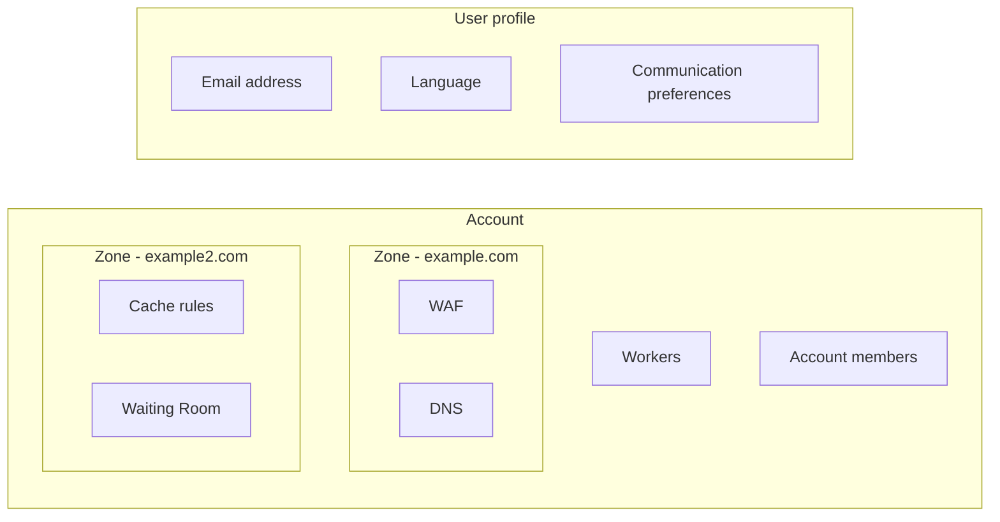

Within the Cloudflare ecosystem, there are three organizing concepts that control where specific settings live: user profiles, accounts, and zones.

***

## User profiles

Each user has a profile that contains several settings, such as [Communication preferences](/fundamentals/setup/account/customize-account/communication-preference/) and [Language preferences](/fundamentals/setup/account/customize-account/language-preference/).

### Navigation

To access your profile, select the user icon and then **My Profile** from any page within the [Cloudflare dashboard](https://dash.cloudflare.com).

***

## Accounts

An account refers to an organization account. Accounts contain one or more users and can contain one or more zones. A user can be part of one or more accounts.

There are also several account-level products - such as [Workers](/workers/), [Pages](/pages/), [Security Center](/security-center/), and [Bulk redirects](/rules/url-forwarding/bulk-redirects/) - that can affect some or all zones contained within that account.

After you [log in](https://dash.cloudflare.com) and select an account - but before you select a zone - the sidebar will list account-level products.

Accounts also have their own settings, including [account billing profiles](/fundamentals/subscriptions-and-billing/create-billing-profile/), [account members](/fundamentals/setup/manage-members/), [lists](/waf/tools/lists/), and more.

### Navigation

When you log into the [Cloudflare dashboard](https://dash.cloudflare.com), you can access all accounts where your user is a member.

To access account settings and account-level products from within a zone, use the **Account Home** option from the **Profile** dropdown.

You can also use the back button near the zone name.

***

## Zones

Domains (or [subdomains](/dns/zone-setups/subdomain-setup/)) that are added to Cloudflare become zones[^1], which have a direct impact on the security and performance of your website, application, or API. Use your zone to monitor security and performance, update configurations, and apply zone-level products and services.

Zone-level services - such as [Load Balancers](/load-balancing/) and [Cache rules](/cache/how-to/cache-rules/) - only affect your website, application, or API for that zone and not other zones, even if they are contained within the same account.

### Navigation

When you log into the [Cloudflare dashboard](https://dash.cloudflare.com) and choose an account, there will be a list of all zones within that account.

Once you are within a zone, items within the sidebar will be zone-related products.

If you need to change to another zone, use the forward arrow next to the zone name or by go back to the homepage of your account.

[^1]: Similar to [DNS zones](https://www.cloudflare.com/learning/dns/glossary/dns-zone/), but with additional capabilities.
