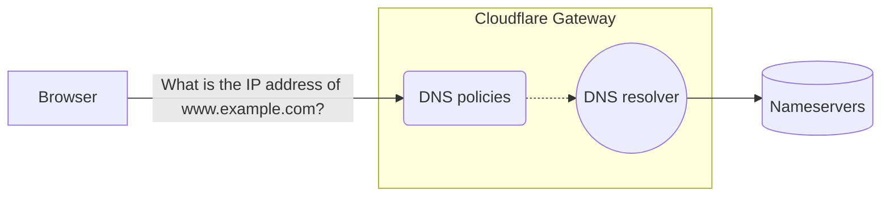
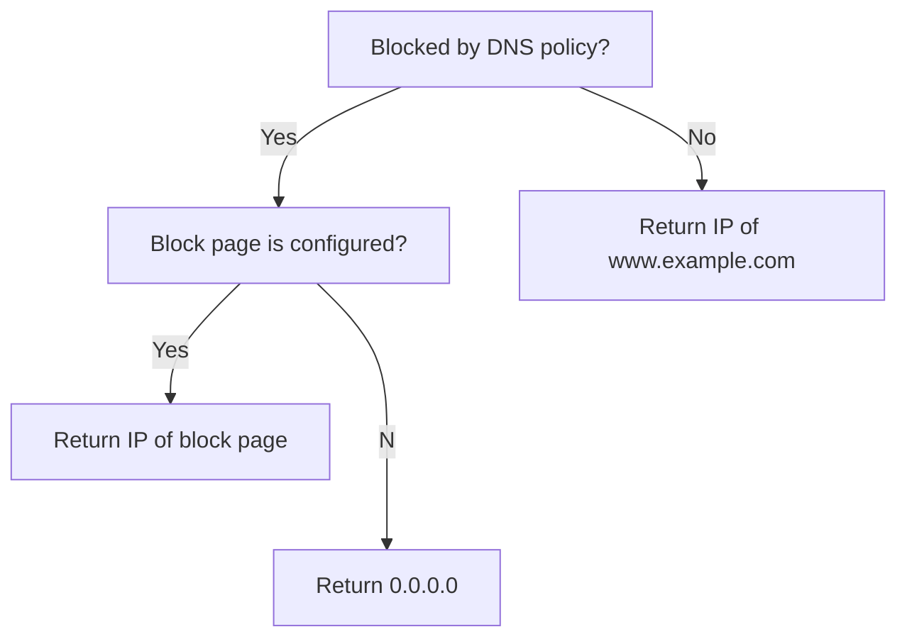

DNS filtering is a technique to block access to websites or online content. DNS filtering is implemented by specialized DNS resolvers (such as Cloudflare Gateway) that allow you to define a blocklist of domains or content categories. The DNS resolver acts as a filter by refusing to resolve queries for domains on the blocklist, thus preventing users from loading those websites.

## Purpose of DNS filtering

DNS filtering is commonly used to:

* Protect school data from phishing, ransomware, and malware.
* Block websites that go against school acceptable use policy, such as adult content, gambling, and piracy.
* Restrict access to websites that may impact student productivity, such as gaming, social media, and video streaming.

## How DNS filtering works

DNS filtering involves configuring your browser, device, or router to send all DNS requests to a DNS filtering service. The DNS filtering service checks the domain or IP against your DNS policies. If the domain or IP matches a block policy, the DNS filtering service can redirect the request to an alternative IP address or block it altogether. The diagram below shows the logic for Cloudflare Gateway's DNS filtering service.

## DNS filtering vs. Secure Web Gateway

A URL assumes the form: `protocol://subdomain.domain.tld:port/path?query`

DNS filtering only applies to the hostname — `subdomain.domain.tld`. You cannot block specific protocols, ports, paths, or query types. Additionally, users can bypass DNS policies if they already know the IP address of the website, or by connecting through a Virtual Private Network (VPN) or proxy server.

Secure Web Gateways (SWGs) offer a greater set of capabilities, including:

* [URL filtering](https://www.cloudflare.com/learning/access-management/what-is-url-filtering/) to block specific paths and queries
* L4 firewalls to block ports and protocols
* Antivirus scanning
* [Data loss prevention](https://www.cloudflare.com/learning/access-management/what-is-dlp/)
* [Browser isolation](https://www.cloudflare.com/learning/access-management/what-is-browser-isolation/)

However, this can make SWGs more complex to deploy. Therefore, many organizations will start with DNS filtering as an initial layer of defense against Internet threats.

## Related resources

* For more background information on DNS filtering, refer to our [Learning Center](https://www.cloudflare.com/learning/access-management/what-is-dns-filtering/).

## Next steps

In the remaining modules, you will learn how to set up DNS filtering on your devices using Cloudflare Gateway.
