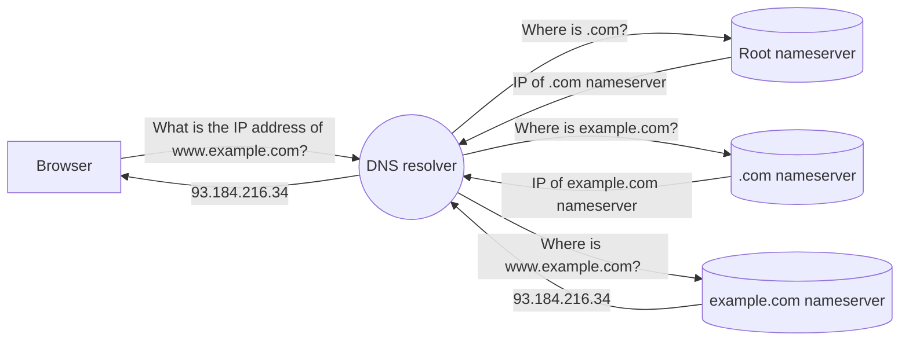

The Domain Name System (DNS) is the phonebook of the Internet. DNS translates the domain name that you type in the browser (such as `www.example.com`) to a computer-friendly IP address (`93.184.216.34`), similar to how a phonebook translates a person's name to a phone number. The IP address identifies the server where the website data is stored, allowing the browser to contact the server and load the page.

## Life of a DNS query

The process of translating a domain to an IP address is known as a DNS lookup. DNS lookups are performed by dedicated servers called DNS resolvers. Your Wi-Fi router is typically preconfigured to send DNS queries to the resolver owned by your ISP. However, you can choose to configure your router, operating system, or browser to use a different resolver. Some examples of free, public DNS resolvers include Cloudflare 1.1.1.1, Google 8.8.8.8, and OpenDNS.

As shown in the diagram below, the DNS resolver contacts a series of nameservers (where DNS records are stored) to track down the requested IP address. The resolver analyzes the domain in reverse, starting from the top-level domain (`.com`) and ending with the subdomain (`www`). The final nameserver in the DNS lookup, called the authoritative nameserver, contains the desired IP address. The concept is similar to how the post office delivers a package — first routing it to the correct country, then to the correct state, city, street and so forth until it arrives at your home address.

## Related resources

For more background information on DNS, refer to our [Learning Center](https://www.cloudflare.com/learning/dns/what-is-dns/).
