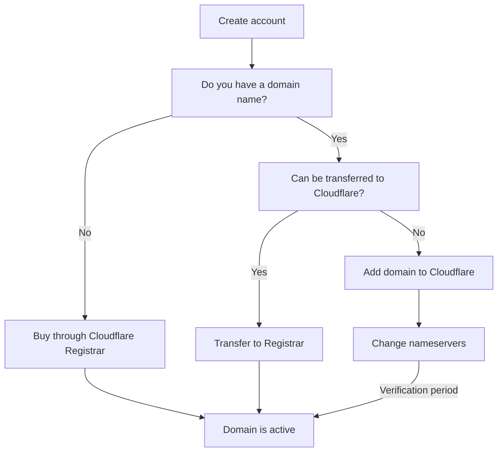

import { Render } from "~/components"

For most customers, adding and activating your domain on Cloudflare is straightforward.

The first step is always the same, to [create a Cloudflare account](/fundamentals/setup/account/create-account/).

Your next steps depend on whether you have a domain name, such as `example.com`.

## No domain

If you do not already have a domain name, purchase one through [Cloudflare Registrar](/registrar/get-started/register-domain/).

Registrar simplifies your Cloudflare setup - and is often cheaper than other registrars - so it is our recommended option for most customers.

## Existing domain

### Transfer to Cloudflare

If you already have a domain, the easiest way to get set up with Cloudflare is to [transfer your domain](/registrar/get-started/transfer-domain-to-cloudflare/) to Cloudflare Registrar. Just like with buying a domain name through Cloudflare, this option simplifies your Cloudflare setup.

:::note

`.uk` domains work too, just with a [slightly different setup](/registrar/top-level-domains/uk-domains/).

:::

### Keep current registrar

If you cannot transfer your domain or want to keep your current registrar, your setup has a few more steps:

1. [Add your site](/fundamentals/setup/manage-domains/add-site/).
2. (*Optional*) If your domain is sensitive to downtime, you may have a [few additional steps](/fundamentals/basic-tasks/minimize-downtime/).
3. At your registrar (where you bought your domain name), disable DNSSEC.   <Render file="dnssec-providers" product="dns" />
4. (*For some*) At your origin server, [allow Cloudflare IP addresses](/fundamentals/concepts/cloudflare-ip-addresses/).
5. Change your [domain nameservers](/dns/zone-setups/full-setup/setup/).
6. Wait for your domain to become [Active](/dns/zone-setups/reference/domain-status/) on Cloudflare.

### Troubleshooting

If you have issues activating your domain on Cloudflare, refer to our troubleshooting guides on [adding sites to Cloudflare](/dns/zone-setups/troubleshooting/cannot-add-domain/) and [changing nameservers](/dns/zone-setups/full-setup/troubleshooting/).
