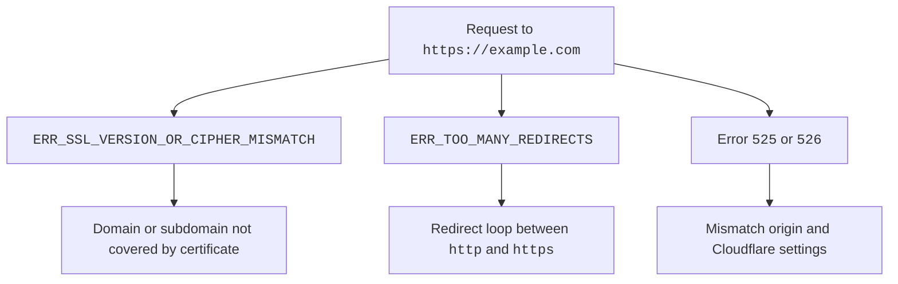

import { Details, Render } from "~/components";

Once you [add and activate](/learning-paths/get-started-free/onboarding/add-and-activate/) your domain at Cloudflare, you also should check your domain's SSL/TLS certificate is working correctly.

SSL/TLS certificates let websites use `https` at the start of the URL (instead of `http`), which is a more secure connection protocol. HTTPS is good for website security, user privacy, SEO, and much more.

For more details on SSL/TLS, refer to the [Learning Center](https://www.cloudflare.com/learning/ssl/what-is-ssl/).

By default, Cloudflare issues — and renews — free, unshared, publicly trusted **Universal SSL** certificates to all domains added to and activated on Cloudflare.

<Render file="universal-ssl-enable-full" product="ssl" />

## Can you visit your website?

To make sure your website's SSL/TLS is working correctly, try visiting your website over an HTTPS connection (where you specify the `https://` at the beginning of the URL, like `https://example.com`).

If you have any deeper subdomains (`test.www.example.com`), also try visiting those over HTTPS (`https://test.www.example.com`).

### Potential issues

Sometimes, domains added to Cloudflare can experience issues in SSL/TLS certificates.

 

For more details on these errors and how to fix them, refer to the following resources:

- [`ERR_SSL_VERSION_OR_CIPHER_MISMATCH`](/ssl/troubleshooting/version-cipher-mismatch/)
- [`ERR_TOO_MANY_REDIRECTS`](/ssl/troubleshooting/too-many-redirects/)
- [Cloudflare 5xx errors](/support/troubleshooting/cloudflare-errors/troubleshooting-cloudflare-5xx-errors/)
- [Common SSL/TLS errors](/ssl/troubleshooting/general-ssl-errors/)
- [Universal SSL/TLS certificates](/ssl/edge-certificates/universal-ssl/)
- [Cloudflare encryption modes](/ssl/origin-configuration/ssl-modes/)
