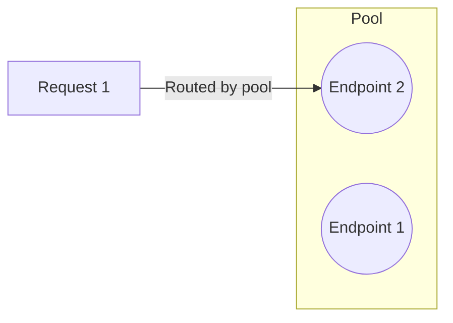

import { Render } from "~/components"

At it's most basic, load balancing is made up of three components:

* **Pools**: Which contain one or more endpoints.
* **Endpoints**: Which respond to individual requests.
* **A load balancer**: Which decides which traffic goes to each pool.

## How it works

Normally, requests to your application would go to individual servers directly.

With a load balancer, requests first go through the load balancer. Your load balancer then routes requests to specific pools.

<Render file="load-balancing-diagram" product="load-balancing" />  

Within each pool, requests then go to individual endpoints. And that endpoint is what responds to the request.

 

This progression of load balancer --> pool --> endpoint is the core part of how a load balancer works.
