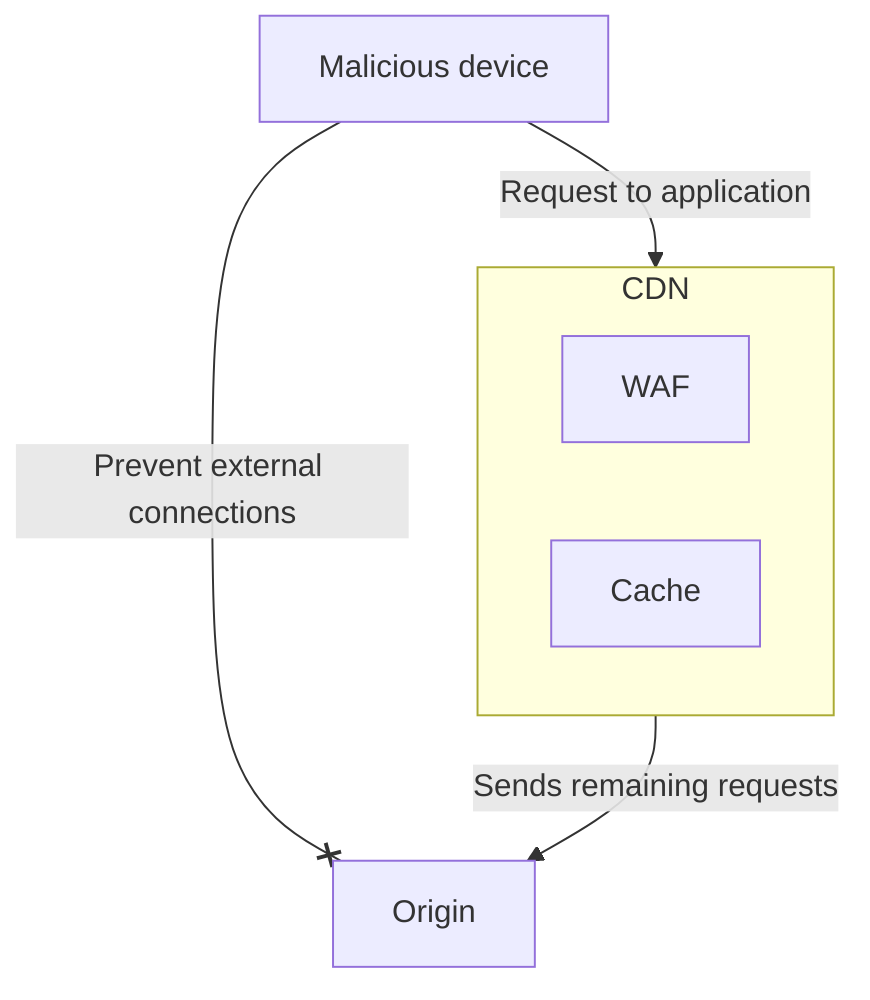
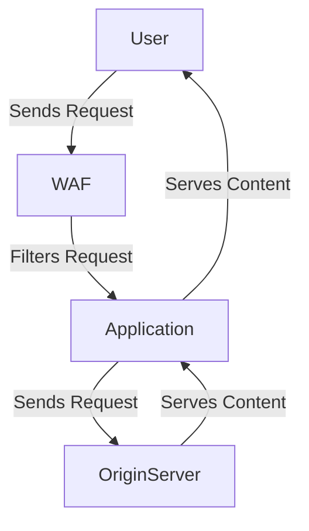
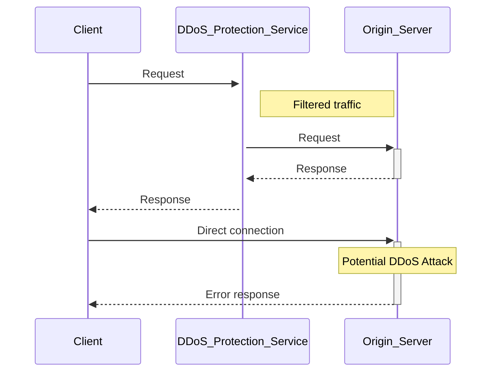

import { Render } from "~/components"

Since DDoS attacks target your web servers, the way to prevent them is to reduce requests reaching those servers.

 

Requests can come to your origin server in two ways, from your web application and from direct connections to the server itself.

***

## Reduce application requests to the origin

### Caching

A cache stores copies of frequently accessed resources (images, CSS files).

When a resource is cached - either on a user's browser or Content Delivery Network (CDN) server - requests for that resource do not have to go to your origin server. Instead, these resources are served directly by the cache.

<Render file="cache-basic-diagram" />  

In the context of DDoS attacks, caching reduces the number of requests going to your origin server, which makes it harder for your server to get overwhelmed by traffic.

### Web Application Firewall (WAF)

A Web Application Firewall (WAF) creates a shield between a web app and the Internet. This shield checks incoming web requests and filters undesired traffic to help mitigate many common attacks.

## Prevent external connections

Generally, your origin server should only accept requests coming from your web application.

This is a general best practice for security, but especially important in the context of DDoS attacks. Any traffic that bypasses your web application will also bypass any WAF or caching and has a stronger chance of overwhelming your origin.

