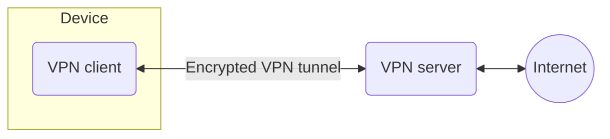

A virtual private network (VPN) is an Internet security service that allows users to access the Internet as though they were connected to a private network. This encrypts Internet communications and provides a strong degree of anonymity. Some of the most common reasons people use VPNs are to protect against snooping on public WiFi, to circumvent Internet censorship, or to connect to a business’s internal network for the purpose of remote work.

## Why use a VPN

Ordinarily, most Internet traffic is unencrypted and very public. When a user creates an Internet connection, such as visiting a website in a browser, the user’s device will connect to their Internet Service Provider (ISP). The ISP will then connect to the Internet to find the appropriate web server to communicate with to fetch the request website.

Information about the user is exposed in every step of the website request. Since the user’s IP address is exposed throughout the process, the ISP and any other intermediary can keep logs of the user’s browsing habits. Additionally, the data flowing between the user’s device and the web server is unencrypted; this creates opportunities for malicious actors to spy on the data or perpetrate attacks on the user, such as an [on-path attack](https://www.cloudflare.com/learning/security/threats/on-path-attack/).

## How a VPN works

A user connecting to the Internet using a VPN service has a higher level of security and privacy.

A VPN connection involves the following four steps:

1. The VPN client connects to the ISP using an encrypted connection.
2. The ISP connects the VPN client to the VPN server, maintaining the encrypted connection.
3. The VPN server decrypts the data from the user’s device and then connects to the Internet to access the web server in an unencrypted communication.
4. The VPN server creates an encrypted connection with the client, known as a VPN tunnel.

The VPN tunnel between the VPN client and VPN server passes through the ISP, but since all the data is encrypted, the ISP cannot see the user’s activity. The VPN server’s communications with the Internet are unencrypted, but the web servers will only log the IP address of the VPN server, which gives them no information about the user.
