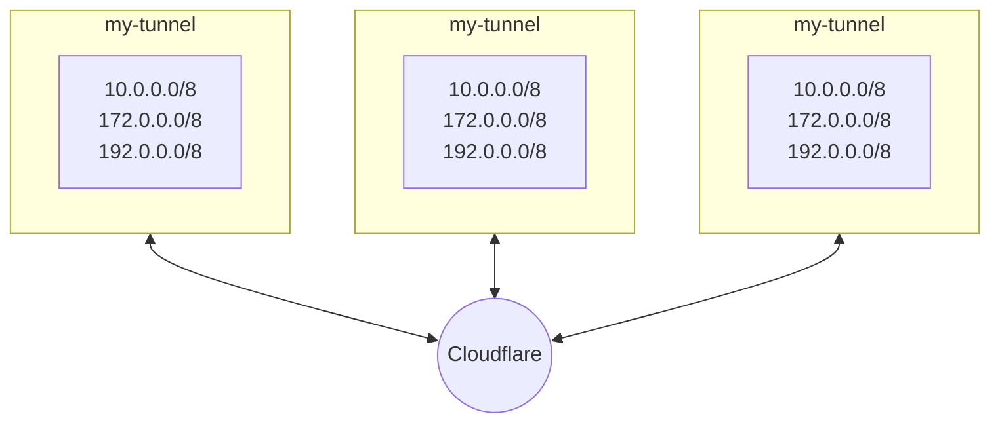
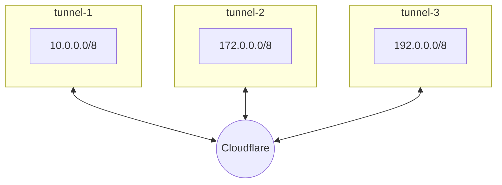

import { Render } from "~/components"

Now that you have a Cloudflare Tunnel up and running, evaluate whether `cloudflared` has enough system resources to handle the expected volume of requests from end users. <Render file="tunnel/tunnel-capacity-intro" product="cloudflare-one" />
If you have exhausted the ports on a single machine, you will need to add additional servers running `cloudflared`.

## Size the tunnel

To determine how many `cloudflared` host servers you need:

1. Start with our baseline recommendations: <Render file="tunnel/tunnel-capacity-baseline" product="cloudflare-one" />

2. After you have completed this learning path and have users actively engaging with the network, [calculate](/cloudflare-one/connections/connect-networks/deploy-tunnels/system-requirements/#calculate-your-tunnel-capacity) your actual tunnel usage.

3. Decide how much headroom you want to include and [resize the tunnel](#scale-the-tunnel) if needed.

## Scale the tunnel

There are two ways to scale Cloudflare Tunnel: you could either add additional replicas of the existing tunnel (Figure 1), or you could divide your network's IP space across multiple tunnels (Figure 2).

### When to add replicas

Adding additional [replicas](/cloudflare-one/connections/connect-networks/deploy-tunnels/deploy-cloudflared-replicas/#cloudflared-replicas) of an existing Cloudflare Tunnel (two is the baseline recommendation) should only be done to support additional traffic to the IP routes in the tunnel. Replicas should always be added in the same physical location as one another so that they can operate in a pooled mode. If you are considering adding a replica in a different geographic location, reevaluate the network proxy design for your Cloudflare Tunnel and refer to [When to add tunnels](#when-to-add-tunnels).

### When to add tunnels

#### Servers in different locations

Consider creating brand new tunnels when your network is dispersed across different geographic locations. For example, assume that the network represented by `10.0.0.0/8` is almost entirely contiguous in Eastern United States, with one non-overlapping exception for `10.0.50.0/24` served out of the Pacific Northwest. Rather than serve an additional replica from the Pacific Northwest, we recommend breaking out `10.0.50.0/24` into a separate Cloudflare Tunnel. Serve this new tunnel from a host machine near the Pacific Northwest with its own balanced replica implementation.

:::note

If you add the `10.0.50.0/24` range to a new tunnel without removing it from your existing `10.0.0.0/8` tunnel, Cloudflare will automatically default to the most specific path for user traffic. In other words, all traffic to `10.0.50/0/24` will flow through the newly created tunnel even though both tunnels technically include that route. 
:::

#### Servers in same location

Even if all routes in your network are served from the same physical location, it may eventually make sense from a control-plane redundancy perspective to split up the network into separate tunnels rather than add replicas.

For instance, if you proxy the ranges `10.0.0.0/8`, `172.0.0.0/8`, and `192.0.0.0/8` from a single tunnel with multiple replicas, you may reach a point of port exhaustion with respect to the traffic flowing through the multitude of networks. It may make sense to break out `10.0.0.0/8`, `172.0.0.0/8`, and `192.0.0.0/8` into their own independent tunnels, each with their own replica. Alternatively, you could find specific applications or functions (like DNS servers or other functions that generate a high volume of independent traffic) and break them out into standalone tunnels with properly rated throughput and replica volume.
