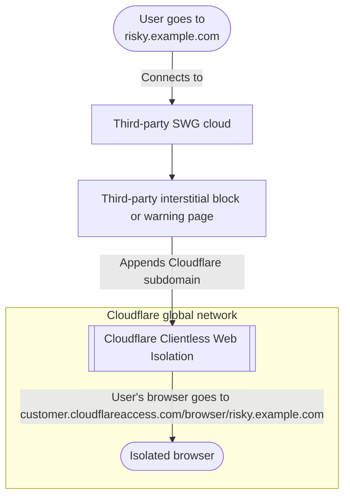

import { GlossaryDefinition, TabItem, Tabs } from "~/components";

<GlossaryDefinition term="Cloudflare Browser Isolation" />

Browser Isolation provides unique and transparent protection for your users using methods that surpass the capabilities of a traditional secure web gateway. This section focuses primarily on Browser Isolation for external services, assuming that most traffic from a device or a network is being forwarded to Cloudflare. For other applications of Browser Isolation, refer to the [Zero Trust Web Access (ZTWA) learning path](/learning-paths/zero-trust-web-access/).

As a note, Cloudflare's Browser Isolation technology was built to be used for 100% of your user's daily browsing. These recommendations do not suggest that you should limit or be cautious with your use of Browser Isolation, but instead help identify practical outcomes that balance technology with actualized security benefits.

## Get the most out of Browser Isolation

If your organization is interested in implementing Browser Isolation, there are a few methods that Cloudflare recommends exploring.

### Block copy, paste, and upload/download for shadow IT

As you have begun deploying Cloudflare Zero Trust, you may have started to visualize user traffic patterns using [Shadow IT Discovery](/cloudflare-one/insights/analytics/access/). This feature gives you visibility into detected SaaS applications that your users use. Administrators can categorize applications and services on the basis of proper organizational use. If you do not use Shadow IT Discovery and instead maintain a similar list manually or with other tools, you can port that data into a [Zero Trust list](/learning-paths/secure-internet-traffic/understand-policies/create-list/), update it via the API, and achieve the same outcomes.

You can control potential risk and shape user behavior without applying heavy-handed block policies by applying policies to isolate user traffic to applications that match your defined categories. You can then set additional parameters in the policy, such as the ability to restrict copy/paste and upload/download. Users can still access information in the tools -- if not use the tools to a lesser extent -- while you minimize the risk of data loss.

<Tabs syncKey="dashPlusAPI"> <TabItem label="Dashboard">

1. In [Zero Trust](https://one.dash.cloudflare.com/), go to **Gateway** > **Firewall policies**.

2. In the **HTTP** tab, select **Add a policy**.

3. Name the policy.

4. In **Traffic**, add the following expression:

   | Selector | Operator | Value       | Action  |
   | -------- | -------- | ----------- | ------- |
   | Host     | in list  | _Shadow IT_ | Isolate |

5. In **Configure policy settings**, turn on the following options:

   - _Disable copy / paste_
   - _Disable file downloads_
   - _Disable file uploads_

6. Select **Create policy**.

</TabItem> <TabItem label="API">

```bash
curl https://api.cloudflare.com/client/v4/accounts/{account_id}/gateway/rules \
--header "X-Auth-Email: <EMAIL>" \
--header "X-Auth-Key: <API_KEY>" \
--header "Content-Type: application/json" \
--data '{
  "action": "isolate",
  "description": "Block copy, paste, and upload/download for shadow IT",
  "enabled": true,
  "filters": [
    "http"
  ],
  "name": "Block shadow IT interaction",
  "precedence": 0,
  "traffic": "http.request.host in <SHADOW_IT_LIST_UUID>",
  "rule_settings": {
    "block_page_enabled": false,
    "block_reason": "",
    "override_ips": null,
    "override_host": "",
    "l4override": null,
    "biso_admin_controls": {
      "dp": false,
      "dcp": true,
      "dd": true,
      "du": true,
      "dk": false,
      "dcr": false
    }
  }
}'
```

</TabItem> </Tabs>

### Isolate all "gray-listed" traffic

A common method for using Browser Isolation to protect against unknown or zero-day threats can dramatically enhance your security posture: Separate all HTTP traffic into known acceptable, known malicious, and unknown buckets. Once your sort your traffic, isolate everything in the unknown bucket.

You can accomplish this by creating the following policies:

- Explicit allow policies for all of your known applications and trusted websites using either Cloudflare application definitions or a list
- Explicit block policies for all security risks, known malicious traffic, and against-acceptable-use intentional denies
- A policy to isolate all other traffic in this middle

In this context, if some traffic is unknown to your organization, Cloudflare will isolate it by default. Cloudflare will also prevent any malicious code from being executed client side, with additional controls available.

<Tabs syncKey="dashPlusAPI"> <TabItem label="Dashboard">

- Allow known applications and websites:

  | Selector | Operator | Value           | Action |
  | -------- | -------- | --------------- | ------ |
  | Domain   | in list  | _Known Domains_ | Allow  |

- Block security risks:

  | Selector       | Operator | Value                | Action |
  | -------------- | -------- | -------------------- | ------ |
  | Security Risks | in       | _All Security Risks_ | Block  |

- Isolate all other traffic:

  | Selector | Operator      | Value | Action  |
  | -------- | ------------- | ----- | ------- |
  | Host     | matches regex | `.*`  | Isolate |

</TabItem> <TabItem label="API">

```bash title="Allow known applications and websites"
curl https://api.cloudflare.com/client/v4/accounts/{account_id}/gateway/rules \
--header "X-Auth-Email: <EMAIL>" \
--header "X-Auth-Key: <API_KEY>" \
--header "Content-Type: application/json" \
--data '{
  "action": "isolate",
  "description": "Allow known applications and websites",
  "enabled": true,
  "filters": [
    "http"
  ],
  "name": "Allow known apps and sites",
  "precedence": 0,
  "traffic": "http.request.domains in <TRUSTED_DOMAINS_LIST_UUID>",
  "rule_settings": {
    "block_page_enabled": false,
    "block_reason": "",
    "override_ips": null,
    "override_host": "",
    "l4override": null
  }
}'
```

```bash title="Block security risks"
curl https://api.cloudflare.com/client/v4/accounts/{account_id}/gateway/rules \
--header "X-Auth-Email: <EMAIL>" \
--header "X-Auth-Key: <API_KEY>" \
--header "Content-Type: application/json" \
--data '{
  "action": "isolate",
  "description": "Block all security risks",
  "enabled": true,
  "filters": [
    "http"
  ],
  "name": "Block security risks",
  "precedence": 0,
  "traffic": "http.request.uri.security_category in {68 178 80 83 176 175 117 131 134 151 153}",
  "rule_settings": {
    "block_page_enabled": false,
    "block_reason": "",
    "override_ips": null,
    "override_host": "",
    "l4override": null
  }
}'
```

```bash title="Isolate all other traffic"
curl https://api.cloudflare.com/client/v4/accounts/{account_id}/gateway/rules \
--header "X-Auth-Email: <EMAIL>" \
--header "X-Auth-Key: <API_KEY>" \
--header "Content-Type: application/json" \
--data '{
  "action": "isolate",
  "description": "Isolate all other traffic",
  "enabled": true,
  "filters": [
    "http"
  ],
  "name": "Isolate traffic",
  "precedence": 0,
  "traffic": "http.request.host matches \".*\"",
  "rule_settings": {
    "block_page_enabled": false,
    "block_reason": "",
    "override_ips": null,
    "override_host": "",
    "l4override": null
  }
}'
```

</TabItem> </Tabs>

### Vendor-chain using link-based isolation

Many vendors that may exist within your security framework support URL manipulation. You can use URL manipulation as an on-ramp for Browser Isolation to add additional security controls.

For example, vendors like Zscaler and Proofpoint allow you to prepend links to URLs in a static or dynamic format. You can prepend the clientless isolation link generated for your Cloudflare account to derive additional security benefits for potentially risky clicks. This means that if you have traffic not sent through Cloudflare today (such as through another proxy), you can potentially prepend specific filtered requests with a link to automatically send the traffic to a Cloudflare isolated browser session without an endpoint agent installed.


