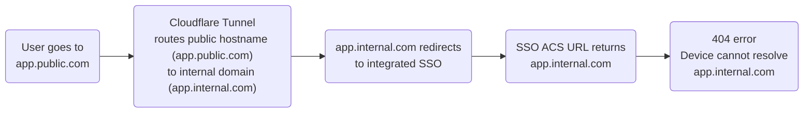
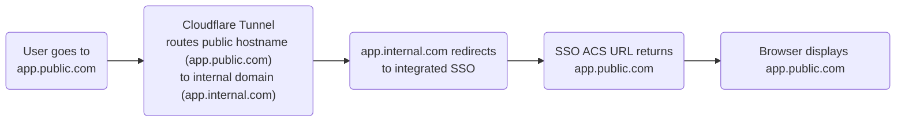

Many organizations in the past few years have recognized the importance of source-of-truth identity and have directly integrated their SSO provider with their internal applications. The SSO provider is only aware of the internal domain on which the application exists (via the configured ACS URL), which means the user must be connected to the local network in order to access the application. This security architecture makes sense for a traditional network perimeter, but it presents challenges for Zero Trust adoption. In the ZTWA model, the user's device has no concept of an internal corporate network, only the specific, scoped applications to which they have access. The problem is summarized in the following diagram:

## Potential solutions

If your applications use integrated SSO, there are a number of different paths you can take to onboard your applications to Cloudflare Access.

| Solution                                                                                                                       | Steps required                                                                                                     | Pros                                                                                                                                                                        | Cons                                                                                                                     |
| ------------------------------------------------------------------------------------------------------------------------------ | ------------------------------------------------------------------------------------------------------------------ | --------------------------------------------------------------------------------------------------------------------------------------------------------------------------- | ------------------------------------------------------------------------------------------------------------------------ |
| [Present applications exclusively on Cloudflare domains](#recommended-solution)                                                | Change SSO ACS URL to the Cloudflare Tunnel public hostname                                                        | <li> Increased security posture </li> <li> No changes to application code</li> <li> No changes to internal DNS design </li>                                                 | Hard cutover event when ACS URL changes from internal to external domain                                                 |
| Present applications on existing internal domains with identical external domains delegated to Cloudflare                      | Add domains to Cloudflare that match internal domains                                                              | <li> No changes to SSO ACS URL </li> <li> No change for end users </li>                                                                                                     | <li> Requires careful management of internal and external domains </li> <li> Requires changing internal DNS design </li> |
| [Consume the Cloudflare JWT in internal applications](/learning-paths/zero-trust-web-access/migrate-applications/consume-jwt/) | <li> Remove integrated SSO </li> <li> Update application to accept the Cloudflare JWT for user authorization </li> | <li> Reduced authentication burden for end users </li> <li> No changes to internal DNS design </li> <li> Instantly secure applications without direct SSO integration </li> | <li> Requires changing application code </li> <li> Hard cutover event when application updates </li>                     |
| Use Cloudflare as the direct SSO integration, which then calls your IdP of choice (Okta, OneLogin, etc.)                       | Swap existing SSO provider for [Access for SaaS](/cloudflare-one/applications/configure-apps/saas-apps/)           | <li> Increased flexibility for changing IdPs </li> <li> Ability to use multiple IdPs simultaneously </li>                                                                   | <li> Hard cutover event for IdP changes </li> <li> No SCIM provisioning for application </li>                            |

## Recommended solution

If you are able to configure your SSO provider, we recommend presenting all internal web services exclusively on Cloudflare domains. This is the model that Cloudflare takes for web application access internally and the most common method of resolution for customers in this scenario.

With this approach, you do not need to make any changes to your existing DNS infrastructure. Cloudflare Tunnel in your network will manage the translation from external (Cloudflare public) DNS to internal DNS, which is how the system is designed to function. After you update the ACS URL in your SSO provider to the Cloudflare public hostname, the outcome will look like this:

All users - whether in the office, remote, using or not using the VPN client - will always route through the Cloudflare Access authentication flow at `app.public.com` to access a private application. This provides a single control plane for policy application and security audits, and no additional user training is necessary.
