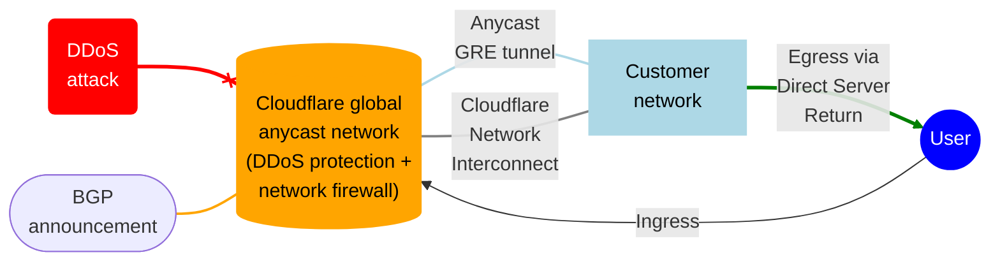

import { GlossaryTooltip } from "~/components"

Magic Transit is a network security and performance solution that offers DDoS protection, traffic acceleration, and more for on-premise, cloud-hosted, and hybrid networks.

Magic Transit delivers its connectivity, security, and performance benefits by serving as the front door to your IP network. This means it accepts IP <GlossaryTooltip term="data packet">packets</GlossaryTooltip> destined for your network, processes them, and then outputs them to your origin infrastructure.

The Cloudflare network uses [Border Gateway Protocol (BGP)](https://www.cloudflare.com/learning/security/glossary/what-is-bgp/) to announce your company’s IP address space, extending your network presence globally, and <GlossaryTooltip term="anycast" link="https://www.cloudflare.com/learning/cdn/glossary/anycast-network/">anycast</GlossaryTooltip> to ingest your traffic. Today, Cloudflare’s anycast global network spans [hundreds of cities worldwide](https://www.cloudflare.com/network/).

Once packets hit Cloudflare’s network, traffic is inspected for attacks, filtered, <GlossaryTooltip term="traffic steering">steered</GlossaryTooltip>, accelerated, and sent onward to your origin. Magic Transit connects to your origin infrastructure using anycast <GlossaryTooltip term="GRE tunnel">Generic Routing Encapsulation (GRE)</GlossaryTooltip> tunnels over the Internet or, with [Cloudflare Network Interconnect (CNI)](/network-interconnect/), via physical or virtual interconnect.

Magic Transit users have two options for their implementation: ingress traffic or ingress and [egress traffic](/magic-transit/reference/egress/). Users with an egress implementation will need to set up <GlossaryTooltip term="policy-based routing">policy-based routing (PBR)</GlossaryTooltip> or ensure default routing on their end forwards traffic to Cloudflare via tunnels.

:::note
Magic Transit is not yet supported on Cloudflare's China Network.
:::

For detailed information on Magic Transit architecture, refer to the [Reference section](/magic-transit/reference/).
