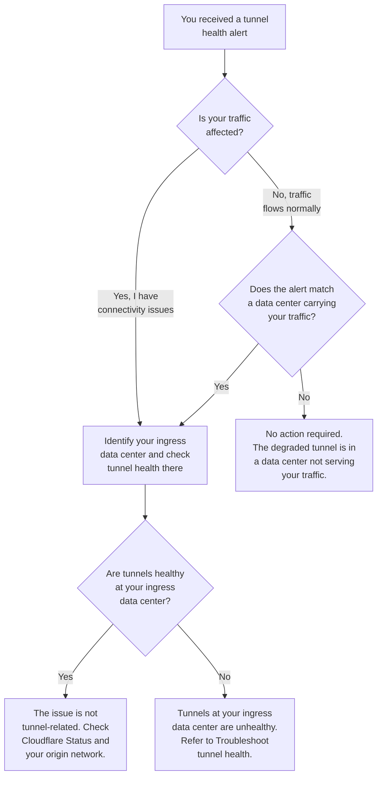

import { DashButton } from "~/components";

This guide helps you determine whether a tunnel health alert is actually affecting your traffic. A degraded or down tunnel only matters if your traffic is currently routing through the Cloudflare data center where that tunnel is unhealthy.

:::note
Cloudflare does not synchronize health checks among global network servers. A tunnel can be healthy in one data center and degraded in another at the same time. This is normal behavior, not an outage.
:::

## Before you begin

Understand how Magic Transit health checks and traffic routing work:

- Health checks run independently from every Cloudflare data center.
- Each data center evaluates tunnel health based on its own probes.
- Traffic enters Cloudflare at the data center closest to the source (anycast routing).
- A degraded tunnel in a data center that is not handling your traffic has no impact on your connectivity.

If you are experiencing actual tunnel health issues (tunnels flapping, all tunnels down, or IPsec errors), refer to [Troubleshoot tunnel health](/magic-transit/troubleshooting/tunnel-health/) instead.

## Diagnostic flowchart

Use this flowchart to determine whether a tunnel health alert requires action.



## 1. Identify your ingress data center

Determine which Cloudflare data center your traffic is entering. This is the only data center whose tunnel health status matters for your current connectivity.

### Use traceroute

Run a `traceroute` from the source network to your Magic Transit prefix. Look for the Cloudflare data center hostname in the trace output, which contains a three-letter [IATA airport code](https://en.wikipedia.org/wiki/IATA_airport_code) that identifies the data center.

```sh
traceroute 203.0.113.1
```

```txt
 1  192.168.1.1 (192.168.1.1)  1.234 ms
 2  10.0.0.1 (10.0.0.1)  5.678 ms
 3  198.51.100.1 (198.51.100.1)  10.123 ms
 4  198.51.100.10 (198.51.100.10)  12.345 ms
 5  lhr01.cf (198.51.100.11)  15.678 ms
```

In this example, `lhr` indicates that traffic enters Cloudflare at the London (Heathrow) data center.

### Use the Cloudflare dashboard

You can also identify which data centers handle your traffic by checking traffic volume on the **Connector health** page. Data centers showing traffic are actively routing your traffic.

1. Go to the **Network health** page.

	<DashButton url="/?to=/:account/networking-insights/health" />

2. Select the **Connector health** tab.
3. Select the tunnel you want to inspect.
4. In the tunnel detail view, look for data centers that show traffic volume. These are the data centers actively routing traffic for your network.
5. Review the health status for those data centers. If the tunnels are healthy at data centers that carry your traffic, a degraded tunnel at a different data center is not the cause of your connectivity issue.

:::note[Ask Stephen]
1. Are there specific dashboard views or filters that help customers narrow down tunnel health to a specific data center? If so, we should document the exact steps here.
2. What is the exact column name that shows traffic volume per data center in the tunnel detail view? The existing docs reference a "Traffic volume (1 hour)" column, but we need to confirm the current label.
3. Does this type of troubleshooting also apply to Cloudflare WAN customers? The 2025 supportability recap mentions WAN IPsec tunnel degradation as a top issue, and support runbooks point WAN tunnel troubleshooting back to the MT guide. If so, we should convert this page to a shared partial and render it from both products.
:::

## 2. Correlate with Cloudflare status

If your tunnels are healthy at the relevant data center but you still experience connectivity issues, check for broader platform issues.

1. Go to [Cloudflare Status](https://www.cloudflarestatus.com/).
2. Look for any active incidents or maintenance at the data center you identified.
3. Check for incidents affecting Magic Transit specifically.

## 3. Gather information for support

If you have worked through this guide and cannot resolve the issue, contact [Cloudflare support](https://dash.cloudflare.com/?to=/:account/support) with:

1. **Account ID** and **tunnel name(s)** affected.
2. **Timestamps** (in UTC) of when the issue started.
3. **Traceroute output** from your source network to your Magic Transit prefix.
4. **Dashboard screenshots** showing tunnel health at the relevant data center.
5. **Description of impact** — what traffic is affected and how.

## Related resources

- [Troubleshoot tunnel health](/magic-transit/troubleshooting/tunnel-health/): Resolve common tunnel health issues (flapping, IPsec errors, stateful firewall drops).
- [Troubleshoot routing and BGP](/magic-transit/troubleshooting/routing-and-bgp/): Diagnose routing and BGP issues that affect traffic delivery.
- [Check tunnel health in the dashboard](/magic-transit/network-health/check-tunnel-health-dashboard/): Monitor tunnel status per data center.
- [Tunnel health checks](/magic-transit/reference/tunnel-health-checks/): Technical details on how health checks work.
- [Network Analytics](/magic-transit/analytics/network-analytics/): Analyze traffic patterns over time.
