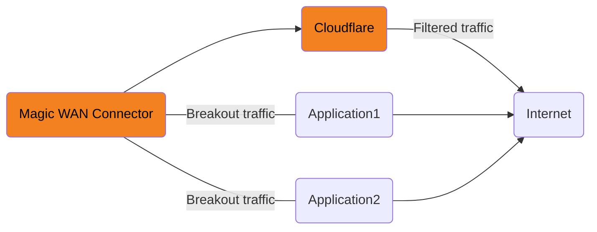

import { Render, TabItem, Tabs } from "~/components";

Breakout traffic allows you to define which applications should bypass Cloudflare’s security filtering, and go directly to the Internet. It works via DNS requests inspection. This means that if your network is caching DNS requests, Breakout traffic will only take effect after you cache entries expire and your client issues a new DNS request that the Magic WAN Connector can detect. This can take several minutes.

:::caution[Warning]
Breakout traffic will not work for applications that use DNS-over-HTTPs.
:::

<br />



_In the graph above, Applications 1 and 2 are configured to bypass Cloudflare's security filtering, and go straight to the Internet_

:::note[A note on security]
We recommend routing all traffic through our global network for comprehensive security filtering and access controls. However, there may be specific cases where you want a subset of traffic to bypass Cloudflare’s security filtering and route it directly to the Internet. You can scope this breakout traffic to specific applications from the Cloudflare dashboard.

Refer to [Traffic steering](/magic-wan/reference/traffic-steering/) to learn how Cloudflare routes traffic.
:::

## Add an application

You need to configure Breakout traffic for each of your existing sites, as it is a per-site configuration.

<Tabs syncKey="dashPlusAPI"> <TabItem label="Dashboard">

<Render
	file="connector/app-aware-policies/add-app"
	params={{ one: "Breakout traffic" }}
/>

6. Select one or more applications that should bypass Cloudflare filtering from the list. You can also use the search box.
7. Select **Add applications**.

The traffic for that application will now go directly to the Internet and bypass Cloudflare's filtering.

</TabItem> <TabItem label="API">

<Render file="connector/account-id-api-key" />

1. Create a [`GET` request](/api/operations/magic-site-app-configs-list-app-configs) to list the applications associated with a site.

Example:

```bash
curl https://api.cloudflare.com/client/v4/accounts/{account_id}/magic/sites/{site_id}/app_configs \
--header "X-Auth-Email: <EMAIL>" \
--header "X-Auth-Key: <API_KEY>" \
--header "Content-Type: application/json" \
```

If successful, you will receive a response like the following:

```json
{
	"errors": [],
	"messages": [],
	"result": [
		{
			"breakout": true,
			"id": "023e105f4ecef8ad9ca31a8372d0c353",
			"priority": 0,
			"site_id": "023e105f4ecef8ad9ca31a8372d0c353",
			"account_app_id": "ac60d3d0435248289d446cedd870bcf4"
		}
	],
	"success": true
}
```

Take note of the `"account_app_id"` value for any application that want to configure.

2. Create a [`POST` request](/api/operations/magic-site-app-configs-add-app-config) to add new apps the breakout traffic list.

Example:

```bash
curl --request POST \
--url https://api.cloudflare.com/client/v4/accounts/{account_id}/magic/sites/{site_id}/app_configs \
--header "X-Auth-Email: <EMAIL>" \
--header "X-Auth-Key: <API_KEY>" \
--header "Content-Type: application/json" \
--data '{
  "account_app_id": "ac60d3d0435248289d446cedd870bcf4",
  "breakout": true
}'
```

</TabItem> </Tabs>

## Delete an application

<Render
	file="connector/app-aware-policies/delete-app"
	params={{ one: "Breakout traffic" }}
/>
