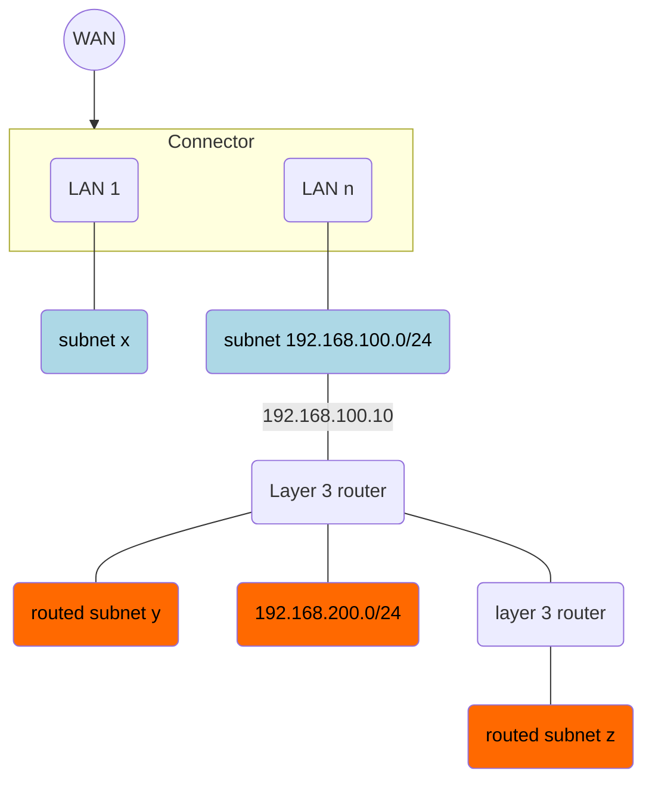

Each LAN interface (physical port + VLAN tag) on a Magic WAN Connector is part of a _directly-attached subnet_. When you specify a static address for the LAN interface, you indicate both the interface's address as well as the subnet it attaches to. For example, `192.168.100.13/24` means the LAN interface has the IP address `192.168.100.13`, and is part of the subnet `192.168.100.0/24`.

Some LANs are more complex. In addition to the directly-attached subnet, they might have additional subnets sitting behind L3 routers south of the Magic WAN Connector. We call these _routed subnets_.

Refer to the diagram below for an example of how this might work:

:::note
Blue represents directly-attached subnets, and red represents routed subnets.
:::

 

To add a routed subnet to your LAN, you need:

- **A prefix**: The subnet's CIDR prefix; Cloudflare will automatically install static routes to this prefix in our global network (to forward packets for this subnet to the right Connector), and in your Connector (to forward packets for this subnet to the right LAN interface). In the figure above, the routed subnet in the center has the prefix `192.168.200.0/24`.
- **A next-hop address**: The address of the L3 router to which the Connector should forward packets for this subnet. In the figure, the routed subnet in the center has the next-hop address `192.168.100.10`.

Optionally, you can also [enable NAT for a subnet](/magic-wan/configuration/connector/network-options/nat-subnet/) by providing a static overlay prefix.

## Create routed subnets

For more information on how to create routed subnets, refer to **Create a LAN**, either in [Configure hardware Connector](/magic-wan/configuration/connector/configure-hardware-connector/#3-create-a-lan) or [Configure virtual Connector](/magic-wan/configuration/connector/configure-virtual-connector/#3-create-a-lan).
