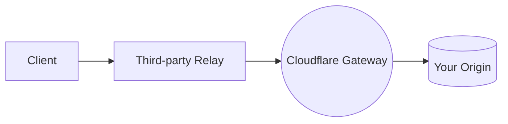

In Gateway mode, Cloudflare acts as the **OHTTP gateway** — decrypting OHTTP-encapsulated requests and forwarding them to your backend, which is already behind the Cloudflare CDN.

Use Gateway mode when your application backend is **already proxied through Cloudflare**. Because your origin traffic already passes through Cloudflare's network, Cloudflare can serve as the gateway without requiring a separate gateway server that you operate.

Cloudflare never acts as both relay and gateway simultaneously. 



**What Cloudflare sees in Gateway mode:** The decrypted application request content, since Cloudflare is the gateway. Cloudflare does not see the originating client IP address — that information is visible only to the relay.

**What you (the origin operator) see:** Normal application request content forwarded from the Cloudflare gateway, with the gateway IP address rather than the client IP.

---

## Before you begin

Privacy Gateway is currently in closed beta. If you are interested, [contact us](https://www.cloudflare.com/lp/privacy-edge/).

To use Gateway mode:

- Your application backend must already be proxied through Cloudflare (orange-clouded).
- You must use an independent third-party relay — Cloudflare cannot act as both relay and gateway.

---

## Step 1 - Enable the Cloudflare gateway

[Contact Cloudflare](https://www.cloudflare.com/lp/privacy-edge/) to enable the OHTTP gateway for your zone. During onboarding, Cloudflare will:

1. Generate and manage OHTTP key pairs for your gateway.
2. Expose a public key configuration endpoint for client discovery.
3. Configure the gateway to decrypt OHTTP-encapsulated requests and forward them to your origin.

You do not need to operate your own gateway server. Cloudflare manages the decryption and forwarding on your behalf.

After enablement, Cloudflare provides:

- **Key configuration URL**: Where clients fetch your gateway's public key.
- **Gateway endpoint**: Where the relay sends encrypted requests.

---

## Step 2 - Fetch the gateway key configuration

Clients must fetch the Cloudflare-managed gateway's public key configuration before sending OHTTP requests.

### Key configuration endpoint

Cloudflare exposes the key configuration at:

```txt
https://<YOUR_ZONE>/ohttp-config
```

Fetch the configuration using curl:

```bash
curl -s https://example.com/ohttp-config \
  -H "Accept: application/ohttp-keys" \
  --output gateway-config.bin
```

The response uses the `application/ohttp-keys` media type and contains the binary-encoded key configuration as specified in [RFC 9458](https://datatracker.ietf.org/doc/rfc9458/).

### Key rotation

Cloudflare rotates gateway keys periodically. Your client should:

- Cache the key configuration locally.
- Refresh the configuration at least daily.
- Handle `HTTP 422` responses from the gateway, which indicate the key ID is unknown and the client should fetch a new configuration.

---

## Step 3 - Configure your client

Clients must:

1. Fetch the Cloudflare gateway's public key configuration (see Step 2).
2. Encrypt outbound requests using OHTTP encapsulation.
3. Send the encrypted request to a third-party relay.
4. Decrypt the corresponding encrypted response.

### OHTTP request format

The inner HTTP request (before encryption) is your normal application request:

```txt
GET /api/data HTTP/1.1
Host: example.com
Authorization: Bearer <token>
```

Your client converts this to binary HTTP format, encrypts it using the gateway's public key, and sends the encrypted payload to the relay.

### Send a request through the relay

The relay forwards your encrypted request to the Cloudflare gateway. The outer request format is:

```bash
curl -X POST https://relay.example.org/proxy \
  -H "Content-Type: message/ohttp-req" \
  -H "Proxy-Authorization: PrivateToken token=<YOUR_PAT_TOKEN>" \
  --data-binary @encrypted-request.bin \
  --output encrypted-response.bin
```

The relay URL and authentication method depend on your third-party relay provider. Common authentication methods include:

- **Privacy Pass tokens**: `Proxy-Authorization: PrivateToken token=<token>`
- **Pre-shared key**: `Proxy-Authorization: Preshared <key>`

### Decrypt the response

After receiving the encrypted response from the relay, your client decrypts it using the OHTTP context established during encryption. The decrypted response is your origin's normal HTTP response.

### Resources

Use the following resources for help with client configuration:

- **Objective C**: [Sample application](https://github.com/cloudflare/privacy-gateway-client-demo)
- **Rust**: [Client library](https://github.com/martinthomson/ohttp/tree/main/ohttp-client)
- **JavaScript / TypeScript**: [Client library](https://github.com/chris-wood/ohttp-js)

---

## Step 4 - Select a third-party relay

Because Cloudflare is the gateway, the relay must be operated by an independent third party — Cloudflare cannot operate both. The relay's role is to:

- Forward encrypted OHTTP requests from the client to the Cloudflare gateway without being able to read the payload.
- Return the encrypted response from the Cloudflare gateway to the client.

The relay sees the client's IP address but not the request content. The Cloudflare gateway sees the request content but receives it from the relay IP, not the client IP. Neither party alone can link a client identity to a request.

### Relay requirements

You can use any OHTTP-compatible relay that you or a partner operates. The relay must:

- Accept OHTTP-encapsulated requests (`Content-Type: message/ohttp-req`).
- Forward requests to the Cloudflare gateway endpoint.
- Support your chosen client authentication method.

---

## Step 5 - Review your application

After configuring your setup, review your application to ensure only intended data passes through the gateway.

- Scrub identifying user data (names, email addresses, phone numbers, and similar information) from requests.
- Encourage users to disable crash reporting when using Privacy Gateway. Crash reports can contain sensitive user data including email addresses.
- Where possible, encrypt application data on the client device with a key known only to the client.

---

## Step 6 - Test the integration

Verify your integration by sending a test request through the full OHTTP flow.

### Verify key configuration

Confirm you can fetch the gateway's key configuration:

```bash
curl -s -o /dev/null -w "%{http_code}" \
  https://example.com/ohttp-config \
  -H "Accept: application/ohttp-keys"
```

A successful response returns `200`.

### End-to-end test

Using an OHTTP client library, send a test request through your relay to the Cloudflare gateway. Verify that:

1. The client successfully encrypts the request using the gateway's public key.
2. The relay forwards the request to the Cloudflare gateway.
3. The gateway decrypts the request and forwards it to your origin.
4. Your origin returns a response.
5. The gateway encrypts the response and returns it through the relay.
6. The client successfully decrypts the response.

If you receive an `HTTP 422` response, your key configuration may be stale — fetch a fresh configuration and retry.
