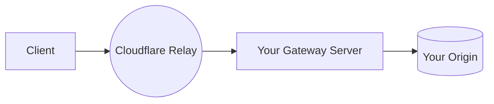
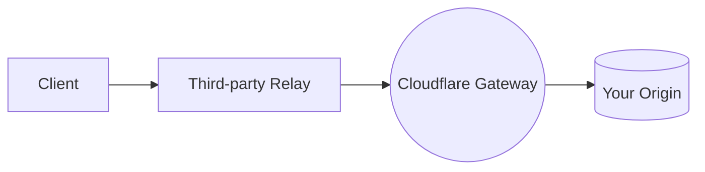

import { Description, Plan } from "~/components";

<Description>

Implements the Oblivious HTTP IETF standard to improve client privacy.

</Description>

<Plan type="enterprise" />

[Privacy Gateway](https://blog.cloudflare.com/building-privacy-into-internet-standards-and-how-to-make-your-app-more-private-today/) is a managed service deployed on Cloudflare's global network that implements the [Oblivious HTTP (OHTTP) IETF](https://www.ietf.org/archive/id/draft-thomson-http-oblivious-01.html) standard. The goal of Privacy Gateway and Oblivious HTTP is to obfuscate the client's IP address from the server it is being sent to, i.e. your application's backend.

OHTTP introduces a proxy between client and server, called a relay, whose purpose is to forward encrypted requests and responses between client and server. These messages are encrypted between client and server such that the relay learns nothing of the application data, beyond the length of the encrypted message and the server the client is interacting with.

Privacy Gateway is currently in closed beta. If you are interested, [contact us](https://www.cloudflare.com/lp/privacy-edge/).

---

## Choose your deployment mode

Cloudflare Privacy Gateway supports two deployment modes, but never operates both at the same time. If your application server or backend is not behind Cloudflare CDN, use Relay mode. If your application server is already behind Cloudflare CDN, use Gateway mode.

### Relay mode

In Relay mode, Cloudflare forwards encrypted OHTTP requests from your clients to your application gateway server (which you operate). Cloudflare cannot read the encrypted payload — it only sees the client IP address and your gateway server's address.

Use Relay mode if your backend is not already behind the Cloudflare CDN.

[Get started with Relay mode](/privacy-gateway/relay-mode/)

### Gateway mode

In Gateway mode, Cloudflare decrypts OHTTP requests and forwards them to your origin, which is already behind the Cloudflare CDN. A third-party relay (not operated by Cloudflare) sits between the client and Cloudflare. Cloudflare can see the request content but not the client IP.

Use Gateway mode if your application is already proxied through Cloudflare.

[Get started with Gateway mode](/privacy-gateway/gateway-mode/)

---

## Chunked OHTTP

Privacy Gateway supports [Chunked Oblivious HTTP](https://datatracker.ietf.org/doc/draft-ietf-ohai-chunked-ohttp/), an extension to OHTTP that allows requests and responses to be encrypted and decrypted incrementally. Instead of waiting for the entire message to be processed, chunks can be sent and received as they become available.

Chunked OHTTP is useful for:

- **Large messages**: Process multi-gigabyte uploads or downloads without buffering the entire payload in memory.
- **Streaming responses**: Begin receiving response data before the server has finished generating the full response, reducing time-to-first-byte.
- **Long-running requests**: Maintain privacy for requests that take significant time to process on the server.
