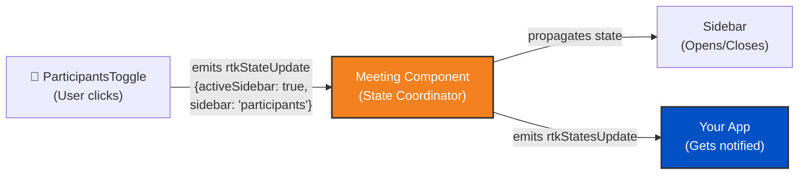

import RTKSDKSelector from "~/components/realtimekit/RTKSDKSelector/RTKSDKSelector.astro";
import RTKCodeSnippet from "~/components/realtimekit/RTKCodeSnippet/RTKCodeSnippet.astro";

## Prerequisites

This page builds upon the [Basic Implementation Guide](/realtime/realtimekit/ui-kit). Make sure you have read it first.

The code examples on this page assume you have already imported the necessary packages and initialized the SDK.

<RTKSDKSelector />

## How UI Kit components communicate

<RTKCodeSnippet id="web-react">

The UI Kit components are able to understand and synchronize with each other because they are nested under the `RtkMeeting` component. The `RtkMeeting` component acts as the central coordinator that ensures all components under it stay in sync when it comes to meeting state, participant updates, and other real-time changes.

</RTKCodeSnippet>

<RTKCodeSnippet id="web-web-components">

The UI Kit components are able to understand and synchronize with each other because they are nested under the `rtk-meeting` component. The `rtk-meeting` component acts as the central coordinator that ensures all components under it stay in sync when it comes to meeting state, participant updates, and other real-time changes.

</RTKCodeSnippet>

<RTKCodeSnippet id="web-angular">

The UI Kit components are able to understand and synchronize with each other because they are nested under the `rtk-meeting` component. The `rtk-meeting` component acts as the central coordinator that ensures all components under it stay in sync when it comes to meeting state, participant updates, and other real-time changes.

</RTKCodeSnippet>

<RTKCodeSnippet id="mobile-react-native">

The UI Kit components are able to understand and synchronize with each other because they are nested under the `RtkMeeting` component. The `RtkMeeting` component acts as the central coordinator that ensures all components under it stay in sync when it comes to meeting state, participant updates, and other real-time changes.

</RTKCodeSnippet>

<RTKCodeSnippet id={["mobile-android", "mobile-ios", "mobile-flutter"]}>

**On Android, iOS, and Flutter, the UI Kit manages all internal state automatically**. The prebuilt UI components handle state synchronization internally, so there are no state management APIs exposed for you to listen to.

To build a custom UI with full state management control, use the [Core SDK](/realtime/realtimekit/core/) directly and build your interface using native platform components. Refer to the [Build Your Own UI](/realtime/realtimekit/ui-kit/build-your-own-ui/) guide for more information.

The following resources explain how to access and manage state:

- [Meeting Object Explained](/realtime/realtimekit/core/meeting-object-explained/) - Access the meeting object and its properties
- [Local Participant](/realtime/realtimekit/core/local-participant/) - Manage local user media and state
- [Remote Participants](/realtime/realtimekit/core/remote-participants/) - Handle remote participant events and state
- [Display Active Speakers](/realtime/realtimekit/core/display-active-speakers/) - Track who is speaking

</RTKCodeSnippet>

<RTKCodeSnippet id={["web-react", "web-web-components", "web-angular", "mobile-react-native"]}>

Here is an example of how state synchronization works when opening the participants sidebar:



</RTKCodeSnippet>

## State flow

<RTKCodeSnippet id={["web-react", "web-web-components", "web-angular", "mobile-react-native"]}>

1. **Child components emit state updates**: When any UI component needs to update state, it emits a state update event
2. **Meeting component listens and coordinates**: The meeting component listens to all these state update events from its children
3. **State propagation**: The meeting component propagates the updated state to all other child components to keep them synchronized
4. **External notification**: The meeting component also emits `rtkStatesUpdate` event that your application can listen to for updating your custom UI or performing actions based on state changes

</RTKCodeSnippet>

<RTKCodeSnippet id={["mobile-android", "mobile-ios", "mobile-flutter"]}>

The UI Kit handles state flow internally. To manage state in a custom UI, use the [Core SDK](/realtime/realtimekit/core/) directly.

</RTKCodeSnippet>

## Listening to state updates

<RTKCodeSnippet id={["web-react", "web-web-components", "web-angular", "mobile-react-native"]}>

To build custom UI or perform actions based on meeting state changes, listen to the `rtkStatesUpdate` event emitted by the meeting component. This event provides the current state of the meeting, including active speaker, participant list, recording status, and more.

:::note
Store the states in a state management solution (like React's `useState` or a plain JavaScript object) to alter your UI based on meeting state changes.
:::

</RTKCodeSnippet>

<RTKCodeSnippet id={["mobile-android", "mobile-ios", "mobile-flutter"]}>

The UI Kit handles state updates internally. To listen to state updates in a custom UI, use the [Core SDK's meeting object](/realtime/realtimekit/core/meeting-object-explained/) directly.

</RTKCodeSnippet>

## Example code

<RTKCodeSnippet id="web-react">

For React, you can use the `onRtkStatesUpdate` prop on the `RtkMeeting` component to listen for state updates.

```jsx
import {
	RealtimeKitProvider,
	useRealtimeKitClient,
} from "@cloudflare/realtimekit-react";
import { RtkMeeting } from "@cloudflare/realtimekit-react-ui";
import { useEffect, useState } from "react";

function App() {
	const [meeting, initMeeting] = useRealtimeKitClient();
	const [authToken, setAuthToken] = useState("<participant_auth_token>");
	const [states, setStates] = useState({});

	useEffect(() => {
		if (authToken) {
			initMeeting({
				authToken: authToken,
			});
		}
	}, [authToken]);

	return (
		<RealtimeKitProvider value={meeting}>
			<RtkMeeting
				showSetupScreen={true}
				meeting={meeting}
				onRtkStatesUpdate={(e) => {
					// Update states when rtk-meeting emits state updates
					setStates(e.detail);

					// Example: Access various state properties
					console.log("Meeting state:", e.detail.meeting); // 'idle', 'setup', 'joined', 'ended', 'waiting'
					console.log("Is sidebar active:", e.detail.activeSidebar);
					console.log("Current sidebar section:", e.detail.sidebar);
					console.log("Is screen sharing:", e.detail.activeScreenShare);
				}}
			/>

			{/* Use states to build custom UI */}
			<div className="custom-ui">
				<p>Meeting State: {states.meeting}</p>
				<p>Sidebar Open: {states.activeSidebar ? "Yes" : "No"}</p>
			</div>
		</RealtimeKitProvider>
	);
}
```

### Alternative: Using refs (multiple meetings)

If you are building an experience with multiple meetings on the same page or back-to-back meetings, using refs is recommended to avoid state conflicts between different meeting instances:

```jsx
import {
	RealtimeKitProvider,
	useRealtimeKitClient,
} from "@cloudflare/realtimekit-react";
import { RtkMeeting } from "@cloudflare/realtimekit-react-ui";
import { useEffect, useState, useRef } from "react";

function App() {
	const [meeting, initMeeting] = useRealtimeKitClient();
	const [authToken, setAuthToken] = useState("<participant_auth_token>");
	const [states, setStates] = useState({});
	const meetingRef = useRef(null);

	useEffect(() => {
		if (authToken) {
			initMeeting({
				authToken: authToken,
			});
		}
	}, [authToken]);

	useEffect(() => {
		if (!meetingRef.current) return;

		const handleStatesUpdate = (e) => {
			setStates(e.detail);
			console.log("Meeting state:", e.detail.meeting);
			console.log("Is sidebar active:", e.detail.activeSidebar);
		};

		// Add event listener via ref
		meetingRef.current.addEventListener("rtkStatesUpdate", handleStatesUpdate);

		// Cleanup listener when component unmounts or meeting changes
		return () => {
			meetingRef.current?.removeEventListener(
				"rtkStatesUpdate",
				handleStatesUpdate,
			);
		};
	}, [meetingRef.current]);

	return (
		<RealtimeKitProvider value={meeting}>
			<RtkMeeting ref={meetingRef} showSetupScreen={true} meeting={meeting} />

			{/* Use states to build custom UI */}
			<div className="custom-ui">
				<p>Meeting State: {states.meeting}</p>
				<p>Sidebar Open: {states.activeSidebar ? "Yes" : "No"}</p>
			</div>
		</RealtimeKitProvider>
	);
}
```

:::note
Using refs with event listeners provides better control and isolation when handling multiple `RtkMeeting` instances. This approach ensures that state updates from one meeting do not interfere with another, which is important for back-to-back meetings or multi-meeting interfaces.
:::

</RTKCodeSnippet>

<RTKCodeSnippet id="mobile-react-native">

For React Native, you can use the `onRtkStatesUpdate` prop on the `RtkMeeting` component to listen for state updates.

```jsx
import {
	RealtimeKitProvider,
	useRealtimeKitClient,
} from "@cloudflare/realtimekit-react";
import { RtkMeeting, RtkText } from "@cloudflare/realtimekit-react-ui";
import { useEffect, useState } from "react";
import { View } from "react-native";

function App() {
	const [meeting, initMeeting] = useRealtimeKitClient();
	const [authToken, setAuthToken] = useState("<participant_auth_token>");
	const [states, setStates] = useState({});

	useEffect(() => {
		if (authToken) {
			initMeeting({
				authToken: authToken,
			});
		}
	}, [authToken]);

	return (
		<RealtimeKitProvider value={meeting}>
			<RtkMeeting
				showSetupScreen={true}
				meeting={meeting}
				onRtkStatesUpdate={(e) => {
					// Update states when rtk-meeting emits state updates
					setStates(e.detail);

					// Example: Access various state properties
					console.log("Meeting state:", e.detail.meeting); // 'idle', 'setup', 'joined', 'ended', 'waiting'
					console.log("Is sidebar active:", e.detail.activeSidebar);
					console.log("Current sidebar section:", e.detail.sidebar);
					console.log("Is screen sharing:", e.detail.activeScreenShare);
				}}
			/>

			{/* Use states to build custom UI */}
			<View>
				<RtkText>Meeting State: {states.meeting}</RtkText>
				<RtkText>Sidebar Open: {states.activeSidebar ? "Yes" : "No"}</RtkText>
			</View>
		</RealtimeKitProvider>
	);
}
```

### Alternative: Using refs (multiple meetings)

If you are building an experience with multiple meetings on the same page or back-to-back meetings, using refs is recommended to avoid state conflicts between different meeting instances:

```jsx
import {
	RealtimeKitProvider,
	useRealtimeKitClient,
} from "@cloudflare/realtimekit-react";
import { RtkMeeting, RtkText } from "@cloudflare/realtimekit-react-ui";
import { useEffect, useState, useRef } from "react";
import { View } from "react-native";

function App() {
	const [meeting, initMeeting] = useRealtimeKitClient();
	const [authToken, setAuthToken] = useState("<participant_auth_token>");
	const [states, setStates] = useState({});
	const meetingRef = useRef(null);

	useEffect(() => {
		if (authToken) {
			initMeeting({
				authToken: authToken,
			});
		}
	}, [authToken]);

	useEffect(() => {
		if (!meetingRef.current) return;

		const handleStatesUpdate = (e) => {
			setStates(e.detail);
			console.log("Meeting state:", e.detail.meeting);
			console.log("Is sidebar active:", e.detail.activeSidebar);
		};

		// Add event listener via ref
		meetingRef.current.addEventListener("rtkStatesUpdate", handleStatesUpdate);

		// Cleanup listener when component unmounts or meeting changes
		return () => {
			meetingRef.current?.removeEventListener(
				"rtkStatesUpdate",
				handleStatesUpdate,
			);
		};
	}, [meetingRef.current]);

	return (
		<RealtimeKitProvider value={meeting}>
			<RtkMeeting ref={meetingRef} showSetupScreen={true} meeting={meeting} />

			{/* Use states to build custom UI */}
			<View>
				<RtkText>Meeting State: {states.meeting}</RtkText>
				<RtkText>Sidebar Open: {states.activeSidebar ? "Yes" : "No"}</RtkText>
			</View>
		</RealtimeKitProvider>
	);
}
```

:::note
Using refs with event listeners provides better control and isolation when handling multiple `RtkMeeting` instances. This approach ensures that state updates from one meeting do not interfere with another, which is important for back-to-back meetings or multi-meeting interfaces.
:::

</RTKCodeSnippet>

<RTKCodeSnippet id="web-web-components">

For Web Components, you need to add an event listener to the `rtk-meeting` component to listen for `rtkStatesUpdate` events.

```html
<body>
	<rtk-meeting id="meeting-component"></rtk-meeting>
</body>
<script type="module">
	import RealtimeKitClient from "https://cdn.jsdelivr.net/npm/@cloudflare/realtimekit@latest/dist/index.es.js";

	const meeting = await RealtimeKitClient.init({
		authToken: "<participant_auth_token>",
	});

	// Add <rtk-meeting id="meeting-component" /> to your HTML, otherwise you will get error
	const meetingComponent = document.querySelector("#meeting-component");

	// Listen for state updates from rtk-meeting
	meetingComponent.addEventListener("rtkStatesUpdate", (event) => {
		console.log("RTK states updated:", event.detail);

		// Store states to update your custom UI
		const states = event.detail;

		// Example: Access various state properties
		console.log("Meeting state:", states.meeting); // 'idle', 'setup', 'joined', 'ended', 'waiting'
		console.log("Is sidebar active:", states.activeSidebar);
		console.log("Current sidebar section:", states.sidebar); // 'chat', 'participants', 'polls', etc.
		console.log("Is screen sharing:", states.activeScreenShare);

		// Update your custom UI based on states
		// For example: Show/hide elements based on meeting state
		if (states.meeting === "joined") {
			// Show meeting controls
		}
	});

	meetingComponent.showSetupScreen = true;
	meetingComponent.meeting = meeting;
</script>
```

</RTKCodeSnippet>

<RTKCodeSnippet id="web-angular">

For Angular, you need to add an event listener to the `rtk-meeting` component to listen for `rtkStatesUpdate` events.

```typescript title="meeting.component.ts"
import {
	Component,
	ElementRef,
	OnInit,
	OnDestroy,
	ViewChild,
} from "@angular/core";

@Component({
	selector: "app-meeting",
	template: `
		<rtk-meeting #meetingComponent id="meeting-component"></rtk-meeting>

		<!-- Use states to build custom UI -->
		<div class="custom-ui" *ngIf="states">
			<p>Meeting State: {{ states.meeting }}</p>
			<p>Sidebar Open: {{ states.activeSidebar ? "Yes" : "No" }}</p>
			<div *ngIf="states.meeting === 'joined'" class="meeting-controls">
				<!-- Show meeting controls when joined -->
				<p>Meeting controls would go here</p>
			</div>
		</div>
	`,
	styleUrls: ["./meeting.component.css"],
})
export class MeetingComponent implements OnInit, OnDestroy {
	@ViewChild("meetingComponent", { static: true }) meetingElement!: ElementRef;

	meeting: any;
	states: any = {};
	private authToken = "<participant_auth_token>";
	private stateUpdateListener?: (event: any) => void;

	async ngOnInit() {
		// Import RealtimeKit client dynamically
		const RealtimeKitClient = await import(
			"https://cdn.jsdelivr.net/npm/@cloudflare/realtimekit@latest/dist/index.es.js"
		);

		// Initialize the meeting
		this.meeting = await RealtimeKitClient.default.init({
			authToken: this.authToken,
		});

		// Set up the meeting component
		const meetingComponent = this.meetingElement.nativeElement;

		// Create the event listener
		this.stateUpdateListener = (event: any) => {
			console.log("RTK states updated:", event.detail);

			// Store states to update your custom UI
			this.states = event.detail;

			// Example: Access various state properties
			console.log("Meeting state:", this.states.meeting); // 'idle', 'setup', 'joined', 'ended', 'waiting'
			console.log("Is sidebar active:", this.states.activeSidebar);
			console.log("Current sidebar section:", this.states.sidebar); // 'chat', 'participants', 'polls', etc.
			console.log("Is screen sharing:", this.states.activeScreenShare);

			// Update your custom UI based on states
			// For example: Show/hide elements based on meeting state
			if (this.states.meeting === "joined") {
				// Show meeting controls
				console.log("Meeting joined - showing controls");
			}
		};

		// Listen for state updates from rtk-meeting
		meetingComponent.addEventListener(
			"rtkStatesUpdate",
			this.stateUpdateListener,
		);

		// Configure the meeting component
		meetingComponent.showSetupScreen = true;
		meetingComponent.meeting = this.meeting;
	}

	ngOnDestroy() {
		// Clean up event listener when component is destroyed
		if (this.stateUpdateListener && this.meetingElement) {
			this.meetingElement.nativeElement.removeEventListener(
				"rtkStatesUpdate",
				this.stateUpdateListener,
			);
		}
	}
}
```

</RTKCodeSnippet>

<RTKCodeSnippet id={["mobile-android", "mobile-ios", "mobile-flutter"]}>

For detailed code examples on each platform, refer to the [Meeting Object Explained](/realtime/realtimekit/core/meeting-object-explained/) guide.

</RTKCodeSnippet>

## State properties

<RTKCodeSnippet id={["web-react", "web-web-components", "web-angular", "mobile-react-native"]}>

The `rtkStatesUpdate` event provides detailed information about the UI Kit's internal state. Key properties include:

- **`meeting`**: Current meeting state - `'idle'`, `'setup'`, `'joined'`, `'ended'`, or `'waiting'`
- **`activeSidebar`**: Whether the sidebar is currently open (boolean)
- **`sidebar`**: Current sidebar section - `'chat'`, `'participants'`, `'polls'`, `'plugins'`, etc.
- **`activeScreenShare`**: Whether screen sharing UI is active (boolean)
- **`activeMoreMenu`**: Whether the more menu is open (boolean)
- **`activeSettings`**: Whether settings panel is open (boolean)
- **`viewType`**: Current video grid view type (string)
- **`prefs`**: User preferences object (for example, `mirrorVideo`, `muteNotificationSounds`)
- **`roomLeftState`**: State when leaving the room
- **`activeOverlayModal`**: Active overlay modal configuration object
- **`activeConfirmationModal`**: Active confirmation modal configuration object
- **And many more UI state properties**

:::note
These are **UI Kit internal states** for managing the interface. For meeting data like participants, active speaker, or recording status, use the [Core SDK's meeting object](/realtime/realtimekit/core/meeting-object-explained/) directly.
:::

</RTKCodeSnippet>

<RTKCodeSnippet id={["mobile-android", "mobile-ios", "mobile-flutter"]}>

For state properties available through the Core SDK, refer to the [Meeting Object Explained](/realtime/realtimekit/core/meeting-object-explained/) guide.

</RTKCodeSnippet>

## Best practices

<RTKCodeSnippet id={["web-react", "web-web-components", "web-angular", "mobile-react-native"]}>

- **Store states appropriately**: Use React's `useState` hook or a state management library (like Zustand or Redux) for React apps. For vanilla JavaScript, use a reactive state management solution or simple object storage.
- **Avoid excessive re-renders**: Only update your UI when necessary. In React, consider using `useMemo` or `useCallback` to optimize performance.
- **Access nested properties safely**: Always check if nested properties exist before accessing them (for example, `states.sidebar`, `states.prefs?.mirrorVideo`).
- **Use states for conditional rendering**: Leverage the UI states to show/hide UI elements or respond to interface changes (for example, showing custom indicators when `states.activeScreenShare` is true).
- **Understand the difference**: `rtkStatesUpdate` provides **UI Kit internal states** for interface management. For meeting data (participants, active speaker, recording status), use the Core SDK's `meeting` object and its events directly.

</RTKCodeSnippet>

<RTKCodeSnippet id={["mobile-android", "mobile-ios", "mobile-flutter"]}>

For best practices when building custom UIs with the Core SDK, refer to the [Build Your Own UI](/realtime/realtimekit/ui-kit/build-your-own-ui/) guide.

</RTKCodeSnippet>
