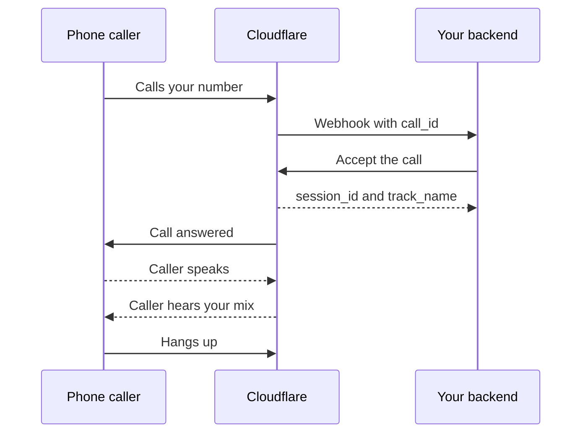

import { Steps } from "~/components";

SIP bridging turns a phone call into an audio track in your Cloudflare Realtime app. Your backend answers calls with ordinary API requests — you do not need to run any telephony infrastructure.

:::note[Availability]

SIP bridging is in development and is not yet generally available. Steps marked as planned describe the intended API surface and may change before release.

:::

## How it works

A SIP provider delivers phone calls to Cloudflare on your behalf. For each call, Cloudflare turns the caller's voice into a track in your Realtime app. That track works like any other track — pull it into a session, or bridge it into a RealtimeKit meeting. Whatever tracks you add to the call's mix are what the caller hears.

You control each call with its `call_id`: accept it, reject it, redirect it, change its mix, or end it. A typical call looks like this:



Calls use G.711 audio (PCMA or PCMU), which all major SIP providers support.

## Prerequisites

- A [Realtime App](/realtime/sfu/get-started/) with its App ID and App Secret
- A SIP provider or carrier that can send calls over TLS with digest authentication
- A backend server that can receive webhooks and call the Realtime API

## Turn on SIP for your app

<Steps>

1. Create SIP credentials for your app (planned):

   ```bash
   curl -X POST "https://rtc.live.cloudflare.com/v1/apps/$APP_ID/sip/credentials" \
     -H "Authorization: Bearer $CLOUDFLARE_API_TOKEN"
   ```

   The response contains a SIP username and password. Store the password securely — it is shown only once.

2. Configure your SIP provider to send calls to the Cloudflare SIP gateway:

   - **Address**: `sip.rtc.live.cloudflare.com:5601`
   - **Protocol**: SIP over TLS
   - **Request-URI user**: your App ID
   - **Authentication**: digest authentication with the SIP username and password

</Steps>

Calls without valid credentials are rejected. Rotating the password takes effect immediately.

Digest authentication uses SHA-256. MD5 is available only as a legacy fallback for providers that do not support SHA-256, and is turned off by default.

## Allow Cloudflare IP addresses

Your provider opens the TLS connection for signaling, and Cloudflare replies on the same connection. You do not need inbound firewall changes for signaling.

Media is different. Cloudflare exchanges RTP with your provider from the address in the SDP answer of the `200 OK`. A call can be handled from any Cloudflare data center, so allow UDP media traffic to and from [Cloudflare IP addresses](/fundamentals/concepts/cloudflare-ip-addresses/) on your provider's session border controller. In the other direction, Cloudflare accepts RTP only from the IP address your provider advertises in its SDP offer; the port may be corrected once from observed traffic, which supports providers behind NAT.

If your provider requires a narrower allowlist, dedicated SIP media IP ranges are under evaluation (planned).

## Handle the incoming call webhook

When a call arrives, Cloudflare sends a webhook to the endpoint configured for your app (planned):

```json
{
	"type": "sip.call.incoming",
	"data": {
		"call_id": "9f2c1ab8e4d34f0e8c6b5a49127d3e56",
		"app_id": "dc9f7e8a1b2c4d5e6f708192a3b4c5d6",
		"from": "sip:+15551234567@provider.example.com",
		"to": "sip:dc9f7e8a1b2c4d5e6f708192a3b4c5d6@sip.rtc.live.cloudflare.com",
		"received_at": "2026-09-05T12:00:00Z"
	}
}
```

Decide what to do with the call: accept it, reject it with a SIP status code, or redirect it to another SIP address. If you do nothing, the call times out after 30 seconds.

## Accept the call

To answer the call, send an accept request (planned). You can optionally name the tracks the caller hears from the start:

```bash
curl -X POST "https://rtc.live.cloudflare.com/v1/apps/$APP_ID/sip/calls/$CALL_ID/accept" \
  -H "Authorization: Bearer $CLOUDFLARE_API_TOKEN" \
  -H "Content-Type: application/json" \
  -d '{
    "initial_mix_config": {
      "inputs": [
        { "session_id": "<SESSION_ID>", "track_name": "<TRACK_NAME>" }
      ]
    }
  }'
```

```json output
{
	"session_id": "8f7e6d5c4b3a29180f1e2d3c4b5a6978",
	"track_name": "sip-inbound-audio"
}
```

The caller's voice is now a track in your app, addressed as `appId:sessionId/trackName`. To decline instead, `POST` to `/v1/apps/{appId}/sip/calls/{callId}/reject` with a SIP status code, or to `/v1/apps/{appId}/sip/calls/{callId}/redirect` with a target SIP URI.

## Hear the caller in a Realtime SFU session

The caller's track behaves like any other track. Pull it into a session with the tracks API:

```bash
curl -X POST "https://rtc.live.cloudflare.com/v1/apps/$APP_ID/sessions/$SESSION_ID/tracks/new" \
  -H "Authorization: Bearer $CLOUDFLARE_API_TOKEN" \
  -H "Content-Type: application/json" \
  -d '{
    "tracks": [
      {
        "location": "remote",
        "sessionId": "<SIP_SESSION_ID>",
        "trackName": "sip-inbound-audio"
      }
    ]
  }'
```

For the full request and response shape, refer to [HTTPS API](/realtime/sfu/https-api/).

## Bridge the caller into a RealtimeKit meeting

RealtimeKit meetings manage their own participants, so a SIP call cannot join a meeting directly. To connect the two, run a small server-side bridge: a meeting participant, built with the RealtimeKit Core SDK, that moves audio between the meeting and your Realtime SFU app.

<Steps>

1. Join the meeting from your server with the Core SDK, as a participant whose preset allows audio publishing.
2. Pull the caller's track from your Realtime SFU app with the tracks API, as described in the previous section.
3. Publish that audio to the meeting as a [custom audio track](/realtime/realtimekit/core/media-acquisition-approaches/). Meeting participants now hear the caller.
4. To send meeting audio back, subscribe to the meeting's audio tracks through the same bridge, publish them to your Realtime SFU app, and add them to the call's mix as described in the next section.

</Steps>

### Current limitations

You run and scale one bridge participant per bridged meeting. You also map three sets of identifiers yourself: the SIP `call_id`, the Realtime SFU `session_id` and `track_name`, and the RealtimeKit meeting and participant IDs. A native meeting dial-in experience is under evaluation.

## Send audio back to the caller

The caller hears a mix of the tracks you choose. Update the mix at any time during the call (planned):

```bash
curl -X PUT "https://rtc.live.cloudflare.com/v1/apps/$APP_ID/sip/calls/$CALL_ID/mix" \
  -H "Authorization: Bearer $CLOUDFLARE_API_TOKEN" \
  -H "Content-Type: application/json" \
  -d '{
    "inputs": [
      { "session_id": "<SESSION_ID>", "track_name": "<TRACK_NAME>" }
    ]
  }'
```

Cloudflare decodes the input tracks, mixes them, and encodes the result for the caller. A track that stops publishing contributes silence — the call and the remaining inputs continue.

## End the call

The call ends when the caller hangs up. To end it from your backend, `POST` to `/v1/apps/{appId}/sip/calls/{callId}/terminate` (planned). Ending the call removes the caller's track and releases the mix.

## Next steps

- [Sessions and tracks](/realtime/sfu/sessions-tracks/) — the model the caller's track follows
- [HTTPS API](/realtime/sfu/https-api/) — session and track management
- [RealtimeKit quickstart](/realtime/realtimekit/quickstart/) — build the meeting you bridge into
- [RealtimeKit webhooks](/realtime/realtimekit/webhooks/) — webhook configuration for RealtimeKit events
