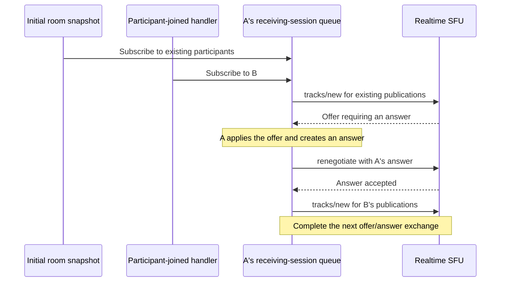

A Realtime SFU session has one WebRTC PeerConnection and one offer/answer state machine. Session Description Protocol (SDP) is the setup text that describes the connection's media and transport settings. It does not carry the media itself.

Your endpoint creates or applies SDP. Your backend carries the descriptions between the endpoint and the [SFU API](/realtime/sfu/api/).

## Offer and answer

An offer proposes connection settings, and an answer completes that negotiation. An endpoint can send an offer describing the tracks it wants to publish. The SFU returns an answer for the endpoint to apply.

An SFU operation can also return an offer that the endpoint must answer. When a response sets `requiresImmediateRenegotiation: true`, complete that exchange before starting another mutation on the session.

Apply the SFU offer, create and set the endpoint's answer, and submit that answer through `PUT /sessions/{sessionId}/renegotiate`. Refer to [Complete an SFU offer](/realtime/sfu/get-started/connection-patterns/#complete-an-sfu-offer) for the exact sequence.

Check the response and each resource result before advancing your application's state. An HTTP `200` response alone does not establish that every requested resource succeeded.

## Serialize mutations per session

Serialize mutations that target the same SFU session, including track and DataChannel creation, updates, closure, and renegotiation. Independent operations on different sessions can run concurrently. Application dependencies still apply: a publication must exist before another session can subscribe to it.

Each mutation finishes only after its API request and required SDP exchange succeed. For an endpoint offer, wait until the returned SFU answer is applied. For an SFU offer, wait until the endpoint's answer is accepted through `/renegotiate`. Returning an offer to the browser, or reaching `signalingState: "stable"` there, does not finish the backend's work.

Sequential `await` calls are sufficient when one execution path owns all mutations for a session, and each awaited operation includes that full exchange. When event handlers, timers, or UI actions can overlap, use one shared queue per session. An `await` inside one handler does not prevent another handler from starting a request.

Separate publishing and receiving sessions can simplify an application's ownership model. A single bidirectional session is also valid when all its mutations share the same queue.

In either layout, initial discovery, publication notifications, and user actions can each trigger mutations. When these independent handlers target the same SFU session, they must use its shared ordering mechanism.

### Example: simultaneous meeting joins

In a conferencing application, participant B may join while participant A is still joining. A's initial room snapshot triggers subscriptions to existing participants, while B's join notification triggers another subscription. Both handlers update **A's receiving session**.

If the handlers submit requests independently, the second `tracks/new` can arrive before the first offer/answer exchange finishes. The SFU can reject the conflicting request with HTTP `406`. A `406` can also indicate other invalid requests; inspect the public `errorCode`, `errorDescription`, and endpoint state when diagnosing it.

Route the initial snapshot and later participant updates through A's receiving-session queue:

Queue the subscription work before creating SDP or issuing its API request. When it runs, reconcile it with the current publications and connection. Deduplicate repeated publication locators and discard subscriptions that are no longer wanted. Other sessions can continue while A completes this exchange.

## Retry and reconnect

Distinguish retrying an application request from creating a replacement SFU session. A network timeout can leave your backend uncertain whether an operation succeeded.

Track in-flight work and the resources returned by successful operations. An application request ID can help your backend recognize duplicate requests, but it does not make every SFU API operation idempotent.

When replacing a connection, assign the new attempt an ID in application state. Reject late responses associated with an older attempt. Republish and rebuild subscriptions using the current session identifiers. Close the old resources and update discovery state as part of that lifecycle.

## Teardown

Stop accepting new mutations before tearing down a session. Resolve or invalidate outstanding negotiation work, retain identifiers returned by in-flight requests, and close known tracks and DataChannels. Close the endpoint's PeerConnection when its transport is no longer needed.

If an operation cannot complete, preserve the cleanup state and provide a retry path. Refer to [application best practices](/realtime/sfu/best-practices/) for ownership and cleanup guidance.

## Learn with an example

The [video-room negotiation queues](https://github.com/cloudflare/realtime-examples/blob/main/video-room/ARCHITECTURE.md#sdp-serialization) hold a session operation open across the browser answer. The [DataChannel example](https://github.com/cloudflare/realtime-examples/tree/main/echo-datachannels#api-and-lifecycle) demonstrates transport setup and teardown through a local Node.js backend.

For a native endpoint, follow the [embedded firmware/SFU walkthrough](https://github.com/cloudflare/realtime-examples/blob/main/esp32-radio/firmware/docs/sfu.md).
