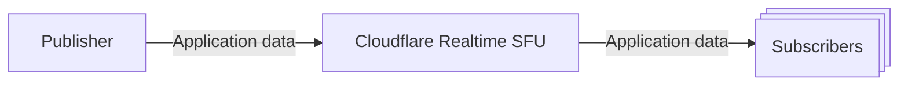
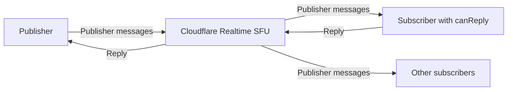

import { Steps } from "~/components";

Use Realtime SFU DataChannels to send low-latency application data over WebRTC. Common payloads include chat messages, game state, sensor updates, and control events.

Use Realtime SFU media tracks, rather than DataChannels, to send audio and video.



Each publisher can send a named DataChannel to multiple subscribers. By default, messages flow from the publisher to subscribers.

## Set up a DataChannel

<Steps>
1. Create a Realtime session for the publisher and one for each subscriber.
2. On each session, establish a DataChannel transport with `POST /apps/{appId}/sessions/{sessionId}/datachannels/establish`. Complete any required Session Description Protocol (SDP) exchange before creating channels.
3. On the publisher session, create a named DataChannel with `POST /apps/{appId}/sessions/{sessionId}/datachannels/new` and set `location` to `"local"`.
4. On each subscriber session, call the same endpoint with `location` set to `"remote"`. Set `sessionId` to the publisher session ID and use the same `dataChannelName`.
5. In each client, call `createDataChannel()` with `negotiated: true` and the ID returned by the API.
6. After the DataChannels open, send messages from the publisher.
</Steps>

## Configure message delivery

DataChannels use reliable, ordered delivery by default. Choose partial reliability or unordered delivery when recent data matters more than delayed data, such as game state or live sensor updates.

Set these optional fields when you create a DataChannel with the [HTTPS API](/realtime/sfu/https-api/):

- `ordered` (`boolean`, default `true`): Set to `false` to allow messages to arrive out of order. A delayed message will not block later messages.
- `maxRetransmits` (`integer`): Limits retransmission attempts after the first send. Set to `0` for no retransmissions, or omit for no retransmission limit.
- `maxPacketLifeTime` (`integer`): Limits how long, in milliseconds, the transport attempts delivery. Omit for no lifetime limit.

`maxRetransmits` and `maxPacketLifeTime` are mutually exclusive. Do not set both on the same channel.

Use the same values on the publisher (`location: "local"`), each subscriber (`location: "remote"`), and each client's `createDataChannel()` call. Realtime DataChannels use negotiated IDs, so the browser does not receive these settings from the remote peer.

Create an unreliable, unordered publisher channel:

```json
{
	"dataChannels": [
		{
			"location": "local",
			"dataChannelName": "player-state",
			"ordered": false,
			"maxRetransmits": 0
		}
	]
}
```

Then create the matching remote channel on the subscriber with the same reliability fields:

```json
{
	"dataChannels": [
		{
			"location": "remote",
			"sessionId": "<PUBLISHER_SESSION_ID>",
			"dataChannelName": "player-state",
			"ordered": false,
			"maxRetransmits": 0
		}
	]
}
```

Create the matching browser DataChannel with the same settings. In this example, `pc` is the active `RTCPeerConnection`, and `resp` is the API response for the channel.

```ts
const dc = pc.createDataChannel("player-state", {
	negotiated: true,
	id: resp.dataChannels[0].id,
	ordered: false,
	maxRetransmits: 0,
});
```

For partial reliability, choose a retransmission limit or packet lifetime based on how long the payload remains useful.

## Wait for subscriber readiness (`waitForAck`)

Set `waitForAck: true` on a remote DataChannel to delay delivery until the subscriber signals that it is ready.

- `waitForAck` applies only to `location: "remote"` DataChannels and defaults to `false`.
- While the gate is closed, the SFU holds delivery to that subscriber.
- After the DataChannel opens, the subscriber sends any message, such as `"ack"`. The SFU consumes this first message, opens the gate, and starts forwarding publisher messages.
- The acknowledgment must reach the SFU within 15 seconds after creating the remote DataChannel. Otherwise, the SFU tears down the gated channel. Create the remote DataChannel again to retry.

Without [`canReply`](#return-to-publisher-canreply), later subscriber messages are not forwarded to the publisher.

Create a remote DataChannel with the gate enabled by calling `POST /apps/{appId}/sessions/{sessionId}/datachannels/new` on the subscriber session:

```json
{
	"dataChannels": [
		{
			"location": "remote",
			"sessionId": "<PUBLISHER_SESSION_ID>",
			"dataChannelName": "my-channel",
			"waitForAck": true
		}
	]
}
```

Then, on the subscriber, send the acknowledgment once the DataChannel is open. This example assumes you have initialized `API_BASE`, `headers`, and `pc`, and defined a `waitForOpen()` helper.

```ts
const response = await fetch(
	`${API_BASE}/sessions/${subscriberId}/datachannels/new`,
	{
		method: "POST",
		headers,
		body: JSON.stringify({
			dataChannels: [
				{
					location: "remote",
					sessionId: publisherId,
					dataChannelName: "my-channel",
					waitForAck: true,
				},
			],
		}),
	},
);

if (!response.ok) {
	throw new Error(`Failed to create DataChannel: ${response.status}`);
}

const resp = await response.json();
const channelId = resp.dataChannels?.[0]?.id;
if (channelId === undefined) {
	throw new Error("DataChannel response did not include an id");
}

const dc = pc.createDataChannel("my-channel-subscribed", {
	negotiated: true,
	id: channelId,
});

await waitForOpen(dc);
dc.send("ack"); // The first message opens the gate.
```

## Return to publisher (canReply)

Messages travel from the publisher to subscribers by default. Set `canReply: true` when one subscriber needs to respond on the same channel, such as an operator responding to a device that publishes telemetry.



`canReply` controls reply access as follows:

- `canReply` applies only to `location: "remote"` DataChannels and defaults to `false`.
- At most one subscriber can have reply access for each publisher DataChannel. Granting access to another subscriber replaces the previous subscriber.
- The SFU forwards replies only from the subscriber with access.
- The publisher receives the replies. Other subscribers do not.

### Allow replies when subscribing

Create the remote DataChannel on the subscriber session with `canReply: true`:

```json
{
	"dataChannels": [
		{
			"location": "remote",
			"sessionId": "<PUBLISHER_SESSION_ID>",
			"dataChannelName": "my-channel",
			"canReply": true
		}
	]
}
```

Example flow:

<Steps>
1. On the publisher, create a local DataChannel named `my-channel`.
2. On the subscriber, pull the DataChannel with `canReply: true` and open the negotiated channel in the browser.
3. From the publisher, send a message to the subscriber.
4. From the subscriber, reply on the same channel. The publisher receives the reply.
</Steps>

### Change reply access

To change reply access without recreating the remote DataChannel, call `PUT /apps/{appId}/sessions/{subscriberSessionId}/datachannels/update`:

```json
{
	"dataChannels": [
		{
			"location": "remote",
			"sessionId": "<PUBLISHER_SESSION_ID>",
			"dataChannelName": "my-channel",
			"canReply": true
		}
	]
}
```

Use the same body with `"canReply": false` to revoke. The following table lists common patterns:

| Goal                              | Action                                                                                                           |
| --------------------------------- | ---------------------------------------------------------------------------------------------------------------- |
| Allow replies after subscribing   | Create the remote DataChannel without `canReply`, then update it with `canReply: true`.                          |
| Move access to another subscriber | On the new subscriber, update the DataChannel with `canReply: true`. The previous subscriber loses reply access. |
| Stop replies                      | On the subscriber with reply access, update the DataChannel with `canReply: false`.                              |

```ts
// The subscriber already pulled "my-channel" without canReply.
// Allow replies later.
const response = await fetch(
	`${API_BASE}/sessions/${subscriberId}/datachannels/update`,
	{
		method: "PUT",
		headers,
		body: JSON.stringify({
			dataChannels: [
				{
					location: "remote",
					sessionId: publisherId,
					dataChannelName: "my-channel",
					canReply: true,
				},
			],
		}),
	},
);

if (!response.ok) {
	throw new Error(`Failed to update DataChannel: ${response.status}`);
}

// The same negotiated DataChannel can now send replies to the publisher.
dc.send(JSON.stringify({ type: "reply", body: "pong" }));
```

### Combine acknowledgment and replies

You can set both `canReply` and `waitForAck` on the same remote DataChannel. The subscriber's first message opens the acknowledgment gate and is not forwarded. Later subscriber messages are forwarded to the publisher while that subscriber has reply access.

## Example

Review the [DataChannel echo example](https://github.com/cloudflare/realtime-examples/tree/main/echo-datachannels) for complete transport, publishing, and subscription setup.

The example places an app token in browser code for local testing. In production, keep the token on your backend.
