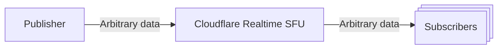
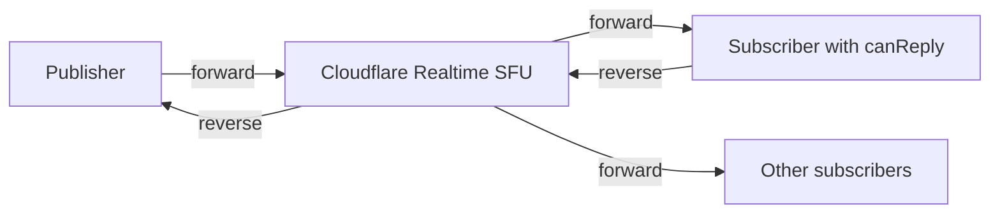

DataChannels are a way to send arbitrary data, not just audio or video data, between client in low latency. DataChannels are useful for scenarios like chat, game state, or any other data that doesn't need to be encoded as audio or video but still needs to be sent between clients in real time.

While it is possible to send audio and video over DataChannels, it's not optimal because audio and video transfer includes media specific optimizations that DataChannels do not have, such as simulcast, forward error correction, better caching across the Cloudflare network for retransmissions.



DataChannels on Cloudflare Realtime can scale up to many subscribers per publisher, there is no limit to the number of subscribers per publisher.

### How to use DataChannels

1. Create two Realtime sessions, one for the publisher and one for the subscribers.
2. Create a DataChannel by calling /datachannels/new with the location set to "local" and the dataChannelName set to the name of the DataChannel.
3. Create a DataChannel by calling /datachannels/new with the location set to "remote" and the sessionId set to the sessionId of the publisher.
4. Use the DataChannel to send data from the publisher to the subscribers.

### Message reliability and ordering

By default, DataChannels are reliable and ordered: every message is delivered, and messages arrive in the order they were sent. For latency-sensitive data such as game state or live sensor updates, you can opt into partial reliability or unordered delivery.

Set these optional fields when you create a DataChannel with the [HTTPS API](/realtime/sfu/https-api/), on the publisher (`location: "local"`) and on each subscriber (`location: "remote"`):

- `ordered` (boolean, default `true`) — when `false`, messages may arrive out of order and do not block later messages.
- `maxRetransmits` (integer) — maximum retransmissions per message. Use `0` for no retransmits (unreliable). Omit for unlimited retransmits.
- `maxPacketLifeTime` (integer) — maximum time in milliseconds the stack may spend trying to send a message. Omit for unlimited lifetime.

`maxRetransmits` and `maxPacketLifeTime` are mutually exclusive; do not set both on the same channel.

Because Realtime DataChannels use negotiated IDs, also pass the same options to `createDataChannel()` on the publisher and on each subscriber. The browser does not learn reliability from an in-band OPEN message.

Create an unreliable, unordered publisher channel:

```json
{
	"dataChannels": [
		{
			"location": "local",
			"dataChannelName": "player-state",
			"ordered": false,
			"maxRetransmits": 0
		}
	]
}
```

Then create the matching remote channel on the subscriber with the same reliability fields:

```json
{
	"dataChannels": [
		{
			"location": "remote",
			"sessionId": "<publisherSessionId>",
			"dataChannelName": "player-state",
			"ordered": false,
			"maxRetransmits": 0
		}
	]
}
```

On both the publisher and the subscriber, mirror those options when creating the negotiated DataChannel:

```ts
const dc = pc.createDataChannel("player-state", {
	negotiated: true,
	id: resp.dataChannels[0].id,
	ordered: false,
	maxRetransmits: 0,
});
```

For partial reliability, set a small `maxRetransmits` value (for example `2`) or a `maxPacketLifeTime` in milliseconds (for example `100`) instead of `0` / unlimited.

### Subscriber acknowledgment gate (waitForAck)

By default, a subscriber starts receiving messages as soon as it pulls a remote DataChannel. To avoid losing the first messages before your subscriber is ready to handle them, you can opt in to an acknowledgment gate for each subscriber.

- Set `waitForAck: true` when you create a remote DataChannel with the [HTTPS API](/realtime/sfu/https-api/). While the gate is closed, the SFU does not forward any messages to that subscriber on that DataChannel.
- After the subscriber's DataChannel opens, have the subscriber send any message on it (for example, the string `"ack"`). The first message opens the gate, and the SFU starts forwarding messages to that subscriber.
- The acknowledgment is consumed by the SFU. It is not forwarded to the publisher or to other subscribers. Without [`canReply`](#return-to-publisher-canreply), the channel stays publisher-to-subscriber only.
- The acknowledgment must reach the SFU within 15 seconds of creating the remote DataChannel. If it does not, the SFU tears down the gated channel and forwards no messages; create the remote DataChannel again to retry.
- `waitForAck` applies only to `location: "remote"` DataChannels and defaults to `false`, so existing behavior is unchanged.

Create a remote DataChannel with the gate enabled by calling `POST /apps/{appId}/sessions/{sessionId}/datachannels/new` on the subscriber session:

```json
{
	"dataChannels": [
		{
			"location": "remote",
			"sessionId": "<publisherSessionId>",
			"dataChannelName": "my-channel",
			"waitForAck": true
		}
	]
}
```

Then, on the subscriber, send the acknowledgment once the DataChannel is open:

```ts
const response = await fetch(
	`${API_BASE}/sessions/${subscriberId}/datachannels/new`,
	{
		method: "POST",
		headers,
		body: JSON.stringify({
			dataChannels: [
				{
					location: "remote",
					sessionId: publisherId,
					dataChannelName: "my-channel",
					waitForAck: true,
				},
			],
		}),
	},
);

if (!response.ok) {
	throw new Error(`Failed to create DataChannel: ${response.status}`);
}

const resp = await response.json();
const channelId = resp.dataChannels?.[0]?.id;
if (channelId === undefined) {
	throw new Error("DataChannel response did not include an id");
}

const dc = pc.createDataChannel("my-channel-subscribed", {
	negotiated: true,
	id: channelId,
});

await waitForOpen(dc);
dc.send("ack"); // The first frame opens the gate; later frames are your application data.
```

### Default direction (publisher to subscribers)

By default, Cloudflare Realtime SFU DataChannels are one-way. The publisher sends, and every subscriber that pulled the channel receives. Subscribers cannot send data back to the publisher unless you opt in with [`canReply`](#return-to-publisher-canreply).

### Return to publisher (canReply)

`canReply` lets one subscriber send messages back to the publisher on the same remote DataChannel it pulled. Forward traffic (publisher to subscribers) does not change. The SFU admits reverse traffic only from the subscriber that holds `canReply`, and delivers those messages only to the publisher, not to other subscribers.



`canReply` follows these rules:

- Set `canReply: true` when the subscriber creates a remote DataChannel with `POST .../datachannels/new`. You can also grant or revoke it later with `PUT .../datachannels/update` on that subscriber session.
- `canReply` applies only to `location: "remote"` DataChannels and defaults to `false`, so existing pull behavior does not change.
- At most one subscriber may hold `canReply` for a given publisher DataChannel at a time. Granting `canReply` to another subscriber replaces the previous holder. To revoke, set `canReply: false` on the subscriber that currently holds it.
- The SFU does not forward messages from a non-admitted subscriber to the publisher.
- The SFU does not fan out reverse messages to other subscribers.

#### Grant at pull time

Create the remote DataChannel on the subscriber session with `canReply: true`:

```json
{
	"dataChannels": [
		{
			"location": "remote",
			"sessionId": "<publisherSessionId>",
			"dataChannelName": "my-channel",
			"canReply": true
		}
	]
}
```

Example flow:

1. Publisher creates a local DataChannel named `my-channel`.
2. Subscriber pulls it with `canReply: true` and opens the negotiated channel in the browser.
3. Publisher sends on the channel; the subscriber receives (forward path).
4. Subscriber sends on the same channel; the publisher receives (reverse path).

#### Grant or revoke with update

To change admission without recreating the pull, call `PUT /apps/{appId}/sessions/{subscriberSessionId}/datachannels/update`:

```json
{
	"dataChannels": [
		{
			"location": "remote",
			"sessionId": "<publisherSessionId>",
			"dataChannelName": "my-channel",
			"canReply": true
		}
	]
}
```

Use the same body with `"canReply": false` to revoke. The following table lists common patterns:

| Goal                                      | Action                                                                                                                  |
| ----------------------------------------- | ----------------------------------------------------------------------------------------------------------------------- |
| Pull without reverse, then allow reverse  | Create remote without `canReply` (or `canReply: false`). Confirm reverse is blocked. Call update with `canReply: true`. |
| Move reverse rights to another subscriber | On the new subscriber, call update with `canReply: true`. The previous holder loses reverse admission.                  |
| Stop reverse traffic                      | On the current holder, call update with `canReply: false`.                                                              |

```ts
// Subscriber already pulled "my-channel" without canReply.
// Grant reverse admission later:
await fetch(`${API_BASE}/sessions/${subscriberId}/datachannels/update`, {
	method: "PUT",
	headers,
	body: JSON.stringify({
		dataChannels: [
			{
				location: "remote",
				sessionId: publisherId,
				dataChannelName: "my-channel",
				canReply: true,
			},
		],
	}),
});

// Same negotiated DataChannel instance; subscriber can now send and the publisher receives.
dc.send(JSON.stringify({ type: "reply", body: "pong" }));
```

#### Combine canReply and waitForAck

You can set both `canReply` and `waitForAck` on the same remote DataChannel. `waitForAck` still gates forward delivery to that subscriber until it sends its first message. That first message is consumed as the acknowledgment and is not forwarded. After the gate opens, further subscriber messages on an admitted `canReply` channel become reverse traffic to the publisher.

## Example

An example of DataChannels in action can be found in the [Realtime Examples github repo](https://github.com/cloudflare/calls-examples/tree/main/echo-datachannels).
