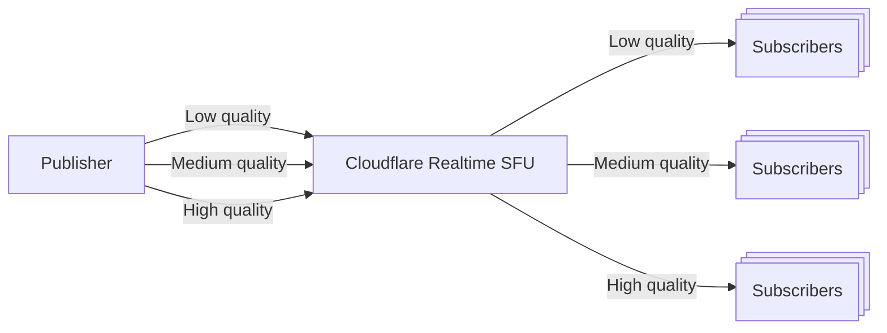

import { Steps } from "~/components";

Simulcast lets a publisher send multiple encodings of one video source. Subscribers can select different quality levels for their display and network conditions.



## How it works

A publisher can encode one video source at multiple qualities. Each encoding has an RTP Stream Identifier (RID), such as `f`, `h`, or `q`, advertised in its session description.

The publisher advertises its encodings. Each subscriber chooses a layer through the `simulcast` object on its remote track request. Each subscription has its own configuration.

Your backend makes the SFU API requests. Keep the App Secret there, check individual track results, and follow [per-session mutation ordering](/realtime/sfu/concepts/negotiation/#serialize-mutations-per-session) throughout these tasks.

<span id="publisher-configuration"></span>

## Publish multiple encodings

Configure the publishing endpoint before creating its offer. Its SDP advertises the simulcast encodings; the SFU uses those attributes for the local publication. For example, the SDP contains:

```txt
a=simulcast:send f;h;q
a=rid:f send
a=rid:h send
a=rid:q send
```

In a browser, use this `addTransceiver()` call in place of the one in [Publish audio or video](/realtime/sfu/get-started/connection-patterns/#publish-audio-or-video). Here, `track` is a video `MediaStreamTrack` and `peerConnection` is the publishing connection:

```js
const transceiver = peerConnection.addTransceiver(track, {
  direction: "sendonly",
  sendEncodings: [
    { scaleResolutionDownBy: 1, rid: "f" },
    { scaleResolutionDownBy: 2, rid: "h" },
    { scaleResolutionDownBy: 4, rid: "q" },
  ],
});
```

Continue the publication recipe from offer creation on that same PeerConnection and its SFU session. The generated SDP contains `a=simulcast:send`. After publication succeeds, share the publisher's session ID, track name, and available RIDs with authorized subscribers.

## Subscribe to a simulcast track

Start with an existing publication that advertises simulcast encodings. Obtain its publisher session ID, track name, and available RIDs through your application. Prepare the receiving PeerConnection and its own SFU session using [Receive a published track](/realtime/sfu/get-started/connection-patterns/#receive-a-published-track), but do not request the track yet.

<Steps>

1. On your backend, call `POST /apps/{appId}/sessions/{sessionId}/tracks/new`. The URL identifies the **receiving session**. The request body identifies the **publisher's session** and publication:

   ```json
   {
    "tracks": [
      {
        "location": "remote",
        "sessionId": "<PUBLISHER_SESSION_ID>",
        "trackName": "camera",
        "simulcast": {
          "preferredRid": "f",
          "priorityOrdering": "asciibetical",
          "ridNotAvailable": "asciibetical"
        }
      }
    ]
   }
   ```

   This example prefers `f` and enables alphabetical fallback through `h` and `q`. Use RIDs advertised by your publisher and choose the [layer policy](#quality-control) for your application.

2. Check the track result and retain its receiving `mid` to identify this subscription. On the receiving endpoint, [complete the returned SFU offer](/realtime/sfu/get-started/connection-patterns/#complete-an-sfu-offer). Confirm that the publication plays there.

</Steps>

<span id="layer-switching-behavior"></span>

## Change the received layer

To change an existing subscription, update `preferredRid` through `PUT /apps/{appId}/sessions/{sessionId}/tracks/update` on your backend. The URL identifies the receiving session. Use that subscription's receiving `mid` in the request and select a RID advertised by the publisher.

Check the track result before advancing application state. Refer to the [OpenAPI schema](/realtime/static/realtime-api-2024-05-21.yaml) for the complete update body.

## Quality control

The `simulcast` object selects a layer and its fallback policy:

- `preferredRid`: The preferred encoding's RID, as [specified by the publisher](https://developer.mozilla.org/en-US/docs/Web/API/RTCRtpSender/setParameters#encodings).
- `priorityOrdering`: Controls how the SFU handles bandwidth constraints.
  - `none`: Keep sending the layer selected by `preferredRid`, even if there is not enough bandwidth.
  - `asciibetical`: Use alphabetical ordering (`a` to `z`) to determine priority. `a` is most desirable and `z` is least desirable.
- `ridNotAvailable`: Controls what happens when the preferred RID is unavailable, for example when the publisher stops sending it.
  - `none`: Do not select an alternative layer.
  - `asciibetical`: Switch to the next available RID in alphabetical priority order.

Both `priorityOrdering` and `ridNotAvailable` default to `none`. Neither selects an alternative layer automatically with that default. When using `asciibetical`, assign RIDs in your desired priority order, such as highest resolution to lowest.

## Learn with an example

The [video-room example](/realtime/sfu/examples/video-room/) demonstrates the publication and subscription lifecycle you would extend with simulcast. Use the publisher configuration on this page when adding video encodings.

The [simulcast echo sample](https://github.com/cloudflare/realtime-examples/tree/main/echo-simulcast) is a legacy reference. It places an SFU token in browser code and is not a recommended application starting point. Keep SFU API calls on your backend when adapting the sample.
