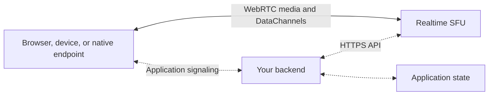

import { CardGrid, Description, LinkButton, LinkTitleCard } from "~/components";

<Description>
	Connect devices, applications, and AI with real-time media and data.
</Description>

Cloudflare Realtime SFU (Selective Forwarding Unit) routes WebRTC audio, video, and DataChannels between your endpoints. Your application chooses who publishes, who subscribes, and who can send controls back.

WebRTC provides connections for live media and messages. Each endpoint connects to the SFU, which forwards its publications to the subscribers your application selects.

Use standard HTTPS APIs and WebRTC from browsers, embedded firmware, native applications, and servers. Your signaling backend can run on Workers, in a container, or on your existing infrastructure.

<LinkButton href="/realtime/sfu/get-started/">Get started</LinkButton>
<LinkButton variant="secondary" href="/realtime/sfu/examples/">
	Explore examples
</LinkButton>

## What you can build

<CardGrid class="xl:grid-cols-3">
	<LinkTitleCard
		title="Embedded devices"
		href="/realtime/sfu/examples/embedded-devices/"
		icon="ph:cpu"
	>
		Send audio and telemetry from an ESP32 to browsers, with controls for one
		authorized operator. Use the same design for robot gateways.
	</LinkTitleCard>
	<LinkTitleCard
		title="Cloud gaming"
		href="/realtime/sfu/examples/cloud-gaming/"
		icon="ph:game-controller"
	>
		Stream a game from a Container to browsers, then send keyboard and pointer
		input back over DataChannels.
	</LinkTitleCard>
	<LinkTitleCard
		title="AI audio pipelines"
		href="/realtime/sfu/examples/ai-audio/"
		icon="ph:waveform"
	>
		Transcribe microphone audio with Workers AI, then send generated speech to
		browsers through WebSocket media adapters.
	</LinkTitleCard>
</CardGrid>

For a video conferencing application, start with [RealtimeKit](/realtime/realtimekit/). It provides meeting SDKs, participant management, and customizable UI components. Choose Realtime SFU when you need direct control over WebRTC connections, media routing, and signaling.

For a browser-first introduction, [run a custom video room](/realtime/sfu/get-started/). You can also compose interactive broadcasts, remote inspection tools, and media-processing applications from the same primitives.

## How the pieces fit together

Your endpoints exchange media and DataChannels with Realtime SFU. A separate application backend authenticates users and devices, calls the SFU API, and shares the track identifiers that endpoints need.

The backend holds the SFU App Secret and manages application state and permissions. Refer to [application architecture](/realtime/sfu/concepts/architecture/) for the responsibilities and trust boundaries.

## Choose a starting point

| You want to                                               | Start with                                                            |
| --------------------------------------------------------- | --------------------------------------------------------------------- |
| Run a working application                                 | [Get started](/realtime/sfu/get-started/)                             |
| Understand connections, publications, and subscriptions   | [Sessions and tracks](/realtime/sfu/concepts/sessions-tracks/)        |
| Implement your own media or messaging endpoint            | [Connection patterns](/realtime/sfu/get-started/connection-patterns/) |
| Add messages, video quality selection, or a media adapter | [Features](/realtime/sfu/features/)                                   |
| Look up an API operation or request body                  | [Connection API](/realtime/sfu/api/)                                  |
| Diagnose a connection or media problem                    | [Observability](/realtime/sfu/observability/)                         |

For a coding agent, start with the [SFU documentation index](/realtime/sfu/llms.txt). It links to the task guides and API reference.

The [examples collection](/realtime/sfu/examples/) identifies each application's requirements and limitations. Refer to [pricing](/realtime/sfu/platform/pricing/) and [limits](/realtime/sfu/platform/limits/) when planning your integration.
