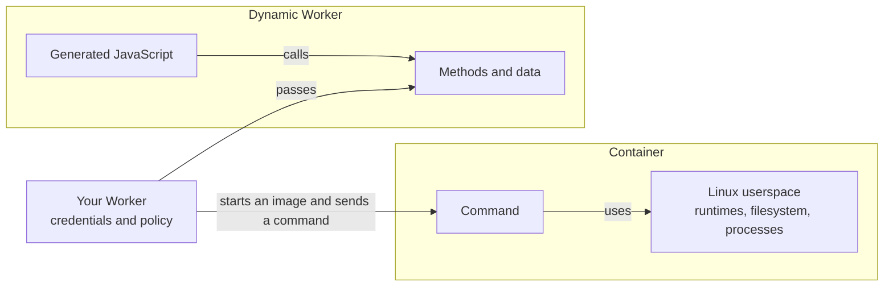

import { CardGrid, Example, LinkTitleCard } from "~/components";

Your application may need to run code it did not create. A short program may need only APIs you provide, while a test runner, build tool, or server may expect Linux. Cloudflare supports both kinds of work, and your [Worker](/workers/) chooses the environment for each job.

## What the code receives

A [Dynamic Worker](/dynamic-workers/) receives the modules, methods, and values you pass to it. It does not inherit your application's bindings, credentials, or data. Set `globalOutbound` to `null` to block direct access to the Internet.

A [Container](/containers/) starts from an image you provide. A command can use the runtimes, packages, and files in that image, and it can start processes.

## Give code an interface

Use a Dynamic Worker when generated code can complete its job through methods and data you define. Your Worker can enforce scope before it passes a method.

Your Worker can expose `listPullRequests()` for one account and repository while keeping the API token. Generated code can filter the returned records without gaining access to another repository or the token. For more information, refer to [Bindings](/dynamic-workers/usage/bindings/).

In [Code Mode](/agents/tools/codemode/), the model writes a JavaScript program against typed methods. A Dynamic Worker runs the program and returns its result, so intermediate values do not enter the model context. For generated snippets, use JavaScript because the runtime decides which host APIs exist.

You can create a Dynamic Worker for one request and discard it afterward. You can also run a generated application with scoped storage. Adding storage does not give that application access to your other resources.

## Run code that expects Linux

Existing programs may depend on an operating system as well as a language runtime. Running `npm test` needs Node.js, project dependencies on a filesystem, and child processes. A preview server keeps a process running and listens on a port. A compiler may need a toolchain or native binaries.

A JavaScript project can also depend on Linux. Workers supports many Node.js APIs, but some modules are partial implementations or non-functional stubs.

A Dynamic Worker cannot run code that starts child processes, loads native add-ons, or uses unavailable Node.js APIs. You can adapt the code to Workers APIs or run it in a Container. For supported APIs, refer to [Node.js compatibility](/workers/runtime-apis/nodejs/).

A Container supplies the Linux environment that these programs expect. Your Worker controls when the instance starts, whether it can reach the Internet, and how HTTP requests reach it. The [Agents sandbox tool](/agents/tools/sandbox/) uses a Container to run commands for an agent.

File contents can go to either environment. If your Worker has text or bytes to parse or transform, pass that data into a Dynamic Worker. Use a Container when the tool working with those files needs a Linux command, runtime, or filesystem behavior.

## What you maintain

With a Dynamic Worker, you define each method and scope the data it returns. When generated code needs another operation, you add it to that interface. The loader code lists everything you pass into the sandbox.

With a Container, you build and update the image. Existing tools can run without being adapted to Workers APIs, but an instance must start before its first command runs. For more information, refer to [Container cold starts](/containers/concepts/architecture/#cold-starts).

## Use both in one application

Choose again when the job changes. The same Worker can start both environments.

<Example title="A coding agent using both environments">

A coding agent can answer questions about a repository through scoped methods in a Dynamic Worker. When the agent proposes a patch, its Worker can start a Container and run the repository test suite. The Container handles the Linux command while the Dynamic Worker handles work expressed through APIs.

</Example>

Start with a Dynamic Worker when methods and data provide everything the job needs. Add a Container when the code expects Linux. Your Worker coordinates both.

<CardGrid>

<LinkTitleCard
	title="Run JavaScript"
	href="/sandbox/get-started/dynamic-workers/"
	icon="ph:code"
>
	Post JavaScript to a Worker and read the sandboxed result.
</LinkTitleCard>

<LinkTitleCard
	title="Run a Linux command"
	href="/sandbox/get-started/containers/"
	icon="ph:terminal-window"
>
	Post a command to a Worker and read stdout from Linux.
</LinkTitleCard>

</CardGrid>
