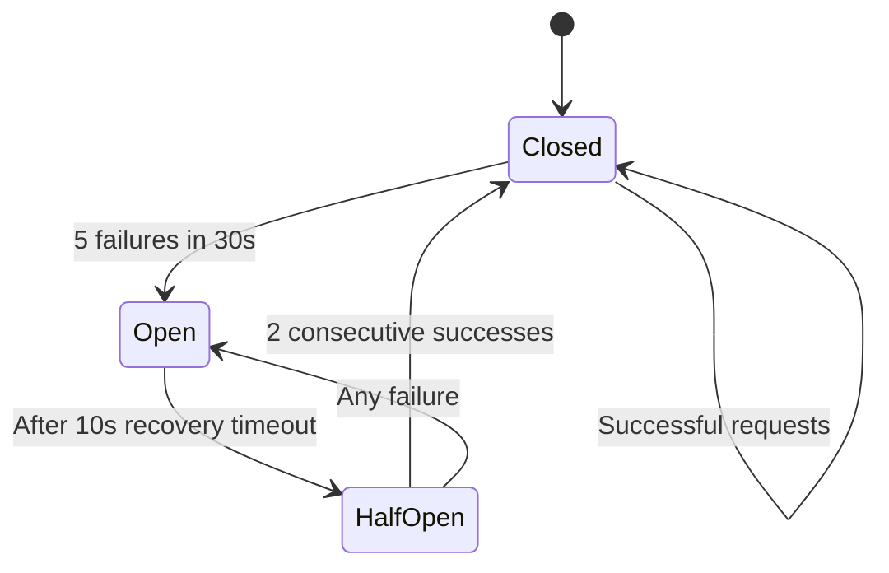

The Sandbox SDK includes built-in resilience features to protect against cascading failures and traffic bursts. These mechanisms operate automatically within the SDK's HTTP client layer to ensure reliable operation under high load and degraded conditions.

## Circuit breaker

The circuit breaker pattern prevents overwhelming unhealthy containers with requests by failing fast when error rates exceed acceptable thresholds.

### How it works

The circuit breaker operates in three states:

- **Closed** - Normal operation. Requests pass through to the container.
- **Open** - Too many failures detected. Requests fail immediately without reaching the container.
- **Half-open** - Testing recovery. Limited requests allowed to check if the container has recovered.

When 5 failures occur within a 30-second window, the circuit opens and rejects all requests for 10 seconds. After the recovery timeout, it enters half-open state. If 2 consecutive requests succeed in half-open state, the circuit closes. Any failure in half-open immediately reopens the circuit.

### State transitions



### Failure detection

Only HTTP 5xx server errors count as failures for circuit breaker purposes. The circuit breaker does not count:

- HTTP 4xx client errors (these indicate caller issues, not container health)
- Successful responses (HTTP 2xx, 3xx)
- Network errors (these trigger container startup retry logic instead)

### Error handling

When the circuit is open, requests fail immediately with `CircuitOpenError`:

```typescript
try {
  await sandbox.exec("python script.py");
} catch (error) {
  if (error.name === 'CircuitOpenError') {
    // Circuit is open - container is unhealthy
    // Wait before retrying: error.remainingMs milliseconds
    console.log(`Service unavailable. Retry after ${Math.ceil(error.remainingMs / 1000)}s`);
  }
}
```

## Request queue

The request queue limits concurrent requests and provides backpressure during traffic bursts. This prevents resource exhaustion and maintains stable performance under load.

### How it works

The queue enforces two limits:

- **Concurrency limit** - Maximum 10 concurrent requests to the container
- **Queue size limit** - Maximum 100 pending requests waiting for capacity

When concurrency is below the limit, requests execute immediately. When at capacity, excess requests queue in FIFO order. Each queued request has a 30-second timeout.

### Queue behavior

```typescript
// Request flow:
// 1. Check if under concurrency limit (< 10 active)
//    - Yes: Execute immediately
//    - No: Add to queue

// 2. Wait in queue (FIFO order)
//    - Request executes when capacity available
//    - OR times out after 30s
//    - OR rejected if queue is full (> 100 pending)

// 3. Active requests release capacity when complete
//    - Next queued request executes automatically
```

### Error handling

Queued requests can fail in two ways:

**Queue timeout** - Request waited too long:

```typescript
try {
  await sandbox.exec("python script.py");
} catch (error) {
  if (error.name === 'QueueTimeoutError') {
    // Waited too long in queue
    console.log(`Request timed out after ${Math.ceil(error.waitTime / 1000)}s in queue`);
  }
}
```

**Queue full** - System overloaded:

```typescript
try {
  await sandbox.exec("python script.py");
} catch (error) {
  if (error.name === 'QueueFullError') {
    // Too many pending requests
    console.log(`Service overloaded. ${error.queueSize} requests already pending.`);
    // Implement exponential backoff or shed load
  }
}
```

## Configuration

Resilience features are configured automatically with production-tested defaults. These settings cannot currently be customized but may become configurable in future SDK versions based on user feedback.

### Default settings

**Circuit breaker:**
- Failure threshold: 5 failures
- Failure window: 30 seconds
- Recovery timeout: 10 seconds
- Success threshold: 2 successes to close

**Request queue:**
- Maximum concurrent: 10 requests
- Maximum queue size: 100 requests
- Queue timeout: 30 seconds

## When resilience features activate

### Circuit breaker opens when

- Container repeatedly crashes on startup
- Container process exhausts resources (OOM, CPU)
- Internal server errors from malformed requests
- Persistent failures in container runtime

The circuit breaker protects against cascading failures by stopping requests to unhealthy containers. This gives the container time to recover without additional load.

### Request queue fills when

- Traffic bursts exceed container capacity
- Long-running commands block request processing
- Multiple concurrent users or requests
- Background processes consume resources

The queue smooths traffic spikes and prevents overwhelming the container with too many concurrent operations.

## Best practices

### Handle resilience errors gracefully

Always catch and handle circuit breaker and queue errors:

```typescript
import type { Sandbox } from "@cloudflare/sandbox";

async function executeWithRetry(sandbox: Sandbox, command: string, maxRetries = 3) {
  for (let attempt = 0; attempt < maxRetries; attempt++) {
    try {
      return await sandbox.exec(command);
    } catch (error) {
      const errorName = (error as Error).name;

      if (errorName === 'CircuitOpenError') {
        // Circuit is open - wait before retry
        const remainingMs = (error as any).remainingMs ?? 10000;
        await new Promise(resolve => setTimeout(resolve, remainingMs));
        continue;
      }

      if (errorName === 'QueueTimeoutError' || errorName === 'QueueFullError') {
        // Queue issues - implement backoff
        const backoffMs = Math.min(1000 * Math.pow(2, attempt), 10000);
        await new Promise(resolve => setTimeout(resolve, backoffMs));
        continue;
      }

      // Other error - rethrow
      throw error;
    }
  }

  throw new Error(`Failed after ${maxRetries} attempts`);
}
```

### Monitor for patterns

Frequent circuit breaker or queue errors indicate underlying issues:

- **Circuit opens frequently** - Container stability problems. Review container logs, check resource limits, audit command patterns.
- **Queue timeouts** - Commands take too long. Optimize slow operations, use background processes for long tasks.
- **Queue fills** - Traffic exceeds capacity. Implement rate limiting, scale horizontally with multiple sandboxes.

### Design for failure

Resilience features provide temporary protection. Design your application to handle degraded states:

- Implement request timeouts at the application level
- Use exponential backoff for retries
- Cache results when possible
- Provide graceful degradation (fallback responses)
- Monitor error rates and alert on anomalies

## Relationship to other features

### Container startup retry

The SDK automatically retries container startup failures (HTTP 503 and some 500 errors) for up to 2 minutes before giving up. This is separate from the circuit breaker, which tracks persistent failures after startup succeeds.

Startup retry handles transient provisioning delays. Circuit breaker handles sustained operational failures.

### Session isolation

Each session maintains independent execution state but shares the same circuit breaker and request queue. A failure in one session affects all sessions in the same sandbox.

Design sessions to isolate risky operations. If one workflow causes circuit breaker trips, other workflows in different sandboxes remain unaffected.

## Related resources

- [Architecture](/sandbox/concepts/architecture/) - Understanding SDK layers and request flow
- [Container runtime](/sandbox/concepts/containers/) - How containers execute commands
- [Session management](/sandbox/concepts/sessions/) - Isolating execution contexts
- [Security model](/sandbox/concepts/security/) - Additional protection mechanisms
