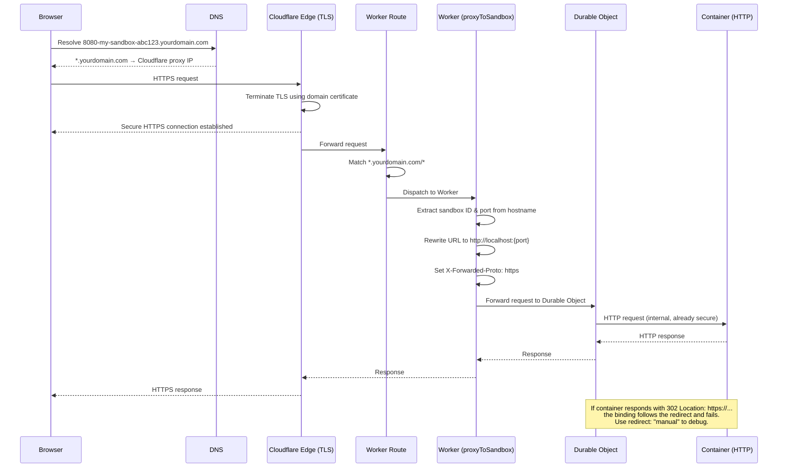

import { WranglerConfig } from "~/components";

:::note[Only required for preview URLs]
Custom domain setup is ONLY needed if you use `exposePort()` to expose services from sandboxes. If your application does not expose ports, you can deploy to `.workers.dev` without this configuration.
:::

Deploy your Sandbox SDK application to production with preview URL support. Preview URLs require wildcard DNS routing because they generate unique subdomains for each exposed port: `https://8080-abc123.yourdomain.com`.

The `.workers.dev` domain does not support wildcard subdomains, so production deployments that use preview URLs need a custom domain.

:::caution[Subdomain depth matters for TLS]
If your worker runs on a subdomain (for example, `sandbox.yourdomain.com`), preview URLs become second-level wildcards like `*.sandbox.yourdomain.com`. Cloudflare's Universal SSL only covers first-level wildcards (`*.yourdomain.com`), so you need a certificate covering `*.sandbox.yourdomain.com`. Without it, preview URLs will fail with TLS handshake errors.

You have three options:

- **Deploy on the apex domain** (`yourdomain.com`) so preview URLs stay at the first level (`*.yourdomain.com`), which Universal SSL covers automatically. This is the simplest option.
- **Use [Advanced Certificate Manager](/ssl/edge-certificates/advanced-certificate-manager/)** to provision a certificate for `*.sandbox.yourdomain.com` through the Cloudflare dashboard.
- **Upload a custom certificate** from a provider like [Let's Encrypt](https://letsencrypt.org/) (free). Generate a wildcard certificate for `*.sandbox.yourdomain.com` using the DNS-01 challenge, then upload it via the Cloudflare dashboard under **SSL/TLS** > **Edge Certificates** > **[Custom Certificates](/ssl/edge-certificates/custom-certificates/)**. You will need to renew it before expiry.
  :::

## How preview URL requests flow

When a browser visits a preview URL like `https://8080-my-sandbox-abc123.yourdomain.com`:

1. **DNS**: The wildcard record (`*.yourdomain.com`) resolves the hostname to Cloudflare's proxy.
2. **TLS**: Cloudflare terminates TLS at the edge using your domain's certificate. The browser gets a secure HTTPS connection.
3. **Worker route**: The wildcard route (`*.yourdomain.com/*`) matches the request and sends it to your Worker.
4. **`proxyToSandbox()`**: Your Worker calls `proxyToSandbox()`, which extracts the sandbox ID and port from the hostname, rewrites the URL to `http://localhost:{port}`, and forwards the request to the correct Durable Object. It sets `X-Forwarded-Proto: https` so your application can detect the original protocol.
5. **Container**: The Durable Object forwards the request to the service inside your container over an internal connection (HTTP -- TLS is not needed because the transport is already secure within Cloudflare's network). If your service responds with an HTTP redirect, the container binding follows it automatically. If the redirect `Location` header contains an `https://` URL, the request fails. To prevent this, ensure your application produces HTTP or relative redirect URLs, or pass `redirect: "manual"` in your Worker to handle redirects yourself.



Each step can fail independently: DNS can resolve but TLS can fail (certificate does not cover the hostname), or TLS can succeed but the route does not match (request reaches the wrong Worker or no Worker at all).

## Prerequisites

- Active Cloudflare zone with a domain
- Worker that uses `exposePort()`
- [Wrangler CLI](/workers/wrangler/install-and-update/) installed

## Setup

### Create Wildcard DNS Record

In the Cloudflare dashboard, go to your domain and create an A record. The record name depends on whether your Worker runs on the apex domain or a subdomain.

#### Apex domain

If your Worker runs on the apex domain (`yourdomain.com`), create a wildcard record for `*`:

- **Type**: A
- **Name**: `*` (wildcard)
- **IPv4 address**: `192.0.2.0`
- **Proxy status**: Proxied (orange cloud)

This routes all subdomains through Cloudflare's proxy. The IP address `192.0.2.0` is a documentation address (RFC 5737) that Cloudflare recognizes when proxied. Preview URLs will look like `https://8080-sandbox-id-token.yourdomain.com`.

#### Subdomain

If your Worker runs on a subdomain (for example, `sandbox.yourdomain.com`), create a wildcard record for `*.sandbox`:

- **Type**: A
- **Name**: `*.sandbox` (where `sandbox` matches your Worker's subdomain)
- **IPv4 address**: `192.0.2.0`
- **Proxy status**: Proxied (orange cloud)

This routes all sub-subdomains of `sandbox.yourdomain.com` through Cloudflare's proxy. Preview URLs will look like `https://8080-sandbox-id-token.sandbox.yourdomain.com`.

:::caution[TLS certificate required]
You also need a TLS certificate covering `*.sandbox.yourdomain.com`. Universal SSL does not cover second-level wildcards. Refer to the [TLS caution at the top of this page](#subdomain-depth-matters-for-tls), or use [Advanced Certificate Manager](/ssl/edge-certificates/advanced-certificate-manager/) to order one through the dashboard.
:::

### Configure Worker Routes

Add a wildcard route to your Wrangler configuration. The route pattern must match the domain or subdomain your Worker runs on.

#### Apex domain

<WranglerConfig>
```jsonc
{
	"$schema": "./node_modules/wrangler/config-schema.json",
	"name": "my-sandbox-app",
	"main": "src/index.ts",
	"compatibility_date": "$today",
	"routes": [
		{
			"pattern": "*.yourdomain.com/*",
			"zone_name": "yourdomain.com"
		}
	]
}
```
</WranglerConfig>

Replace `yourdomain.com` with your actual domain.

#### Subdomain

<WranglerConfig>
```jsonc
{
	"$schema": "./node_modules/wrangler/config-schema.json",
	"name": "my-sandbox-app",
	"main": "src/index.ts",
	"compatibility_date": "$today",
	"routes": [
		{
			"pattern": "*.sandbox.yourdomain.com/*",
			"zone_name": "yourdomain.com"
		}
	]
}
```
</WranglerConfig>

Replace `sandbox.yourdomain.com` with your actual subdomain and `yourdomain.com` with your zone name.

### Deploy

Deploy your Worker:

```sh
npx wrangler deploy
```

## Verify

Test that preview URLs work:

```typescript
// Extract hostname from request
const { hostname } = new URL(request.url);

const sandbox = getSandbox(env.Sandbox, "test-sandbox");
await sandbox.startProcess("python -m http.server 8080");
const exposed = await sandbox.exposePort(8080, { hostname });

console.log(exposed.url);
// https://8080-test-sandbox.yourdomain.com
```

Visit the URL in your browser to confirm your service is accessible.

## Troubleshooting

- **CustomDomainRequiredError**: Verify your Worker is not deployed to `.workers.dev` and that the wildcard DNS record and route are configured correctly.
- **SSL/TLS errors**: Wait a few minutes for certificate provisioning. Verify the DNS record is proxied and SSL/TLS mode is set to "Full" or "Full (strict)" in your dashboard. If your worker is on a subdomain (for example, `sandbox.yourdomain.com`), Universal SSL will not cover the second-level wildcard `*.sandbox.yourdomain.com` -- see the [TLS caution](#subdomain-depth-matters-for-tls) at the top of this page for options.
- **Preview URL not resolving**: Confirm the wildcard DNS record exists and is proxied. Wait 30-60 seconds for DNS propagation.
- **Port not accessible**: Ensure your service binds to `0.0.0.0` (not `localhost`) and that `proxyToSandbox()` is called first in your Worker's fetch handler.
- **Container HTTPS error**: Your service inside the sandbox is using HTTPS (for example, Node.js `https.createServer()` or a framework with `--https` enabled). Configure it to serve plain HTTP instead. Cloudflare terminates TLS at the edge, so the browser connects over HTTPS, but the internal connection to your container uses HTTP. If your framework checks the protocol and redirects HTTP to HTTPS, configure it to trust the proxy (for example, `app.set('trust proxy', 1)` in Express). This error also occurs when your application responds with an HTTP redirect to an `https://` URL. The container binding follows redirects by default. If your framework middleware or auth library constructs redirect URLs using the `X-Forwarded-Proto` header (which `proxyToSandbox()` sets to `https`), the `Location` header may contain an absolute `https://` URL that fails when followed. To debug, pass `redirect: "manual"` to your `containerFetch` call and log the `Location` header. To fix, use relative paths in redirects, or set your auth library's base URL to the container's internal HTTP address (for example, `NEXTAUTH_URL=http://localhost:3001` for NextAuth).
- **Debugging container HTTPS errors**: The container binding follows HTTP redirects by default. If your application redirects to an `https://` URL (for example, auth middleware redirecting to a sign-in page), the binding follows the redirect internally and fails. To debug, pass `redirect: "manual"` to your `containerFetch` call and log the response status and `Location` header to see what URL your application is producing.
- **[Error 1016](/support/troubleshooting/http-status-codes/cloudflare-1xxx-errors/error-1016/)**: Verify your wildcard DNS record exists and is proxied (orange cloud). If your Worker runs on a subdomain like `sandbox.yourdomain.com`, the DNS record name must be `*.sandbox`, not `*`.
- **[Error 522](/support/troubleshooting/http-status-codes/cloudflare-5xx-errors/error-522/)**: Verify `proxyToSandbox()` is called first in your Worker's fetch handler -- if it is not handling the request, Cloudflare tries to reach the `192.0.2.0` origin, which times out.

For detailed troubleshooting, see the [Workers routing documentation](/workers/configuration/routing/).

## Related Resources

- [Preview URLs](/sandbox/concepts/preview-urls/) - How preview URLs work
- [Expose Services](/sandbox/guides/expose-services/) - Patterns for exposing ports
- [Workers Routing](/workers/configuration/routing/) - Advanced routing configuration
- [Cloudflare DNS](/dns/) - DNS management
