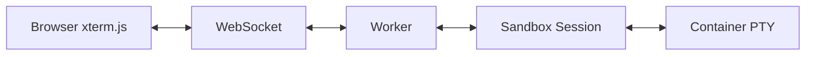

import { TypeScriptExample, WranglerConfig } from "~/components";

Connect web terminals directly to sandbox sessions for real-time terminal interaction. This enables building browser-based terminal interfaces, collaborative terminals, and terminal-based applications.

## Overview

Terminal connections use WebSockets to stream terminal I/O between xterm.js in the browser and a PTY (pseudo-terminal) in the sandbox container. The connection is bidirectional:

- **Terminal input** (keystrokes) flows from browser to sandbox
- **Terminal output** (command results, prompts) flows from sandbox to browser
- **Resize events** synchronize terminal dimensions



## Basic Implementation

### 1. Install Dependencies

```bash
npm install @xterm/xterm @xterm/addon-fit @cloudflare/sandbox
```

### 2. Client-Side Terminal

<TypeScriptExample>
```
import { Terminal } from '@xterm/xterm';
import { FitAddon } from '@xterm/addon-fit';
import { SandboxAddon } from '@cloudflare/sandbox/xterm';
import '@xterm/xterm/css/xterm.css';

// Create terminal with addons
const terminal = new Terminal({
  cursorBlink: true,
  fontSize: 14,
  fontFamily: 'monospace'
});

const fitAddon = new FitAddon();
const sandboxAddon = new SandboxAddon({
  getWebSocketUrl: ({ origin, sessionId }) => 
    `${origin}/ws/terminal/${sessionId}`,
  onStateChange: (state) => {
    console.log('Terminal connection:', state);
    updateConnectionUI(state);
  }
});

// Load addons and open terminal
terminal.loadAddon(fitAddon);
terminal.loadAddon(sandboxAddon);
terminal.open(document.getElementById('terminal'));
fitAddon.fit();

// Connect to sandbox session
sandboxAddon.connect({
  sandboxId: 'my-sandbox',
  sessionId: 'main'
});

// Handle window resize
window.addEventListener('resize', () => fitAddon.fit());
```
</TypeScriptExample>

### 3. Worker WebSocket Handler

<TypeScriptExample>
```
export default {
  async fetch(request, env) {
    const url = new URL(request.url);
    
    // Handle terminal WebSocket connections
    if (url.pathname.startsWith('/ws/terminal/')) {
      const sessionId = url.pathname.split('/').pop();
      
      // Get or create sandbox
      const sandbox = getSandbox(env.Sandbox, 'shared-terminal');
      
      // Connect to specific session
      const session = await sandbox.getSession(sessionId);
      
      // Return WebSocket response - sandbox handles the upgrade
      return session.terminal(request);
    }
    
    // Handle other routes...
    return new Response('Not found', { status: 404 });
  }
}
```
</TypeScriptExample>

### 4. Wrangler Configuration

<WranglerConfig filename="wrangler.toml">
```
name = "terminal-app"
main = "src/worker.ts"

[[durable_objects.bindings]]
name = "Sandbox"
class_name = "Sandbox"
script_name = "cloudflare-sandbox"
```
</WranglerConfig>

## Connection States

Monitor connection status to provide user feedback:

<TypeScriptExample>
```
function updateConnectionUI(state) {
  const indicator = document.getElementById('connection-status');
  
  switch (state) {
    case 'connecting':
      indicator.textContent = 'Connecting...';
      indicator.className = 'status-connecting';
      showSpinner(true);
      break;
      
    case 'connected':
      indicator.textContent = 'Connected';
      indicator.className = 'status-connected';
      showSpinner(false);
      break;
      
    case 'disconnected':
      indicator.textContent = 'Disconnected';  
      indicator.className = 'status-disconnected';
      showSpinner(false);
      break;
  }
}
```
</TypeScriptExample>

## Session Management

### Multiple Sessions

Connect to different sessions for isolated environments:

<TypeScriptExample>
```
// Create session selector
const sessionSelect = document.getElementById('session-select');
sessionSelect.addEventListener('change', (e) => {
  const sessionId = e.target.value;
  
  // Switch to different session
  sandboxAddon.connect({
    sandboxId: 'my-sandbox',
    sessionId: sessionId
  });
});

// Sessions for different environments
const sessions = [
  { id: 'dev', name: 'Development' },
  { id: 'test', name: 'Testing' },
  { id: 'prod', name: 'Production' }
];

sessions.forEach(session => {
  const option = document.createElement('option');
  option.value = session.id;
  option.textContent = session.name;
  sessionSelect.appendChild(option);
});
```
</TypeScriptExample>

### Session Isolation

Each session maintains independent state:

<TypeScriptExample>
```
// Worker: Create sessions with different environments
const devSession = await sandbox.createSession({
  id: 'dev',
  env: { NODE_ENV: 'development', DEBUG: '1' },
  cwd: '/workspace/dev'
});

const prodSession = await sandbox.createSession({
  id: 'prod', 
  env: { NODE_ENV: 'production' },
  cwd: '/workspace/prod'
});

// Browser: Switch between sessions
function switchToDev() {
  addon.connect({ sandboxId: 'my-sandbox', sessionId: 'dev' });
}

function switchToProd() {
  addon.connect({ sandboxId: 'my-sandbox', sessionId: 'prod' });
}
```
</TypeScriptExample>

## Advanced Features

### Custom Terminal Themes

<TypeScriptExample>
```
const terminal = new Terminal({
  theme: {
    background: '#1a1a1a',
    foreground: '#ffffff',
    cursor: '#ff6600',
    black: '#000000',
    red: '#ff5555',
    green: '#55ff55',
    yellow: '#ffff55',
    blue: '#5555ff',
    magenta: '#ff55ff',
    cyan: '#55ffff',
    white: '#ffffff'
  },
  fontFamily: '"Fira Code", "Courier New", monospace',
  fontSize: 14,
  lineHeight: 1.2,
  cursorBlink: true,
  cursorStyle: 'block'
});
```
</TypeScriptExample>

### Authentication

Secure terminal connections with authentication:

<TypeScriptExample>
```
// Client: Include auth token in WebSocket URL
const sandboxAddon = new SandboxAddon({
  getWebSocketUrl: ({ origin, sessionId }) => {
    const token = localStorage.getItem('authToken');
    const url = new URL(`${origin}/ws/terminal/${sessionId}`);
    url.searchParams.set('token', token);
    return url.toString();
  }
});

// Worker: Validate authentication
export default {
  async fetch(request, env) {
    if (request.headers.get('Upgrade') === 'websocket') {
      const url = new URL(request.url);
      const token = url.searchParams.get('token');
      
      // Validate token
      const isValid = await validateAuthToken(token, env);
      if (!isValid) {
        return new Response('Unauthorized', { status: 401 });
      }
      
      // Continue with terminal connection...
    }
  }
};
```
</TypeScriptExample>

### Automatic Reconnection

The addon handles reconnection automatically, but you can customize the behavior:

<TypeScriptExample>
```
const sandboxAddon = new SandboxAddon({
  reconnect: true, // Enable automatic reconnection (default)
  
  getWebSocketUrl: ({ origin, sessionId }) => 
    `${origin}/ws/terminal/${sessionId}`,
    
  onStateChange: (state, error) => {
    if (state === 'disconnected' && error) {
      // Handle specific errors
      if (error.message.includes('Max reconnection attempts')) {
        showReconnectButton();
      }
    }
  }
});

function showReconnectButton() {
  const button = document.createElement('button');
  button.textContent = 'Reconnect';
  button.onclick = () => {
    sandboxAddon.connect({
      sandboxId: 'my-sandbox',
      sessionId: 'main'
    });
    button.remove();
  };
  document.body.appendChild(button);
}
```
</TypeScriptExample>

## Common Patterns

### Collaborative Terminals

Multiple users sharing the same terminal session:

<TypeScriptExample>
```
// All users connect to the same session ID
const roomId = 'shared-room-123';
const sessionId = `room-${roomId}`;

// Each user sees the same terminal output
sandboxAddon.connect({
  sandboxId: 'collaborative-terminal',
  sessionId: sessionId
});

// Add user presence indicator
sandboxAddon.onStateChange = (state) => {
  if (state === 'connected') {
    joinRoom(roomId);
  }
};
```
</TypeScriptExample>

### Code Execution Environments

Terminal interface for code playgrounds:

<TypeScriptExample>
```
// Create language-specific sessions
const languages = {
  python: { sessionId: 'python', env: { LANG: 'python' } },
  node: { sessionId: 'node', env: { LANG: 'javascript' } },
  bash: { sessionId: 'bash', env: { LANG: 'bash' } }
};

function switchLanguage(lang) {
  const config = languages[lang];
  
  // Switch terminal to appropriate session
  sandboxAddon.connect({
    sandboxId: 'code-playground',
    sessionId: config.sessionId
  });
  
  // Update UI to reflect current language
  updateLanguageIndicator(lang);
}
```
</TypeScriptExample>

### Terminal Recording

Capture terminal sessions for playback:

<TypeScriptExample>
```
let terminalLog = [];

terminal.onData((data) => {
  // Record user input
  terminalLog.push({
    type: 'input',
    data: data,
    timestamp: Date.now()
  });
});

terminal.onWriteParsed((data) => {
  // Record terminal output
  terminalLog.push({
    type: 'output', 
    data: data,
    timestamp: Date.now()
  });
});

// Save or replay session
function saveSession() {
  localStorage.setItem('terminal-session', JSON.stringify(terminalLog));
}
```
</TypeScriptExample>

## Troubleshooting

### Connection Issues

**WebSocket fails to connect**:
- Check that your Worker handles WebSocket upgrade requests
- Verify the WebSocket URL path matches your route handler
- Ensure the sandbox and session IDs are valid

**Frequent disconnections**:
- Check network stability
- Verify container resource limits aren't exceeded
- Monitor for session timeout issues

### Performance

**Slow terminal response**:
- Use `requestIdleCallback` for non-critical UI updates
- Implement terminal output throttling for high-volume commands
- Consider using virtual scrolling for large output

**Memory usage**:
- Limit terminal buffer size: `scrollback: 1000`
- Clear terminal periodically: `terminal.clear()`
- Monitor and cleanup WebSocket connections

## Related Documentation

- [xterm.js addon API](/sandbox/api/xterm-addon/)
- [Sessions API](/sandbox/api/sessions/)
- [WebSocket Connections](/sandbox/guides/websocket-connections/)
- [Collaborative terminal example](https://github.com/cloudflare/sandbox-sdk/tree/main/examples/collaborative-terminal)