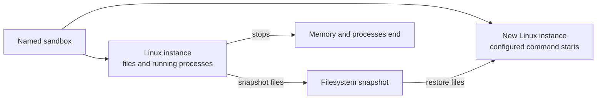

A Linux sandbox has three parts, and each part lasts a different length of time. Your Worker reaches the sandbox by name. The name reaches a [Durable Object](/durable-objects/), and the Durable Object starts a Linux instance in [Containers](/containers/). The name and the Durable Object last as long as your application uses them. A Linux instance runs only while something keeps it running.

Consider a coding agent that clones a repository, installs its dependencies, edits files, and starts a development server, then waits an hour for its next instruction. The agent reaches the same sandbox by name. Whether the repository and the server are still there depends on whether the Linux instance kept running, and on whether the application saved a snapshot.

## The name and the Durable Object remain

Your Worker calls `getByName()` with the sandbox name. The same name always reaches the same Durable Object, so every request for a sandbox arrives in one place. The Durable Object's storage keeps data such as session details or a snapshot ID, whether or not a Linux instance is running.

When work arrives and no instance is running, the Durable Object starts one with [`this.ctx.container.start()`](/durable-objects/api/container/#start).

## Activity keeps an instance running

A Linux instance keeps running while its Durable Object is active. The Durable Object is active while it handles a request or runs an alarm. It also stays active while a WebSocket that it accepted, or a response that it streams, remains open. An open terminal keeps a sandbox running this way, even when nobody types.

After the Durable Object becomes inactive, the instance keeps running for the time set with [`setInactivityTimeout()`](/durable-objects/api/container/#setinactivitytimeout), up to 6 hours. A request that arrives within that time reaches the same instance, with its files and processes. When the time ends, Cloudflare stops the instance. Without a timeout, Cloudflare stops the instance shortly after the Durable Object becomes inactive.

Code that runs inside the instance does not count as activity. A build, a test suite, or an agent that works longer than the inactivity timeout stops with the instance when no requests arrive. A Durable Object [alarm](/durable-objects/api/alarms/) that runs more often than the timeout and checks the work keeps the instance running until the work ends. [Run background processes](/sandbox/commands/run-background-processes/) uses an alarm that runs every minute.

## The timeout does not survive a restart

The inactivity timeout belongs to the running Durable Object, not to the sandbox name. A Durable Object can restart while its Linux instance keeps running, for example between two alarms. After a restart, the Durable Object no longer has the timeout, and the instance stops shortly after the Durable Object next becomes inactive.

A timeout set only after `start()` therefore lasts until the first restart. A timeout set on every request that uses the instance, including alarms, is in place whenever the Durable Object becomes inactive. The sandbox examples set it on every request for this reason.

## What stops an instance

An instance stops when one of these happens:

- The inactivity timeout ends.
- Your Worker calls [`destroy()`](/durable-objects/api/container/#destroy).
- The main process exits.

The main process is the entrypoint passed to `start()`, or the image's default command. When it exits, the instance stops, and every command started with `exec()` ends with it. The default command of `cloudflare/debian-trixie` exits right away, so the sandbox examples start that image with `sleep infinity` as the entrypoint, or run a web server as the main process.

When Cloudflare stops an instance, the main process receives `SIGTERM` and must exit promptly. A main process that runs as process ID 1 exits on `SIGTERM` only when it handles the signal.

After an instance stops, the next request that calls `start()` starts a new instance.

Cloudflare does not wake the Durable Object when its instance stops. To record each stop and its reason, refer to [Run code when a sandbox stops](/sandbox/manage/run-code-when-a-sandbox-stops/).

## Deploys keep instances running

Deploying a new version of your Worker restarts every Durable Object. A running Linux instance keeps running, and the next request reaches the same instance, with its files and processes. Outbound handlers that the Durable Object set up with [`interceptOutboundHttps()`](/durable-objects/api/container/#interceptoutboundhttps) remain in place and run the code of the new version.

A running instance keeps the image, entrypoint, and environment variables that it started with. `start()` throws while an instance runs, so a new image or new startup options apply only to instances that start after the deploy. A sandbox moves to a new image only when its instance stops, for example through `destroy()`, and a new instance starts. The files and processes of the old instance end with it.

Requests, streamed responses, and WebSockets that the previous version was handling end during the deploy. A browser terminal disconnects and must connect again.

After the previous version stops, the instance keeps running for the inactivity timeout that version set. If no request arrives within that time, the instance stops. The new version does not have the timeout, so it sets the timeout again on the next request, as the sandbox examples do.

Container [rollouts](/containers/configuration/rollouts/) replace instances only in Container applications that do not use `scheduling_policy: "durable_object"`, so no rollout replaces a sandbox.

## Files and processes end with the instance

An instance's disk holds the repository, installed packages, configuration files, and output written by commands. Its memory holds running processes, open terminals, and network connections. All of it ends when the instance stops. The next instance starts from its image, or from a snapshot.

For the coding agent, a stopped instance takes the repository, its dependencies, and the edits with it, along with the development server, unless the application saved a snapshot first.

## Snapshots carry files to the next instance

:::note[Public beta]
Container snapshots are in public beta. The API and behavior may change.
:::

[`snapshotContainer()`](/durable-objects/api/container/#snapshotcontainer) saves the writable root filesystem of a running instance. It does not save separately mounted filesystems, memory, or processes. Starting with a snapshot creates a new instance with the saved files, and the new instance runs its entrypoint. The processes that were running do not continue.

Restores are explicit. Cloudflare does not choose a snapshot when a sandbox starts. Your application decides when to save a snapshot, stores it, for example in the Durable Object's storage, and passes it to the next `start()`. Changes made after the last snapshot exist only in the current instance, so save another snapshot before the instance stops.

The coding agent's repository, dependencies, and edits return from a snapshot. The development server does not, so the agent starts it again. To save and restore a workspace, refer to [Save and restore a sandbox with snapshots](/sandbox/files/save-and-restore-a-workspace/). To save a sandbox each time it stops for inactivity, refer to [Save a sandbox automatically](/sandbox/files/save-a-sandbox-automatically/).

## Mounted buckets outlive every instance

Files in a mounted [R2](/r2/) bucket are objects in that bucket. They remain after every instance stops, and other sandboxes and Workers with access to the bucket can read them. A mount belongs to one instance, so each new instance mounts the bucket again. Snapshots do not include mounted directories.

Use a snapshot for files that belong to one continuing workspace. Use a bucket for files that other systems read, or that must outlive the workspace. To mount a bucket, refer to [Mount an R2 bucket](/sandbox/files/mount-an-r2-bucket/).

## Related resources

- [Sandbox security](/sandbox/security/)
- [Durable Object Container API](/durable-objects/api/container/)
- [Durable Object alarms](/durable-objects/api/alarms/)
