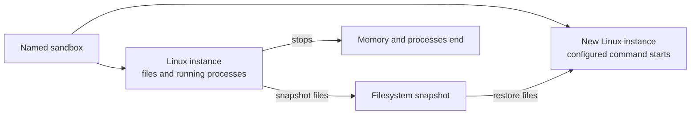

A coding agent may return to a repository after the Linux instance that ran its last command has stopped. The repository can return even though that instance does not.

A persistent sandbox workspace separates the files a sandbox needs from the Linux instance that uses them. The sandbox can keep the same name across requests, while each Linux instance has a shorter lifetime. A filesystem snapshot carries the workspace from one instance to another.

Cloudflare Container snapshots preserve the instance's writable root filesystem, excluding separately mounted filesystems. They do not preserve memory, running processes, open terminals, or network connections.

:::note[Public beta]
Container snapshots are in public beta. The API and behavior may change.
:::

## The sandbox name survives the instance

Your Worker addresses a sandbox by name. That name maps to a [Durable Object](/durable-objects/), which can store session information and route later requests for the same sandbox.

The Durable Object and the Linux instance have different lifetimes. The Durable Object remains addressable when no instance is running. When more work arrives, it can start another instance for that sandbox.

Later requests use the name to reach the same sandbox. The name does not keep the Linux instance running or preserve everything inside it.

## Files and processes have different lifetimes

The writable root filesystem contains the repository, installed packages, configuration files, and output written by commands. A Container snapshot records that filesystem at a point in time. It does not include files provided by separately mounted filesystems.

Processes depend on more than files. They also depend on memory, process identifiers, open terminals, and network connections in the current Linux instance. That runtime state ends with the instance.

Starting from a snapshot creates a new Linux instance that uses the saved filesystem. The instance starts its configured command; it does not resume the previous process tree or memory.

A snapshot is a saved filesystem, not a paused Linux session.

## The workspace returns without its processes

Consider a coding agent that clones a repository, installs its dependencies, edits several files, and starts a development server. A snapshot can preserve the repository, dependencies, and edits because they exist on the filesystem.

When the agent returns, the development server is no longer running. Its shell and test processes have also ended. The new instance starts its configured command, and the agent starts any other processes it still needs.

This separation lets the workspace continue without keeping its Linux instance running between visits. It also means the application must treat running processes as replaceable.

## Each snapshot is a checkpoint

Cloudflare does not automatically select a previous filesystem when a sandbox starts. Your application chooses when to capture a workspace and which snapshot to restore. A failed experiment or unfinished change becomes a future starting point only if the application captures it.

Changes made to the writable root filesystem after a snapshot belong only to the current Linux instance until the application creates another snapshot. The Durable Object can store the latest snapshot ID alongside other session information, but its storage and the Linux filesystem remain separate.

Snapshots suit files that belong to one continuing Linux workspace. Files that must be shared, queried independently, or kept outside that workspace belong in an external storage service such as R2.

To preserve a workspace in an application, refer to [Save and restore a sandbox workspace](/sandbox/how-to/save-and-restore-a-workspace/).
