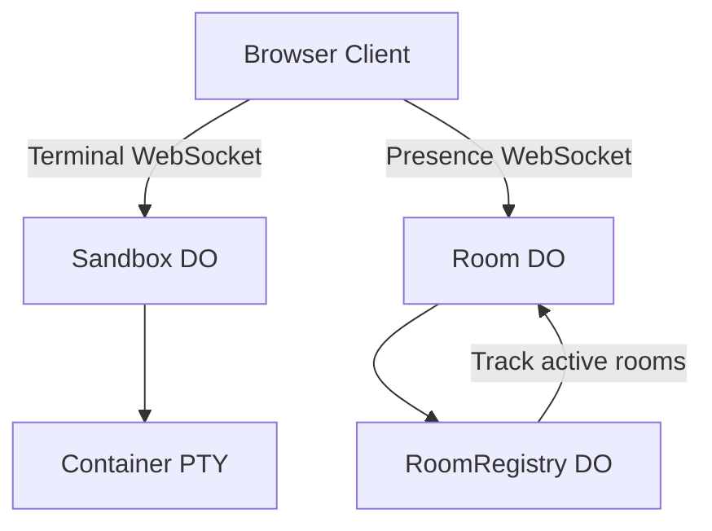

import { TypeScriptExample, WranglerConfig, FileTree } from "~/components";

Build a real-time collaborative terminal where multiple users can share a single shell session. This tutorial demonstrates terminal connections, user presence, room management, and the xterm.js addon.

:::note
This tutorial builds a complete application with React Router, Durable Objects, and real-time WebSocket connections. View the [full source code](https://github.com/cloudflare/sandbox-sdk/tree/main/examples/collaborative-terminal) for reference.
:::

## What You'll Build

- **Shared terminal**: Multiple users see the same PTY output in real-time
- **Room system**: Create rooms, share links, browse active rooms  
- **User presence**: Colored avatars and typing indicators
- **Session isolation**: Each room gets its own sandbox session
- **Live room list**: Homepage updates as rooms are created or deleted

## Architecture Overview

The application uses three Durable Objects working together:



**Terminal connection**: Direct WebSocket to sandbox container's PTY through the SDK. Raw terminal bytes flow between xterm.js and the container with no JSON protocol.

**Room connection**: Separate WebSocket to Room DO for user presence, typing indicators, and room management.

## Prerequisites

- Node.js 20+
- Cloudflare account with container access
- Basic knowledge of React and WebSockets

## Project Setup

### 1. Initialize Project

```bash
npm create react-router@latest collaborative-terminal
cd collaborative-terminal
npm install
```

### 2. Install Dependencies

```bash
npm install @cloudflare/sandbox @xterm/xterm @xterm/addon-fit @xterm/addon-web-links
npm install -D @cloudflare/vite-plugin wrangler
```

### 3. Project Structure

<FileTree>
```
collaborative-terminal/
├── workers/
│   ├── app.ts              # Main Worker
│   ├── room.ts             # Room DO - user presence  
│   ├── registry.ts         # RoomRegistry DO - active rooms
│   └── types/protocol.ts   # WebSocket message types
├── app/
│   ├── routes/
│   │   ├── home.tsx        # Homepage with room creation
│   │   └── room.tsx        # Room page with terminal
│   ├── components/
│   │   ├── Terminal.client.tsx  # xterm.js + SandboxAddon
│   │   └── UserAvatars.tsx      # Presence indicators
│   └── hooks/
│       ├── usePresence.ts       # Room WebSocket hook
│       └── useActiveRooms.ts    # Registry WebSocket hook
├── Dockerfile              # Container configuration
├── wrangler.jsonc          # Cloudflare configuration  
└── package.json
```
</FileTree>

## Implementation

### 1. Durable Object Setup

Create the main Worker that routes requests:

<TypeScriptExample filename="workers/app.ts">
```
export { Room } from './room';
export { RoomRegistry } from './registry';

interface Env {
  Sandbox: DurableObjectNamespace;
  Room: DurableObjectNamespace;  
  Registry: DurableObjectNamespace;
}

export default {
  async fetch(request: Request, env: Env) {
    const url = new URL(request.url);
    
    // Terminal WebSocket - proxy directly to sandbox
    if (url.pathname.startsWith('/ws/terminal/')) {
      const sessionId = url.pathname.split('/').pop()!;
      const sandbox = getSandbox(env.Sandbox, 'shared-terminal');
      const session = await sandbox.getSession(sessionId);
      return session.terminal(request);
    }
    
    // Room presence WebSocket  
    if (url.pathname.startsWith('/ws/room/')) {
      const roomId = url.pathname.split('/').pop()!;
      const id = env.Room.idFromName(roomId);
      const room = env.Room.get(id);
      return room.fetch(request);
    }
    
    // Active rooms WebSocket
    if (url.pathname === '/ws/rooms') {
      const id = env.Registry.idFromName('global');
      const registry = env.Registry.get(id);  
      return registry.fetch(request);
    }
    
    // Room API endpoints
    if (url.pathname === '/api/room' && request.method === 'POST') {
      return createRoom(env);
    }
    
    if (url.pathname.startsWith('/api/room/') && request.method === 'DELETE') {
      const roomId = url.pathname.split('/').pop()!;
      return deleteRoom(roomId, env);
    }
    
    // Serve static files (React Router handles routing)
    return env.ASSETS.fetch(request);
  }
};

async function createRoom(env: Env) {
  const roomId = generateRoomId();
  
  // Initialize room
  const roomStub = env.Room.get(env.Room.idFromName(roomId));
  await roomStub.fetch(new Request('http://internal/init'));
  
  return Response.json({ roomId });
}

function generateRoomId(): string {
  return Math.random().toString(36).substring(2, 8);
}
```
</TypeScriptExample>

### 2. Room Durable Object

Manages user presence and room state:

<TypeScriptExample filename="workers/room.ts">
```
import type { RoomMessage, ServerMessage, User } from './types/protocol';

interface RoomState {
  roomId: string;
  sessionId: string;
  users: Map<string, User>;
  createdAt: number;
}

export class Room implements DurableObject {
  private state: RoomState | null = null;
  private connections = new Set<WebSocket>();
  
  constructor(
    private ctx: DurableObjectState,
    private env: Env
  ) {}
  
  async fetch(request: Request) {
    const url = new URL(request.url);
    
    if (url.pathname === '/init') {
      await this.initialize();
      return new Response('OK');
    }
    
    if (request.headers.get('upgrade') === 'websocket') {
      return this.handleWebSocket(request);
    }
    
    return new Response('Not found', { status: 404 });
  }
  
  private async initialize() {
    if (!this.state) {
      const roomId = await this.getRoomId();
      this.state = {
        roomId,
        sessionId: `room-${roomId}`,
        users: new Map(),
        createdAt: Date.now()
      };
    }
  }
  
  private async handleWebSocket(request: Request) {
    const url = new URL(request.url);
    const userName = url.searchParams.get('name') || 'Anonymous';
    
    const { 0: client, 1: server } = new WebSocketPair();
    server.accept();
    
    const userId = this.generateUserId();
    const user: User = {
      id: userId,
      name: userName, 
      color: this.generateUserColor()
    };
    
    await this.initialize();
    this.state!.users.set(userId, user);
    this.connections.add(server);
    
    // Send initial state
    server.send(JSON.stringify({
      type: 'connected',
      userId,
      user,
      users: Array.from(this.state!.users.values()),
      room: {
        roomId: this.state!.roomId,
        sessionId: this.state!.sessionId
      }
    } satisfies ServerMessage));
    
    // Notify others of join
    this.broadcast({
      type: 'user_joined',
      user,
      users: Array.from(this.state!.users.values())
    }, server);
    
    // Handle messages
    server.addEventListener('message', (event) => {
      try {
        const message = JSON.parse(event.data) as RoomMessage;
        this.handleMessage(message, userId, server);
      } catch (err) {
        console.error('Invalid message:', err);
      }
    });
    
    // Handle disconnect
    server.addEventListener('close', () => {
      this.state!.users.delete(userId);
      this.connections.delete(server);
      
      this.broadcast({
        type: 'user_left',
        userId,
        users: Array.from(this.state!.users.values())
      });
      
      // Delete room if empty
      if (this.state!.users.size === 0) {
        this.deleteRoom();
      }
    });
    
    // Update registry
    await this.updateRegistry();
    
    return new Response(null, { status: 101, webSocket: client });
  }
  
  private handleMessage(message: RoomMessage, userId: string, sender: WebSocket) {
    switch (message.type) {
      case 'typing':
        this.broadcast({
          type: 'user_typing',
          userId
        }, sender);
        break;
    }
  }
  
  private broadcast(message: ServerMessage, exclude?: WebSocket) {
    const data = JSON.stringify(message);
    
    for (const connection of this.connections) {
      if (connection !== exclude && connection.readyState === WebSocket.READY_STATE_OPEN) {
        connection.send(data);
      }
    }
  }
  
  private generateUserId(): string {
    return Math.random().toString(36).substring(2);
  }
  
  private generateUserColor(): string {
    const colors = [
      '#ef4444', '#f97316', '#eab308', '#22c55e',
      '#06b6d4', '#3b82f6', '#a855f7', '#ec4899'
    ];
    return colors[Math.floor(Math.random() * colors.length)];
  }
  
  private async getRoomId(): string {
    // Extract room ID from Durable Object name
    return 'room-123'; // Simplified - use actual ID extraction
  }
  
  private async updateRegistry() {
    const registryId = this.env.Registry.idFromName('global');
    const registry = this.env.Registry.get(registryId);
    
    await registry.fetch(new Request('http://internal/update', {
      method: 'POST',
      body: JSON.stringify({
        roomId: this.state!.roomId,
        userCount: this.state!.users.size,
        createdAt: this.state!.createdAt
      })
    }));
  }
  
  private async deleteRoom() {
    // Notify registry
    const registryId = this.env.Registry.idFromName('global');
    const registry = this.env.Registry.get(registryId);
    
    await registry.fetch(new Request(`http://internal/delete/${this.state!.roomId}`, {
      method: 'DELETE'
    }));
    
    // Notify remaining connections
    this.broadcast({ type: 'room_deleted' });
  }
}
```
</TypeScriptExample>

### 3. Client-Side Terminal

Create the terminal component using SandboxAddon:

<TypeScriptExample filename="app/components/Terminal.client.tsx">
```
import { SandboxAddon } from '@cloudflare/sandbox/xterm';
import { FitAddon } from '@xterm/addon-fit';
import { WebLinksAddon } from '@xterm/addon-web-links';
import { Terminal as XTerm } from '@xterm/xterm';
import { useEffect, useRef, useState } from 'react';
import '@xterm/xterm/css/xterm.css';

interface TerminalProps {
  sandboxId: string;
  sessionId: string;
  onTyping?: () => void;
  onAddonReady?: (addon: SandboxAddon) => void;
}

export function Terminal({ 
  sandboxId, 
  sessionId, 
  onTyping,
  onAddonReady 
}: TerminalProps) {
  const containerRef = useRef<HTMLDivElement>(null);
  const [state, setState] = useState<'disconnected' | 'connecting' | 'connected'>('disconnected');
  
  useEffect(() => {
    if (!containerRef.current) return;
    
    const terminal = new XTerm({
      cursorBlink: true,
      fontFamily: '"JetBrains Mono", "Fira Code", monospace',
      fontSize: 14,
      theme: {
        background: '#09090b',
        foreground: '#fafafa',
        cursor: '#f97316',
        // ... other theme colors
      }
    });
    
    const fitAddon = new FitAddon();
    const webLinksAddon = new WebLinksAddon();
    const sandboxAddon = new SandboxAddon({
      getWebSocketUrl: ({ origin, sessionId }) => 
        `${origin}/ws/terminal/${sessionId}`,
      onStateChange: (newState) => setState(newState)
    });
    
    terminal.loadAddon(fitAddon);
    terminal.loadAddon(webLinksAddon);
    terminal.loadAddon(sandboxAddon);
    terminal.open(containerRef.current);
    fitAddon.fit();
    
    // Handle user input for typing notifications  
    terminal.onData(() => onTyping?.());
    
    // Connect to session
    sandboxAddon.connect({ sandboxId, sessionId });
    onAddonReady?.(sandboxAddon);
    
    // Handle window resize
    const handleResize = () => fitAddon.fit();
    window.addEventListener('resize', handleResize);
    
    return () => {
      window.removeEventListener('resize', handleResize);
      terminal.dispose();
    };
  }, [sandboxId, sessionId]);
  
  return (
    <div className="relative h-full">
      <div ref={containerRef} className="h-full w-full" />
      {state !== 'connected' && (
        <div className="absolute inset-0 flex items-center justify-center bg-zinc-950/80">
          <div className="flex items-center gap-3 text-zinc-400">
            {state === 'connecting' ? (
              <>
                <Spinner />
                <span>Connecting to terminal...</span>
              </>
            ) : (
              <span>Disconnected</span>
            )}
          </div>
        </div>
      )}
    </div>
  );
}
```
</TypeScriptExample>

### 4. Room Page

Combine terminal and presence features:

<TypeScriptExample filename="app/routes/room.tsx">
```
import { lazy, Suspense, useCallback, useMemo, useRef } from 'react';
import { useNavigate } from 'react-router';
import { UserAvatars } from '../components/UserAvatars';
import { usePresence } from '../hooks/usePresence';
import { generateName } from '../utils/names';

const Terminal = lazy(() => 
  import('../components/Terminal.client').then(m => ({ default: m.Terminal }))
);

export default function RoomPage({ params }) {
  const { roomId } = params;
  const navigate = useNavigate();
  const userName = useMemo(() => generateName(), []);
  const addonRef = useRef(null);
  
  const { state, currentUser, users, room, typingUsers, sendTyping } = usePresence({
    roomId,
    userName,
    onRoomDeleted: () => navigate('/', { replace: true })
  });
  
  const copyLink = async () => {
    const url = `${window.location.origin}/room/${roomId}`;
    await navigator.clipboard.writeText(url);
  };
  
  return (
    <div className="h-screen flex flex-col bg-zinc-950">
      <header className="flex items-center justify-between px-4 py-3 border-b border-zinc-800">
        <div className="flex items-center gap-4">
          <span className="font-semibold">Room {roomId}</span>
          <ConnectionIndicator state={state} />
        </div>
        
        <div className="flex items-center gap-4">
          <UserAvatars 
            users={users}
            currentUserId={currentUser?.id ?? null}
            typingUsers={typingUsers}
          />
          <button onClick={copyLink} className="btn">
            Share
          </button>
        </div>
      </header>
      
      <main className="flex-1 p-4 min-h-0">
        <div className="h-full rounded-lg overflow-hidden border border-zinc-800">
          <div className="flex items-center gap-2 px-4 py-2 bg-zinc-900 border-b border-zinc-800">
            <div className="flex gap-1.5">
              <div className="w-3 h-3 rounded-full bg-red-500" />
              <div className="w-3 h-3 rounded-full bg-yellow-500" />
              <div className="w-3 h-3 rounded-full bg-green-500" />
            </div>
            <span className="text-xs text-zinc-500 ml-2">bash</span>
          </div>
          
          <div className="h-[calc(100%-40px)] bg-zinc-950">
            {room ? (
              <Suspense fallback={<div className="loading">Loading terminal...</div>}>
                <Terminal
                  sandboxId="shared-terminal"
                  sessionId={room.sessionId}
                  onTyping={sendTyping}
                  onAddonReady={(addon) => { addonRef.current = addon; }}
                />
              </Suspense>
            ) : (
              <div className="loading">Connecting to room...</div>
            )}
          </div>
        </div>
      </main>
    </div>
  );
}
```
</TypeScriptExample>

### 5. Configuration

<WranglerConfig filename="wrangler.jsonc">
```
{
  "name": "collaborative-terminal",
  "main": "workers/app.ts",
  "compatibility_date": "2024-12-01",
  
  "durable_objects": {
    "bindings": [
      {
        "name": "Sandbox", 
        "class_name": "Sandbox",
        "script_name": "cloudflare-sandbox"
      },
      {
        "name": "Room",
        "class_name": "Room"
      },
      {
        "name": "Registry", 
        "class_name": "RoomRegistry"
      }
    ]
  },
  
  "site": {
    "bucket": "build/client"
  }
}
```
</WranglerConfig>

## Key Features

### Real-time Collaboration

Multiple users connect to the same session ID, sharing terminal output:

```ts
// All users in a room connect to the same session
const sessionId = `room-${roomId}`;
addon.connect({ sandboxId: 'shared-terminal', sessionId });
```

### User Presence

Room Durable Object tracks connected users and broadcasts typing events:

```ts
// Typing notifications
terminal.onData(() => {
  sendTyping(); // Notifies other users
});

// Visual indicators  
<UserAvatars users={users} typingUsers={typingUsers} />
```

### Session Switching

The addon can switch between sessions without recreating:

```ts
// Switch to different room
function switchRoom(newRoomId: string) {
  addon.connect({
    sandboxId: 'shared-terminal', 
    sessionId: `room-${newRoomId}`
  });
}
```

## Deployment

### 1. Build and Deploy

```bash
npm run build
npm run deploy
```

### 2. Container Initialization

After first deployment, wait 2-3 minutes for container provisioning before making requests.

### 3. Domain Setup

For production preview URLs, configure a custom domain with wildcard DNS (`*.yourdomain.com`). The `.workers.dev` domain does not support the subdomain patterns needed for preview URLs.

## Extensions

### Private Rooms

Add password protection:

```ts
// Room creation with password
const room = await createRoom({ 
  password: 'secret123',
  private: true 
});

// Authentication in WebSocket handler
const password = url.searchParams.get('password');
if (room.password && room.password !== password) {
  return new Response('Unauthorized', { status: 401 });
}
```

### File Sharing

Enable file uploads between users:

```ts
// Upload files to shared session
const session = await sandbox.getSession(sessionId);
await session.files.write('/shared/document.txt', content);

// Notify other users
broadcast({
  type: 'file_uploaded',
  filename: 'document.txt',
  path: '/shared/document.txt'
});
```

### Command History

Track and replay command history:

```ts
const commands: string[] = [];

terminal.onData((data) => {
  if (data === '\r') { // Enter key
    const command = getCurrentCommand();
    commands.push(command);
    
    // Sync to other users
    broadcast({
      type: 'command_executed', 
      command,
      timestamp: Date.now()
    });
  }
});
```

## Complete Example

View the full [collaborative terminal example](https://github.com/cloudflare/sandbox-sdk/tree/main/examples/collaborative-terminal) for complete implementation including:

- React Router setup with SSR
- WebSocket connection hooks 
- User avatar components
- Room management UI
- TypeScript types for WebSocket protocol
- Styling with Tailwind CSS

## Next Steps

- [Terminal connections guide](/sandbox/guides/terminal-connections/) - Deep dive into terminal WebSocket handling
- [WebSocket connections guide](/sandbox/guides/websocket-connections/) - General WebSocket patterns
- [Sessions API](/sandbox/api/sessions/) - Session management and isolation