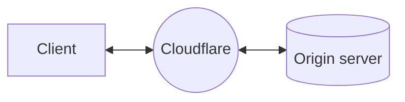
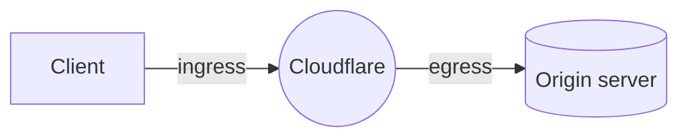

When you use Cloudflare [as a reverse proxy](/fundamentals/concepts/how-cloudflare-works/#how-cloudflare-works-as-a-reverse-proxy), [Cloudflare's global network](https://www.cloudflare.com/network/) sits between client requests and your origin servers.

Zooming in to what happens as a request routes through Cloudflare, you can consider two parts of the process: ingress and egress.

Ingress refers to the data center where the client request lands on, based on Internet routing. From there on, the request will be processed according to your Cloudflare configurations and, if needed, a connection to the origin will be initiated via an egress data center.

Traditionally, Cloudflare maintains a very large pool of egress IPs that are used by all Cloudflare customers and are [publicly documented](https://www.cloudflare.com/ips/). With Dedicated CDN Egress IPs, Cloudflare connects to your origin using IPs that are reserved for you.

:::note
Each dedicated egress pool can consist of either IPs from a [BYOIP prefix](/byoip/) or Cloudflare-leased IPs. A single dedicated egress pool cannot contain both BYOIPs and leased IPs.
:::
