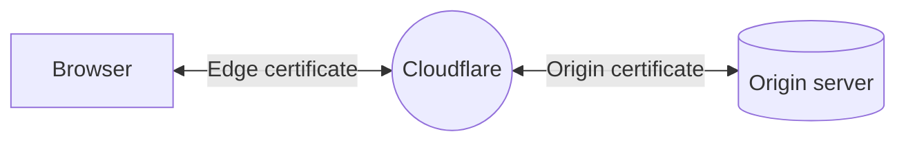

import { Render } from "~/components"

This page defines and articulates key concepts that are relevant to Cloudflare SSL/TLS and are used in this documentation. For more concepts and broader descriptions, check out the [Cloudflare Learning Center](https://www.cloudflare.com/learning/ssl/what-is-ssl/).

## SSL/TLS certificate

An SSL/TLS certificate is what enables websites and applications to establish secure connections. With SSL/TLS, a client - such as a browser - can verify the authenticity and integrity of the server it is connecting with, and use encryption to exchange information.

Since [Cloudflare's global network](https://www.cloudflare.com/network/) is at the core of several products and services that Cloudflare offers, what this implies in terms of SSL/TLS is that, instead of only one certificate, there can actually be two certificates involved in a single request: an edge certificate and an origin certificate.

### Edge certificate

The [edge certificates](/ssl/edge-certificates/) are the ones that Cloudflare presents to clients visiting your website or application. You can manage edge certificates through the [Cloudflare Dashboard](https://dash.cloudflare.com/?to=/:account/:zone/ssl-tls/edge-certificates).

### Origin certificate

[Origin certificates](/ssl/origin-configuration/) guarantee the security and authentication on the other side of the network, between Cloudflare and the origin server of your website or application. Origin certificates are managed on your origin server.

[SSL/TLS encryption modes](/ssl/origin-configuration/ssl-modes/) control whether and how Cloudflare will use both these ceritifcates, and you can choose between different modes on the [SSL/TLS overview page](https://dash.cloudflare.com/?to=/:account/:zone/ssl-tls).

## Validity period

One common aspect of every SSL/TLS certificate is that they must have a fixed expiration date. If a certificate is expired, clients - such as your visitor's browser - will consider that a secure connection cannot be established, resulting in warnings or errors.

Different [certificate authorities (CAs)](#certificate-authority-ca) support different validity periods. Cloudflare works with them to guarantee that both [Universal](/ssl/edge-certificates/universal-ssl/) and [Advanced](/ssl/edge-certificates/advanced-certificate-manager/) edge certificates are always renewed.

## Certificate authority (CA)

A [certificate authority (CA)](/ssl/reference/certificate-authorities/) is a trusted third party that generates and gives out SSL/TLS certificates. The CA digitally signs the certificates with their own private key, allowing client devices - such as your visitor's browser - to verify that the certificate is trustworthy.

As explained in the article about [what is an ssl certificate](https://www.cloudflare.com/learning/ssl/what-is-an-ssl-certificate/), this means that, besides not being expired, an SSL/TLS certificate should be issued by a certificate authority (CA) in order to avoid warnings or errors.

## Validation level

SSL/TLS certificates vary in terms of the level to which a CA has validated them. As explained in the article about [types of certificates](https://www.cloudflare.com/learning/ssl/types-of-ssl-certificates/), SSL/TLS certificates can be DV (Domain Validated), OV (Organization Validated) or EV (Extended Validation).

<Render file="validation-level-note" />  

## Origin pull

When visitors request content from your website or application, Cloudflare first attempts to [serve content from the cache](https://www.cloudflare.com/learning/cdn/what-is-caching/). If this attempt fails, Cloudflare sends a request back to your origin web server to get the content. This request between Cloudflare and your origin web server is called origin pull.

This relates to the difference between [edge certificates](#edge-certificate) and [origin certificates](#origin-certificate), and also explains why some specifications such as [cipher suites](#cipher-suites) can be set differently depending on whether they refer to the connection between Cloudflare and your visitor's browser or between Cloudflare and your origin server.

## Cipher suites

Besides the authentication and integrity aspects that valid certificates guarantee, the other important aspect of SSL/TLS certificates is encryption. Cipher suites determine the set of algorithms that can be used for encryption/decryption and that will be negotiated during an [SSL/TLS handshake](https://www.cloudflare.com/learning/ssl/what-happens-in-a-tls-handshake/).

For the purpose of this documentation, keep in mind that [cipher suites supported at Cloudflare's network](/ssl/edge-certificates/additional-options/cipher-suites/supported-cipher-suites/) may not be the same as [cipher suites presented by Cloudflare to your origin server](/ssl/origin-configuration/cipher-suites/).

## Trust store

The list of [certificate authority (CA)](#certificate-authority-ca) and intermediate certificates that are trusted by operating systems, web browsers or other software that interacts with SSL/TLS certificates is called trust store. Cloudflare maintains its trust store on a public [GitHub repository](https://github.com/cloudflare/cfssl_trust).

While for most cases you do not have to worry about this list or how it is used when a client checks your SSL/TLS certificate, some features such as [Custom Origin Trust Store](/ssl/origin-configuration/custom-origin-trust-store/), and processes such as [bundle methodologies](/ssl/edge-certificates/custom-certificates/bundling-methodologies/), are directly related to it.

## Chain of trust

Depending on your organization requirements, or if you have to troubleshoot an issue with your certificates, for example, you might come across the terms root certificate, intermediate certificate and leaf certificate.

These terms refer to the way in which the certificate presented to a client - the leaf certificate - has to be traceable back to a trusted certificate authority (CA) certificate - the [root certificate](https://en.wikipedia.org/wiki/Root_certificate). This process is structured around a [chain of trust](https://en.wikipedia.org/wiki/Chain_of_trust).
