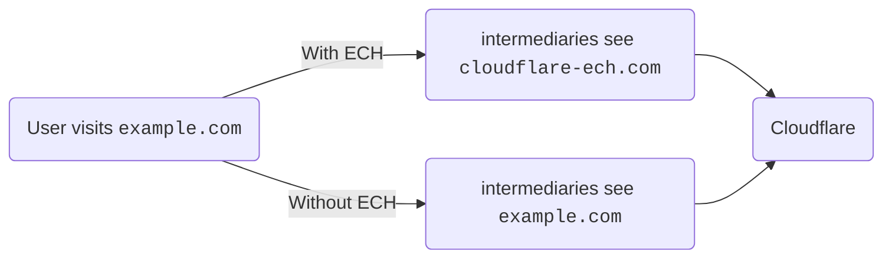

ECH stands for [Encrypted Client Hello](https://datatracker.ietf.org/doc/draft-ietf-tls-esni/16/). It is a protocol extension in the context of Transport Layer Security (TLS). ECH encrypts part of the handshake and masks the Server Name Indication (SNI) that is used to negotiate a TLS session. This means that whenever a user visits a website on Cloudflare that has ECH enabled, intermediaries will be able to see that you are visiting a website on Cloudflare, but they will not be able to determine which one.

## What ECH does

ECH limits access to information that a particular user is visiting your website, ensuring that it is not unnecessarily shared with intermediaries, like Internet Service Provides (ISP). With ECH, specific details regarding their visit no longer leak to network intermediaries when the user accesses your website.

## How ECH works

In a typical [TLS handshake](https://www.cloudflare.com/learning/ssl/what-happens-in-a-tls-handshake/), the client sends a ClientHello message to the server to initiate the TLS session. This message contains important information, including the list of supported cryptographic algorithms, TLS version, and the requested server name (the domain name of the website the client wants to connect to). The server name is indicated through Server Name Indication (SNI).

With ECH, the ClientHello message part is split into two separate messages: an inner part and an outer part. The outer part contains the non-sensitive information such as which ciphers to use and the TLS version and an "outer ClientHello". The inner part is encrypted and contains an "inner ClientHello".

The outer ClientHello contains a common name (SNI) that represents that a user is trying to visit an encrypted website on Cloudflare. We chose `cloudflare-ech.com` as the SNI that all websites will share on Cloudflare. Because Cloudflare controls that domain, we have the appropriate certificates to be able to negotiate a TLS handshake for that server name.

The inner ClientHello contains the actual server name that the user is trying to visit. This is encrypted using a public key and can only be read by Cloudflare. Once the handshake completes, the web page is loaded as normal, just like any other website loaded over TLS.

In practice, this means that any intermediary that is looking at your traffic will simply see normal TLS handshakes with one caveat: any traffic to an ECH-enabled server name on Cloudflare will look the same. Every TLS handshake will appear identical in that it looks like it is trying to load a website for `cloudflare-ech.com`, as opposed to the actual website.

In the example below, a user is visiting `example.com`. Without ECH, any intermediate networks will be able to detect the website being accessed by the user. With ECH, the visible information will be limited to `cloudflare-ech.com` instead.

 

 

For more details about ECH protocol technology, refer to our [introductory blog](https://blog.cloudflare.com/encrypted-client-hello/).

## Enable ECH

ECH is enabled by default on Free zones. Other plans can turn it on or off following the steps below.

1. Log into the [Cloudflare dashboard](https://dash.cloudflare.com).
2. Select your account and zone.
3. Go to **SSL** > **Edge Certificates**.
4. For **Encrypted ClientHello (ECH)**, change the setting to **Enabled**.

## Enterprise network applicability

Some enterprise or regional networks may need to audit or apply filtering policies to traffic that traverses their network. These policies are expressed in terms of domain names, not IP addresses. Consequently, they are best applied at the local DNS resolver in response to the `A` and `AAAA` queries for the individual domain names.

However, for settings wherein DNS-based filtering is not applicable, there are two ways in which networks can disable ECH to allow existing filtering mechanisms to continue working as expected.

The most reliable way is via the local or recursive DNS resolver itself, by dropping ECH configurations from HTTPS resource records returned to clients, or, preferably, by returning a “no error no answer” or NXDOMAIN response to HTTPS queries. This prevents clients from obtaining the necessary information to use ECH. Note that modifying HTTPS resource records may cause failures for clients that perform DNSSEC validation, so dropping HTTPS responses may be the preferred approach. This will prevent browsers, such as Chrome from using ECH.

The second way to disable ECH is via a network canary domain. In particular, your network’s DNS resolver can return a “no error no answer” or an NXDOMAIN response to queries made to the `use-application-dns.net` [canary domain](https://support.mozilla.org/en-US/kb/canary-domain-use-application-dnsnet). This will prevent browsers, such as Firefox from using ECH. For more information, see Firefox's [frequently asked questions page](https://support.mozilla.org/en-US/kb/faq-encrypted-client-hello#w_how-will-ech-interact-with-dohs-opt-outs) for Encrypted Client Hello.
