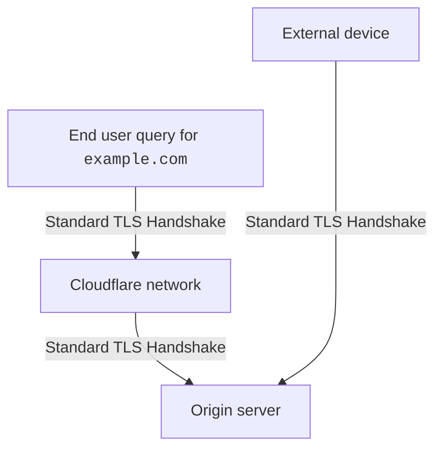
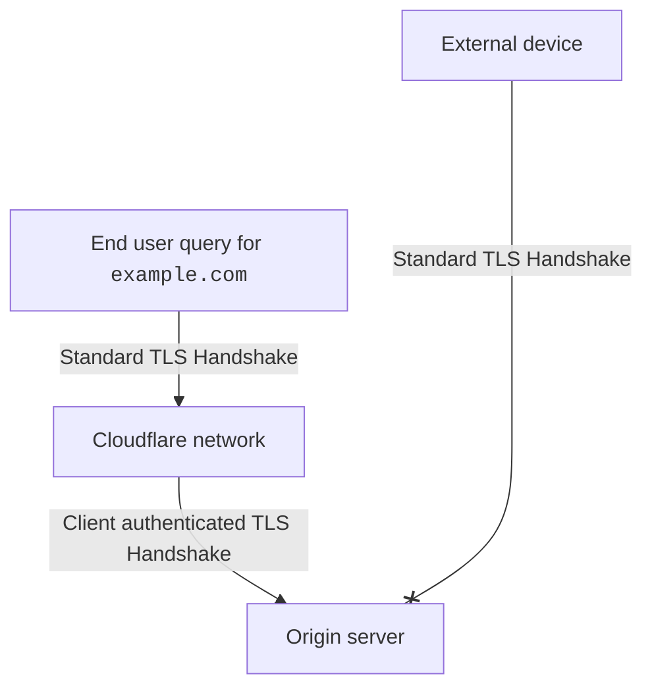

## Simple explanation

When visitors request content from your domain, Cloudflare first attempts to serve content from the cache. If this attempt fails, Cloudflare sends a request — or an `origin pull` — back to your origin web server to get the content.

Authenticated Origin Pulls makes sure that all of these `origin pulls` come from Cloudflare. Put another way, Authenticated Origin Pulls ensures that any HTTPS requests outside of Cloudflare will not receive a response from your origin.

This block also applies for requests to [unproxied DNS records](/dns/manage-dns-records/reference/proxied-dns-records/#dns-only-records) in Cloudflare.

:::caution

Note that the certificate Cloudflare provides for you to [set up Authenticated Origin Pulls](/ssl/origin-configuration/authenticated-origin-pull/set-up/zone-level/) is not exclusive to your account, only guaranteeing that a request is coming from the Cloudflare network.

For more strict security, you should set up Authenticated Origin Pulls with your own certificate and consider [other security measures for your origin](/fundamentals/basic-tasks/protect-your-origin-server/).

:::

## Detailed explanation

Cloudflare enforces authenticated origin pulls by adding an extra layer of TLS client certificate authentication when establishing a connection between Cloudflare and the origin web server.

For more details, refer to the [introductory blog post](https://blog.cloudflare.com/protecting-the-origin-with-tls-authenticated-origin-pulls/).

***

### Types of handshakes

For more details, refer to [What is a TLS handshake?](https://www.cloudflare.com/learning/ssl/what-happens-in-a-tls-handshake/).

**Standard TLS handshake**

**Client authenticated TLS handshake**

### Comparison diagrams

Without Authenticated Origin Pulls, Cloudflare performs standard TLS handshakes between a client device and Cloudflare and Cloudflare and your origin.
This is true even if you have [**Full**](/ssl/origin-configuration/ssl-modes/full/) or [**Full (strict)**](/ssl/origin-configuration/ssl-modes/full-strict/) encryption modes enabled.

 

This lack of authentication means that - even if your origin is [protected behind Cloudflare](/fundamentals/concepts/how-cloudflare-works/) - attackers with your origin's IP address will still receive a response from your origin for HTTPS requests.

With Authenticated Origin Pulls, Cloudflare performs standard TLS handshakes between a client device and Cloudflare, but a client-authenticated TLS handshake between Cloudflare and your origin.

 

This additional layer of authentication ensures that any HTTPS requests outside of Cloudflare will not receive a response from your origin.
