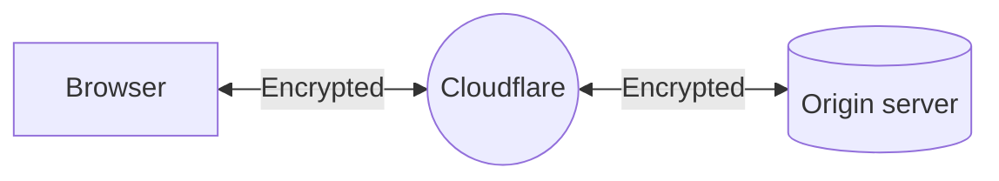

import { Render, TabItem, Tabs } from "~/components";

When you set your encryption mode to **Full**, Cloudflare allows HTTPS connections between your visitor and Cloudflare and makes connections to the origin using the scheme requested by the visitor. If your visitor uses `http`, then Cloudflare connects to the origin using plaintext HTTP and vice versa.

## Use when

Choose **Full** mode when your origin can support an SSL certification, but — for various reasons — it cannot support a valid, publicly trusted certificate.

:::note

In addition to **Full** encryption, you can also set up [Authenticated Origin Pulls](/ssl/origin-configuration/authenticated-origin-pull/) to ensure all requests to your origin are evaluated before receiving a response.

:::

## Required setup

### Prerequisites

Before enabling **Full** mode, make sure your origin allows HTTPS connections on port 443 and presents a certificate (self-signed, [Cloudflare Origin CA](/ssl/origin-configuration/origin-ca/), or purchased from a Certificate Authority). Otherwise, your visitors may experience a [525 error](/support/troubleshooting/cloudflare-errors/troubleshooting-cloudflare-5xx-errors/#error-525-ssl-handshake-failed).

<Render file="ssl-mode-errors" />

### Process

<Tabs syncKey="dashPlusAPI"> <TabItem label="Dashboard">

<Render file="change-encryption-mode-dash" />

</TabItem> <TabItem label="API">

<Render file="change-encryption-mode-api" />

</TabItem> </Tabs>

## Limitations

The certificate presented by the origin will **not be validated in any way**. It can be expired, self-signed, or not even have a matching CN/SAN entry for the hostname requested.

Without using [**Full (strict)**](/ssl/origin-configuration/ssl-modes/full-strict/), a malicious party could technically hijack the connection and present their own certificate.
