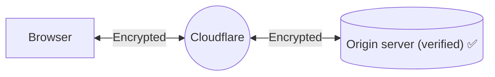

import { Render, Tabs, TabItem } from "~/components";

:::note

This method is only available for Enterprise zones.
:::

When you set your encryption mode to **Strict (SSL-Only Origin Pull)**, connections to the origin will always be made using SSL/TLS, regardless of the scheme requested by the visitor.

The certificate presented by the origin will be validated the same as with [Full (strict) mode](/ssl/origin-configuration/ssl-modes/full-strict/).

## Use when

You want the most secure configuration available for your origin, you are an Enterprise customer, and you meet the requirements for [**Full (strict)** mode](/ssl/origin-configuration/ssl-modes/full-strict/).

## Required setup

The setup is generally the same as [**Full (strict)** mode](/ssl/origin-configuration/ssl-modes/full-strict/), but you select **Strict (SSL-Only Origin Pull)** for your encryption mode.

:::note

In addition to **Strict (SSL-Only Origin Pull)** encryption, you can also set up [Authenticated Origin Pulls](/ssl/origin-configuration/authenticated-origin-pull/) to ensure all requests to your origin are evaluated before receiving a response.

:::

### Process

<Tabs syncKey="dashPlusAPI"> <TabItem label="Dashboard">

<Render file="change-encryption-mode-dash" />

</TabItem> <TabItem label="API">

<Render file="change-encryption-mode-api" />

</TabItem> </Tabs>

## Limitations

<Render file="ssl-mode-errors" />
