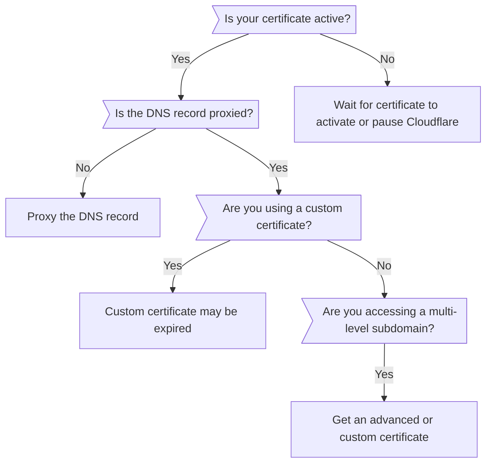

import { Render } from "~/components"

After you [add a new domain](/fundamentals/setup/manage-domains/add-site/) to Cloudflare, your visitors' browsers might display one of the following errors:

* `ERR_SSL_VERSION_OR_CIPHER_MISMATCH` (Chrome)
* `Unsupported protocol The client and server don’t support a common SSL protocol version or cipher suite` (Chrome)
* `SSL_ERROR_NO_CYPHER_OVERLAP` (Firefox)

This error occurs when your domain or subdomain is not covered by an SSL/TLS certificate, which is usually caused by:

* A [delay in certificate activation](#certificate-activation).
* An [unproxied domain or subdomain DNS record](#proxied-dns-records).
* An [expired Custom certificate](#certificate-expiration).
* A [multi-level subdomain](#multi-level-subdomains) (`test.dev.example.com`).

## Decision tree

***

## Certificate activation

<Render file="universal-ssl-enable-full" />

### Potential issues

If your visitors experience `ERR_SSL_VERSION_OR_CIPHER_MISMATCH` (Chrome) or `SSL_ERROR_NO_CYPHER_OVERLAP` (Firefox), check the status of your Universal certificate:

1. Log into the [Cloudflare dashboard](https://dash.cloudflare.com).
2. Choose your account and domain.
3. Go to **SSL** > **Edge Certificates**.
4. Find the certificate with the **Type** of **Universal**.
5. Make sure the **Status** is **Active**.

If the **Status** is anything other than **Active**, you can either wait a bit longer for certificate activation or take immediate action.

### Solutions

If you need to immediately resolve this error, [temporarily pause Cloudflare](/fundamentals/setup/manage-domains/pause-cloudflare/).

Since Universal certificates can take up to 24 hours to be issued, wait and [monitor the certificate's status](/ssl/reference/certificate-statuses/#ssltls). Once your certificate becomes **Active**, unpause Cloudflare using whichever method you used previously.

If your certificate is still not **Active** after 24 hours, try the various troubleshooting steps used to [resolve timeout issues](/ssl/edge-certificates/universal-ssl/troubleshooting/#resolve-a-timed-out-state). If these methods are successful (and your certificate becomes **Active**), unpause Cloudflare using whichever method you used previously.

***

## Proxied DNS records

Cloudflare Universal and Advanced certificates only cover the domains and subdomains you have [proxied through Cloudflare](/dns/manage-dns-records/reference/proxied-dns-records/).

If the **Proxy status** of `A`, `AAAA`, or `CNAME` records for a hostname are **DNS-only**, you will need to change it to **Proxied**.

***

## Certificate expiration

If you have a [Custom certificate](/ssl/edge-certificates/custom-certificates/) and visitors experience `ERR_SSL_VERSION_OR_CIPHER_MISMATCH` (Chrome) or `SSL_ERROR_NO_CYPHER_OVERLAP` (Firefox), [check its status](/ssl/reference/certificate-statuses/#ssltls) to make sure it is not expired.

If it is expired, [upload a replacement certificate](/ssl/edge-certificates/custom-certificates/renewing/).

***

## Multi-level subdomains

<Render file="ussl-limitations-table" />

This means that you might experience `ERR_SSL_VERSION_OR_CIPHER_MISMATCH` (Chrome) or `SSL_ERROR_NO_CYPHER_OVERLAP` (Firefox) on multi-level subdomains.

<Render file="ussl-limitations-solutions" />
